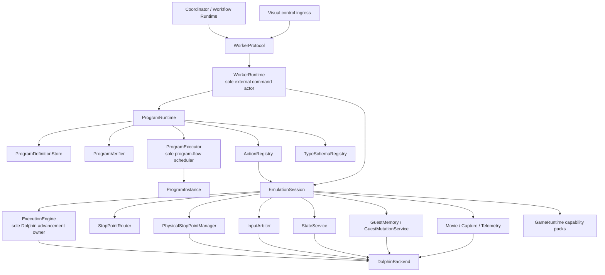

# Target Execution Architecture

## Scope

This document describes the target component responsibilities, authority boundaries, control-flow
ownership, and worker/session lifecycle. Concrete names and API shapes may adapt as implementation
evidence develops; the single-owner boundaries and cleanup rules are the constraints to preserve.

This document incorporates the session, execution-engine, router, input-arbitration, state-service, and
thread-ownership conclusions from the read-only worker breakpoint-router analysis. It supersedes that
analysis where it retains a separate `PhaseScriptInterpreter`, `InputMacroEngine`, descriptor-selected
program factory, or "shrunken VM." The target has one `ProgramRuntime` subsystem and one
`ProgramExecutor`.

## Purpose and non-goals

The target must make every bounded phase program use the same execution machinery while allowing
orthogonal game capabilities, passive observers, modal interceptors, visual debugging, and workflow
composition to coexist safely.

This document defines:

- the boundary from worker protocol ingress to Dolphin;
- the sole owners of external commands, program flow, emulator advancement, physical stop points, pad
  publication, and guest-state replacement;
- the serialized control model and allowed background-thread behavior;
- invocation lifecycle, suspension, cancellation, and session disposition;
- the relationship between `WorkerRuntime`, `ProgramRuntime`, `ProgramExecutor`, and
  `EmulationSession`; and
- the architectural test for adding a phase without modifying central runtime code.

This document does not define:

- concrete C++ class declarations, ownership pointer types, or coroutine libraries;
- changes to SavorDb SQL/schema, migrations, stored representations, database-service interfaces,
  queues, claims, workflow persistence, transaction boundaries, or artifact-storage interfaces;
- byte-level worker messages;
- the typed program IR, which is fixed in document 03;
- individual action schemas, which are fixed in document 04;
- workflow/frontier persistence redesign, which is outside this refactor and treated as an unchanged
  external boundary in document 06; or
- the game algorithm for any particular phase.

## Current code evidence

The present worker is a useful executable composition root, but its control authority is not isolated:

- `SavorWorker/SavorWorker.cpp:204-240` constructs `DolphinWrapper`, loads the game, builds the
  breakpoint map, and constructs `PhaseScriptVM` directly over both.
- `SavorWorker/SavorWorker.cpp:273-342` starts a visual-control thread that calls
  `pauseEmulationBlocking`, `resumeEmulation`, and `stepOneFrameBlocking` on `DolphinWrapper`, while also
  mutating VM visual-debug state.
- `SavorWorker/SavorWorker.cpp:355-472` keeps the active `PhaseScript`, selects it by numeric
  `ProgramKind`, decodes a program-specific payload, and executes the VM on the pipe-processing thread.
- `SavorCore/Runner/Script/PhaseScriptVM.h:35-77` makes the VM a direct `DolphinWrapper` client and a
  private implementation of three input-macro host/provider interfaces. The same object also stores
  breakpoint scopes, visual-debug flags, macro state, and one in-memory snapshot.
- `SavorCore/Runner/Script/PhaseScriptVM.cpp:125-167` clears watchpoints, disarms prior breakpoints,
  loads a savestate, arms the next program's breakpoints, and captures the per-job baseline during VM
  initialization.
- `SavorCore/Runner/Script/PhaseScriptVM.cpp:170-325` dispatches generic language flow, emulator
  lifecycle, memory, input, capture, TAS, and battle/navigation domain operations from one opcode switch.
- `SavorCore/Runner/Script/PhaseScriptVMControl.cpp:57-103` loads and saves the VM snapshot and replaces
  the globally enabled breakpoint set.
- `SavorCore/Runner/Script/PhaseScriptVMControl.cpp:162-369` publishes input, directly steps the core,
  replaces enabled breakpoints, and calls `runUntilBreakpointFlexible` as one operation.
- `SavorCore/Runner/Script/PhaseScriptVMInput.cpp:15-20` directly steps frames/opcodes, toggles all
  breakpoints, records movies, and publishes input.
- `SavorCore/Runner/InputMacro/IInputMacroHost.h:38-58` requires a macro host to acquire an exclusive
  session, run to breakpoints, step, read memory, neutralize input, clear watchpoints, and restore
  breakpoint state. `PhaseScriptVM` currently implements that authority.
- `SavorCore/Core/DolphinWrapper.h:32-240` combines lifecycle, savestates, raw memory, pad publication,
  frame/opcode stepping, physical breakpoints, memory watchpoints, capture startup, and run-until
  behavior in one public facade.

The router analysis records the resulting conflicts in
`D:\SoAInvestigate\Analyses\20260723_2107_savor_worker_breakpoint_router\20260723_2107_savor_worker_breakpoint_router_architecture_summary.txt`:

- lines 83-212 identify split physical-breakpoint ownership, destructive enabled-state replacement,
  implicit input ownership, stepping bypasses, VM-owned capture lifetime, and unsynchronized thread
  mutation;
- lines 214-473 define the reusable session-service direction;
- lines 717-729 state the single-owner invariants; and
- lines 735-787 stage the session, physical-stop, router, execution, and input-arbitration extractions.

These observations are static-analysis evidence. They do not prove that the target components already
exist.

## Core architectural constraints

### Top-level composition

There is one path for program execution:

1. `WorkerProtocol` translates external framing into a typed command.
2. `WorkerRuntime` serializes the command against the one owned `EmulationSession`.
3. `ProgramRuntime` resolves and verifies the exact module/dependency closure and constructs one
   `ProgramInstance`.
4. `ProgramExecutor` advances that instance until it returns, fails, reaches a budget boundary, or
   awaits one registered action.
5. `ProgramRuntime` validates and dispatches the requested action through `ActionRegistry`.
6. Session services perform the bounded effect. Any emulator advancement goes through
   `ExecutionEngine`.
7. The typed completion is delivered back to `ProgramRuntime`; `ProgramExecutor` resumes only the
   matching continuation.
8. On every terminal path, `ProgramRuntime` unwinds the instance resource scopes and returns one typed
   result to `WorkerRuntime`.

No alternate native-controller, input-macro-controller, user-script, or phase-specific execution path
is permitted.

### Predicate composition boundary

Reusable predicate composition is a module-authoring facility, not another component in the live
execution graph. The shared library accepts pure typed predicate definitions plus explicit `Check` use
policies and lowers them into a `ProgramModule`'s ordinary IR, exact imports, scoped resource operations,
and declared emissions before verification.

At runtime there is no `PredicateRuntime`, predicate scheduler, predicate VM, or predicate-specific
dispatch path. `ProgramExecutor` executes the lowered control flow, registered actions acquire typed
observations, and existing session services own emulator advancement and stop subscriptions. A predicate
definition owns none of those facilities.

### Semantic-observation composition boundary

Semantic observation is also a module-authoring facility rather than a live runtime component.
Capability packs define logical `SemanticPointDefinition`s and typed address/query definitions; module
builders bind them through `SemanticAwaitDefinition` and `ObservationUse` policies. Before verification,
the composer lowers each use into exact imports, scoped router subscriptions, ordinary
`continue_until`/step/read/query actions, typed values, branches, and declared emissions.

The router may acquire only a bounded `HitTimeSample` needed to qualify or describe a matched hit.
Ordinary guest reads and coherent domain queries execute while paused through registered actions. A
post-instruction observation is represented by an explicit execution step followed by another
observation, not by a hidden acquisition mode. Every point receipt, observation, guest-derived handle,
and baseline is bound to the current `StateEpoch`; unavailable evidence remains distinct from a false or
zero value.

There is no `ObservationRuntime`, query VM, observation opcode family, filesystem access, database
access, or persistence catalog. Predicate composition consumes these typed observations rather than
reconstructing its own breakpoint/read mechanism.

### Interaction composition boundary

Interaction composition turns a finite set of typed input segments plus pure initialization/advancement
reducers into ordinary subprogram control flow. A segment binds input acquisition and acknowledgement,
semantic gates, exact stop receipts, optional held-through-hit behavior, observations/checks, budgets,
and completion mapping. Reducers may select only segment identities already visible to module
verification; they cannot dynamically construct effects.

The lowered program holds one input lease across the interaction and uses nested router/observation
scopes. Input publication, source-stop step-off, exact point matching, request acknowledgement, neutral
release acknowledgement, and unwind remain explicit action/receipt dependencies. No
`InteractionRuntime`, `InputMacroEngine`, native phase controller, private cancellation path, or
whole-macro action is permitted.

### Capture compatibility boundary

The existing `savor.capture.profile/1` document remains an opaque configuration interpreted by
`CaptureService`. Initially the service preserves its parser, filters, predicate bytecode, address
programs, dynamic watchpoints, PC/post-write sampling, sampling order and retention policies, windows,
flight recorders, queues/drop/coalescing behavior, progress/event ordering, and artifact finalization.
This refactor does not replace that language with a generalized capture plan.

`CaptureService` is passive. `StopPointRouter` and `ExecutionEngine` own wake/control authority, while
capture observes the same matched routed event so existing profile control subscriptions, flags,
metrics, control-triggered windows/recorders, and synthetic control events retain their meaning. One
routed hit carries the same sequence, snapshot, and epoch identity through control, capture, and
progress views.

### Component responsibilities

| Component | Sole responsibilities | Explicitly forbidden responsibilities |
|---|---|---|
| `WorkerProcess` | Process arguments, logging, pipe handles, process shutdown, and construction of the worker object graph | Dolphin policy, program interpretation, phase selection, direct execution control |
| `WorkerProtocol` | Decode/validate transport frames into typed commands and serialize worker events/results | Mutating session state, selecting a controller, interpreting `ProgramKind` as an executor |
| `WorkerRuntime` | Serialize external commands, own exactly one session, start/cancel invocations, enforce session disposition, coordinate visual control and shutdown | Interpreting IR, implementing phase logic, physically manipulating stop points |
| `EmulationSession` | Own the live backend and all session-scoped services; expose capability interfaces to registered actions | Workflow scheduling, module selection, phase-specific control loops |
| `DolphinBackend` | Narrow adapter for primitive boot/run/step, physical debug objects, raw memory/register access, pad publication, state/movie/screenshot primitives, and CPU-thread callback ingress | `ProgramKind`, IR, action IDs, game policy, router priority, workflow identity |
| `ProgramRuntime` | Own definition storage, verification, executor, action/type registries, instance lifecycle, effect dispatch, resource unwind, and result assembly | Advancing Dolphin directly, scheduling durable workflow work |
| `ProgramExecutor` | Interpret the canonical IR and exclusively advance program control flow | Calling Dolphin/session services directly, running native phase controllers |
| `ProgramInstance` | Hold mutable state for one invocation: instruction location, call frames, typed values, pending continuation, scope stack, epoch, emissions, and diagnostics | Threads, virtual controller behavior, worker commands, Dolphin handles |
| `ActionRegistry` | Resolve exact action descriptors and dispatch a validated bounded request to its handler | Choosing subsequent program branches or owning a whole phase |
| `TypeSchemaRegistry` | Resolve exact type/schema dependencies and validate values at module, action, result, and artifact boundaries | Persisting workflow topology or silently converting incompatible values |

### Exclusive authority invariants

The following are architectural constraints, not conventions:

1. `WorkerRuntime` is the only receiver of commands that may alter the session.
2. `ProgramExecutor` is the only component that may advance program control flow.
3. `ExecutionEngine` is the only component that may transition the emulated core into running or issue
   an instruction/frame advancement.
4. `PhysicalStopPointManager` is the only component that may install, remove, enable, or disable a
   physical Dolphin PC breakpoint or memcheck.
5. `InputArbiter` is the only component that may publish controller state to Dolphin.
6. `StateService` is the only component that may boot, reboot, load, restore, or save emulation state.
7. `GuestMutationService` is the only program-facing path for guest data writes or executable patches.
8. `MovieService` owns movie start/stop state; passive `CaptureService` owns existing-profile
   interpretation, capture attachment, observation, publication, and artifact finalization, but cannot
   create a foreground control wait or advance/pause emulation.
9. Programs, action handlers, reducers, capability packs, visual readers, transport callbacks, and
   background workers cannot call `DolphinBackend` directly.
10. Every emulator-advancing operation remains under `StopPointRouter` supervision, including instruction
    stepping, frame stepping, input-sequence playback, and interceptor child operations.

These invariants must be enforceable through dependencies: forbidden callers shall not receive a
backend reference or a capability broad enough to reconstruct one.

### Worker control and threading model

`WorkerRuntime` is a single logical actor even if the implementation later uses a coroutine scheduler
instead of one OS thread.

- Pipe ingress, visual-control ingress, cancellation, and shutdown become typed commands in one queue.
- Commands that can affect emulation are executed serially on the worker control actor.
- Exactly one foreground invocation may be active in a worker.
- Exactly one foreground `ExecutionEngine` operation may advance the core at a time.
- A program waiting for an action is suspended data, not a blocked private event loop.
- A router interceptor may suspend the foreground execution operation and request bounded child
  operations through the same engine. The parent operation retains its deadline, completion condition,
  input relationship, stall baseline, and suppression state.
- CPU-thread hooks may only perform bounded, allocation-free matching/sampling against immutable
  dispatch state and enqueue raw events. They cannot call program logic, publish input, or wait for the
  worker control actor.
- Capture/artifact writer threads may perform passive buffering and I/O. They cannot mutate emulator
  run state, program state, input, physical stop points, or `StateEpoch`.
- All outbound worker messages pass through one serialized publisher. Callback and recorder threads
  enqueue telemetry rather than writing transport frames directly.
- Private threads and nested event loops inside actions, reducers, or program definitions are forbidden.
  A service may own a documented background facility, but its effects return through the worker actor.

### Worker lifecycle

The logical worker states are:

| State | Meaning | Accepted mutating commands |
|---|---|---|
| `Starting` | Backend/session construction is incomplete | `Shutdown` |
| `Ready` | Session is clean and no invocation is active | `InvokeProgram`, allowed visual/session commands, `Shutdown` |
| `Running` | One invocation owns the root program resource scope | `CancelInvocation`; policy-allowed visual commands are queued |
| `InteractivelyPaused` | The execution operation is safely suspended under an invocation that permits visual debugging | `ResumeInteractive`, allowed debug step, `CancelInvocation`, `Shutdown` |
| `Cancelling` | Cancellation is propagating and scopes are unwinding | `Shutdown`; later commands wait or are rejected |
| `Recovering` | A clean, declared session recovery is in progress | `Shutdown` |
| `Tainted` | Mandatory cleanup or state-integrity verification failed | `Shutdown` or an explicit full-session rebuild command; no invocation |
| `Stopping` | Ingress is closed and owned resources are being released | none |

An invocation has its own lifecycle:

`Created -> Verified -> PreparingState -> Running -> AwaitingAction <-> Running -> Unwinding -> Finished`.

`Rejected` is terminal before state preparation. `Cancelled`, `TimedOut`, `Failed`, and `Completed` all
pass through `Unwinding`. No terminal outcome skips cleanup.

### External and visual commands

The logical worker command surface includes:

- prepare/cache a module by exact identity;
- invoke an exact module entrypoint;
- cancel one active invocation;
- request a safe interactive pause;
- resume or perform an allowed debug step;
- request a screenshot or read-only diagnostic snapshot; and
- rebuild or shut down the session.

This is a logical surface, not a frozen wire protocol.

Cancellation and shutdown are always accepted. Screenshot and telemetry requests may execute while a
program is active only if they do not advance or mutate the core. Pause, resume, or step commands during
an invocation are accepted only when the invocation's execution policy allows interactive debugging.
Otherwise they receive a typed rejection. The visual pipe never calls Dolphin or VM methods directly.

### Program-level and execution-level suspension

Two suspension kinds exist and shall not be conflated:

- **Program suspension:** `ProgramExecutor` reaches `await action`, stores a typed continuation in the
  `ProgramInstance`, and returns control to `ProgramRuntime`.
- **Execution suspension:** `ExecutionEngine` pauses a foreground emulator operation so the router can
  process a guard or modal interceptor through structured child operations.

An action completion identifies the invocation, action request, continuation, and originating
`StateEpoch`. Stale, duplicate, or mismatched completions are rejected and cannot advance program flow.
An execution child operation cannot directly resume the program; it completes back into the parent
action, which returns one typed action completion to `ProgramRuntime`.

### Extension rule

A new phase that can be expressed with existing actions and schemas shall require only:

- a new or revised `ProgramModule`;
- its typed input/output/emission schemas; and
- reusable predicate definitions or `Check` uses composed through the shared frontend library where
  useful;
- reusable semantic points, awaits, observations, and interaction definitions/uses composed through the
  shared frontend libraries where useful; and
- program-kind handler or adjacent integration-adapter mappings through existing SavorDb interfaces and
  stored representations.

It shall not require a change to `WorkerRuntime`, `ProgramRuntime`, `ProgramExecutor`,
`ExecutionEngine`, `StopPointRouter`, worker transport core, or a central opcode table. A genuinely new
machine/game capability may add a bounded action and capability-pack implementation, but does not add an
executor or controller. Adding or reusing a predicate changes only the composing module and its exact
action, reducer, type, and capability dependencies. The same is true for semantic observations and
interaction segments.

## Interfaces and ownership affected

### Session service boundary

`EmulationSession` exposes narrow logical services:

| Service | Program-visible through actions? | Owns |
|---|---|---|
| `ExecutionEngine` | Indirectly | Run/step operations, deadlines, cancellation, structured suspension |
| `StopPointRouter` | Indirectly | Logical subscriptions, routing order, wake/intercept/guard decisions |
| `PhysicalStopPointManager` | No | Physical PC breakpoints, memchecks, immutable CPU dispatch snapshot |
| `GuestMemory` | Through checked read/query actions | Paused-safe typed reads and symbolic resolution |
| `GuestMutationService` | Through declared mutation actions | Checked writes, patches, receipts, restoration |
| `InputArbiter` | Through input actions | Leases, pad publication, poll acknowledgement, neutral release |
| `StateService` | Through state actions and invocation state policy | Boot/load/save/snapshot handles and `StateEpoch` |
| `MovieService` | Through movie actions | Playback/recording session state |
| `CaptureService` | Through capture actions | Opaque existing profile semantics, passive routed-hit observation, recorder lifecycle, publication, artifact finalization |
| `TelemetryBus` | Through bounded emit actions | Ordered progress/diagnostic events, serialized publication |
| `GameRuntime` | Through named capability packs | Skies-specific address catalogs, queries, actions, and schemas |

Actions receive only the specific service capabilities declared by their descriptor. They do not receive
the whole `EmulationSession`.

### Stop-point and execution relationship

`StopPointRouter` owns logical subscription semantics. `PhysicalStopPointManager` derives the physical
union from those subscriptions. A program/action owns tokens for its subscription group, not an enabled
PC set. Removing a scope removes only that scope's subscriptions.

Every `ExecutionEngine` request declares:

- completion conditions;
- deadline and stall policy;
- movie-ended behavior;
- cancellation token;
- optional input lease relationship;
- throttle policy;
- interruption policy; and
- the current `StateEpoch`.

Stop delivery is ordered as passive observations/progress, guards, interceptors, then the foreground
wake condition. An unclaimed physical stop is a typed debugger/policy event, not a string reason guessed
by the VM.

### Game capability packs

Skies-specific capability registration is split into independently versioned packs:

- `soa.battle`;
- `soa.field`;
- `soa.navigation`;
- `soa.cutscene`; and
- `soa.overworld`.

Packs register types, bounded actions, pure reducers, semantic stop points, and query schemas. They may
depend on generic session services, but not on workflow storage, `WorkerRuntime`, or another executor.
Adding a pack does not change existing module hashes unless a module imports that pack's definitions.

`ProgramKind` may remain as SavorDb job/handler/queue/affinity, semantic, UI, or workflow-family metadata
during and after migration. Existing persisted affinity and claim data remain unchanged. Once the
program-kind integration adapter constructs an exact runtime invocation, `ProgramKind` cannot select an
executor, controller class, worker-side payload decoder, or worker runtime.

## Failure and cleanup behavior

### Failure ownership

| Failure source | Owning layer | Required outcome |
|---|---|---|
| Malformed transport or unknown command | `WorkerProtocol` | Reject without mutating the session |
| Module/dependency/schema/capability mismatch | `ProgramRuntime` verifier path | Reject before state preparation |
| IR fail or declared domain terminal | `ProgramExecutor` | Produce typed domain/program outcome, then unwind |
| Action contract violation | `ProgramRuntime` / `ActionRegistry` | Fail invocation, cancel pending effect, then unwind |
| Emulator operation timeout, stall, guard, or backend failure | Session service that owns the operation | Return typed completion/failure to the action; executor follows program policy or fails |
| External cancellation | `WorkerRuntime` | Cancel active action/execution, stop program advancement, unwind |
| Resource restoration failure | Resource-owning service plus `ProgramRuntime` | Record cleanup failure and taint the session |
| Worker process or backend crash | Process/coordinator boundary | Invocation attempt fails; durable workflow decides retry on a fresh worker |

A domain-negative result such as "locked," "not found," or "no anomaly" is not an infrastructure
failure when the action and program completed normally.

### Cancellation and unwind sequence

Cancellation is monotonic:

1. `WorkerRuntime` marks the invocation cancelling and rejects new program effects.
2. `ProgramRuntime` requests cancellation of the outstanding action.
3. The owning service asks `ExecutionEngine` to safely pause/cancel any foreground or child operation.
4. `InputArbiter` drives required neutral release and records whether the guest observed it.
5. `ProgramRuntime` resumes no ordinary program branch; it unwinds nested scopes in reverse acquisition
   order.
6. Services return restoration receipts. Cleanup continues after one cleanup failure so the complete
   damage set is known.
7. The result is finalized with independent infrastructure, domain, and cleanup/session statuses.
8. If any mandatory restoration cannot be proven, the session becomes `Tainted` and cannot accept
   another invocation.

Timeout and guard abort use the same sequence. Shutdown adds transport closure and backend destruction
after the unwind attempt.

### Tainted-session disposition

A tainted session is never treated as a clean baseline. `ContinueSession` is rejected. The worker may
recover only through an explicit full-session rebuild that destroys and recreates the backend and then
passes clean-session validation. If rebuild is unavailable or fails, `WorkerRuntime` reports the taint
and exits so the coordinator can replace the worker. Loading an ordinary savestate over an unknown
leaked host resource is not sufficient proof of recovery.

## Dependencies and migration implications

The implementation order is constrained by ownership:

1. Establish `WorkerRuntime` command serialization and route visual commands through it.
2. Extract `DolphinBackend` and the session service boundaries without changing phase behavior.
3. Make `PhysicalStopPointManager` the only physical debug-object owner.
4. Add `StopPointRouter` and translate current VM/capture/macro requirements into logical
   subscriptions.
5. Add `ExecutionEngine` and move every run, step, and tape path beneath it.
6. Add `InputArbiter`, `StateService`, mutation, movie, capture, and telemetry scopes.
7. Introduce the universal `ProgramRuntime` and migrate phase definitions into the canonical IR.
8. Delete direct `PhaseScriptVM`/`DolphinWrapper` coupling and the peer macro runtime after differential
   parity gates pass.

The breakpoint-router analysis stages 1 through 5 remain useful guidance. Its stage 6 is replaced:
implementation shall not merely shrink the current VM while retaining `PhaseScriptInterpreter` and
`InputMacroEngine` as peers. It shall introduce the one universal typed `ProgramExecutor`, translate
legacy programs for a bounded migration window, and remove the legacy interpreter.

No new phase, including Navmesh Survey, should be implemented on a temporary controller path while this
cutover is underway.

## Architecture checks

- Static dependency checks make it impossible for programs, reducers, action handlers, capability packs,
  visual readers, or protocol callbacks to call `DolphinBackend` directly.
- A deterministic fake backend proves that all continue, instruction-step, frame-step, input-sequence,
  and interceptor-child advancement passes through one `ExecutionEngine`.
- Concurrent pipe and visual commands are serialized into one reproducible worker command order.
- A visual step cannot bypass an active router interceptor or mutate a non-debuggable invocation.
- Two logical stop-point consumers can share one PC without either replacing the other's subscription.
- An interceptor can suspend and resume a foreground operation while preserving its remaining deadline
  and input lease relationship.
- Cancellation from every program suspension point reaches `Unwinding`, releases every scope, and emits
  one terminal result.
- An injected cleanup failure marks the session tainted, rejects a subsequent invocation, and requires a
  full rebuild or worker replacement.
- The same worker can run phase modules `A -> B -> A` with explicit state policy and no leaked input,
  patch, movie, capture, router, or epoch-bound resources.
- Current phase parity can be measured through the new path without running a second permanent executor.
- Adding a phase that uses existing capabilities changes no central runtime component or opcode switch.
- A predicate-composed module normalizes to the same verified IR/action path as an equivalent
  hand-composed module and leaves no predicate-specific runtime dispatch.
- Semantic-observation and interaction compositions normalize to the same verified IR/action path as
  equivalent hand-composed modules and leave no observation- or interaction-specific runtime dispatch.
- Router hit-time samples are bounded; paused reads and coherent queries use registered actions, and
  state replacement invalidates every outstanding receipt, observation, derived handle, and baseline.
- Existing capture profiles retain profile-visible sampling, window, recorder, progress, control-event,
  queue, and artifact behavior without giving `CaptureService` execution authority.

## Deferred work

- Exact C++ class, interface, worker-internal command-queue, coroutine, and smart-pointer spellings.
- Concrete worker-message framing and capability-negotiation encoding.
- Whether the logical worker control actor uses a dedicated OS thread or an equivalent serialized
  executor.
- Multi-console sessions inside one process; the target assumes exactly one `EmulationSession` per
  worker.
- Distributed worker scheduling, claiming, and durable retry remain unchanged workflow/coordinator
  concerns and are not modified by this refactor.
- Visual debugger UI behavior beyond the locked command and ownership boundary.
- Performance targets and batching optimizations that do not weaken event ordering or authority.

## Source references

- `SavorWorker/SavorWorker.cpp:204-240`
- `SavorWorker/SavorWorker.cpp:273-342`
- `SavorWorker/SavorWorker.cpp:355-500`
- `SavorCore/Core/DolphinWrapper.h:32-240`
- `SavorCore/Runner/Script/PhaseScriptVM.h:35-130`
- `SavorCore/Runner/Script/PhaseScriptVM.cpp:87-167`
- `SavorCore/Runner/Script/PhaseScriptVM.cpp:170-325`
- `SavorCore/Runner/Script/PhaseScriptVMControl.cpp:57-103`
- `SavorCore/Runner/Script/PhaseScriptVMControl.cpp:162-369`
- `SavorCore/Runner/Script/PhaseScriptVMInput.cpp:15-70`
- `SavorCore/Runner/InputMacro/IInputMacroHost.h:38-58`
- `SavorCore/Runner/InputMacro/IInputMacroPlanDriver.h:42-59`
- `SavorCore/Runner/Breakpoints/BPRegistry.h:15-93`
- `D:\SoAInvestigate\Analyses\20260723_2107_savor_worker_breakpoint_router\20260723_2107_savor_worker_breakpoint_router_architecture_summary.txt:83-212`
- `D:\SoAInvestigate\Analyses\20260723_2107_savor_worker_breakpoint_router\20260723_2107_savor_worker_breakpoint_router_architecture_summary.txt:214-473`
- `D:\SoAInvestigate\Analyses\20260723_2107_savor_worker_breakpoint_router\20260723_2107_savor_worker_breakpoint_router_architecture_summary.txt:717-787`
