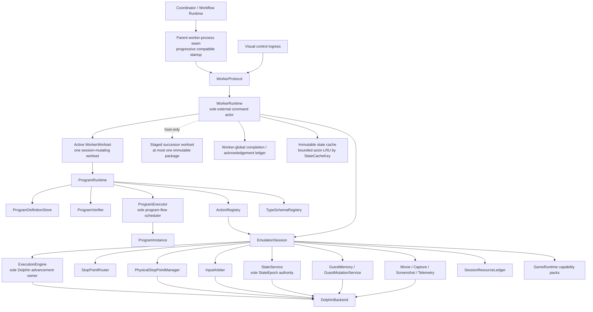

# Target Execution Architecture

## Scope

This document describes the target component responsibilities, authority boundaries, control-flow
ownership, and worker/session lifecycle. Concrete names and API shapes may adapt as implementation
evidence develops; the single-owner boundaries and cleanup rules are the constraints to preserve.

This document incorporates the session, execution-engine, router, input-arbitration, state-service, and
thread-ownership conclusions from the read-only worker breakpoint-router analysis. It supersedes that
analysis where it retains a separate `PhaseScriptInterpreter`, `InputMacroEngine`, descriptor-selected
program factory, or "shrunken VM." The target has one `ProgramRuntime` subsystem and one
`ProgramExecutor`.

## Purpose and non-goals

The target must make every bounded phase program use the same execution machinery while allowing
orthogonal game capabilities, passive observers, router-requested interruption handlers, visual
debugging, and workflow composition to coexist safely.

This document defines:

- the boundary from worker protocol ingress to Dolphin;
- the sole owners of external commands, program flow, emulator advancement, physical stop points, pad
  publication, and guest-state replacement;
- the serialized control model and allowed background-thread behavior;
- invocation lifecycle, suspension, cancellation, and session disposition;
- the relationship between `WorkerRuntime`, `ProgramRuntime`, `ProgramExecutor`, and
  `EmulationSession`; and
- the architectural test for adding a phase without modifying central runtime code.

This document does not define:

- concrete C++ class declarations, ownership pointer types, or coroutine libraries;
- changes to SavorDb SQL/schema or migrations, durable queue/claim lifecycle, workflow persistence,
  result-projection transaction boundaries, or artifact-storage interfaces. The pre-6A hard cutover
  does remove obsolete timing fields from public authoring interfaces and newly generated arguments;
  the six physical timing columns remain ignored behind private neutral insert shims until a separate
  database refactor removes them. Document 06 permits ordered batch claim, exact-set lease renewal,
  claim/start validation, and targeted terminal reconciliation interfaces over the same durable records
  and semantics;
- byte-level worker messages;
- the typed program IR, which is fixed in document 03;
- individual action schemas, which are fixed in document 04;
- workflow/frontier persistence redesign, which is outside this refactor and treated as an unchanged
  external boundary in document 06; or
- the game algorithm for any particular phase.

## Current code evidence

The present worker is a useful executable composition root, but its control authority is not isolated:

- `SavorWorker/SavorWorker.cpp:204-240` constructs `DolphinWrapper`, loads the game, builds the
  breakpoint map, and constructs `PhaseScriptVM` directly over both.
- `SavorWorker/SavorWorker.cpp:273-342` starts a visual-control thread that calls
  `pauseEmulationBlocking`, `resumeEmulation`, and `stepOneFrameBlocking` on `DolphinWrapper`, while also
  mutating VM visual-debug state.
- `SavorWorker/SavorWorker.cpp:355-472` keeps the active `PhaseScript`, selects it by numeric
  `ProgramKind`, decodes a program-specific payload, and executes the VM on the pipe-processing thread.
- `SavorCore/Runner/Script/PhaseScriptVM.h:35-77` makes the VM a direct `DolphinWrapper` client and a
  private implementation of three input-macro host/provider interfaces. The same object also stores
  breakpoint scopes, visual-debug flags, macro state, and one in-memory snapshot.
- `SavorCore/Runner/Script/PhaseScriptVM.cpp:125-167` clears watchpoints, disarms prior breakpoints,
  loads a savestate, arms the next program's breakpoints, and captures the per-job baseline during VM
  initialization.
- `SavorCore/Runner/Script/PhaseScriptVM.cpp:170-325` dispatches generic language flow, emulator
  lifecycle, memory, input, capture, TAS, and battle/navigation domain operations from one opcode switch.
- `SavorCore/Runner/Script/PhaseScriptVMControl.cpp:57-103` loads and saves the VM snapshot and replaces
  the globally enabled breakpoint set.
- `SavorCore/Runner/Script/PhaseScriptVMControl.cpp:162-369` publishes input, directly steps the core,
  replaces enabled breakpoints, and calls `runUntilBreakpointFlexible` as one operation.
- `SavorCore/Runner/Script/PhaseScriptVMInput.cpp:15-20` directly steps frames/opcodes, toggles all
  breakpoints, records movies, and publishes input.
- `SavorCore/Runner/InputMacro/IInputMacroHost.h:38-58` requires a macro host to acquire an exclusive
  session, run to breakpoints, step, read memory, neutralize input, clear watchpoints, and restore
  breakpoint state. `PhaseScriptVM` currently implements that authority.
- `SavorCore/Core/DolphinWrapper.h:32-240` combines lifecycle, savestates, raw memory, pad publication,
  frame/opcode stepping, physical breakpoints, memory watchpoints, capture startup, and run-until
  behavior in one public facade.

The router analysis records the resulting conflicts in
`D:\SoAInvestigate\Analyses\20260723_2107_savor_worker_breakpoint_router\20260723_2107_savor_worker_breakpoint_router_architecture_summary.txt`:

- lines 83-212 identify split physical-breakpoint ownership, destructive enabled-state replacement,
  implicit input ownership, stepping bypasses, VM-owned capture lifetime, and unsynchronized thread
  mutation;
- lines 214-473 define the reusable session-service direction;
- lines 717-729 state the single-owner invariants; and
- lines 735-787 stage the session, physical-stop, router, execution, and input-arbitration extractions.

Those observations describe the legacy path that motivated the cutover. Slices 1 through 4 establish
the worker actor, session, physical-stop router, execution owner, and generic scoped services. Slice 5
now adds the canonical `ProgramRuntime` model/store/verifier/executor, registries, actor-queued action
seam, concrete internal `SessionProgramActionHost` service bindings, initial source-backed packs, and
composition frontends. The legacy VM remains
production-disconnected. Current-program migration and production `ProgramInvocation` capability
activation do not yet exist.

## Core architectural constraints

### Top-level composition

There is one path for program execution:

1. The pre-6A parent worker-process seam launches and completely negotiates one compatible worker,
   supports direct one-item process tests, and then starts the rest of the desired pool progressively
   with at most two concurrent startups. It keeps the coordinator data plane disabled. Slice 7 applies
   the same gate only after that first worker proves `CompleteExact`: exactly the planned nine module
   IDs/hashes, their exact dependency manifest, and no extra installed module. Only then may DB work
   open while the rest of the desired pool continues starting.
2. `WorkerProtocol` translates external framing into one typed `SubmitWorkset` command containing one
   to the declared maximum number of items.
3. If no workset owns the session, `WorkerRuntime` accepts the command as the active workset. While one
   active workset exists, it may accept at most one additional command as an immutable host-only staged
   successor package.
4. Staging validates the complete static item set and shared `WorkerWorksetExecutionKey`, resolves
   cached modules, validates typed inputs, reads and hashes immutable artifacts, and may acquire bounded
   module/state-cache leases. It does not bind a session or epoch, restore state, capture a baseline,
   acquire session-effect resources, construct a `ProgramInstance`, or advance Dolphin.
5. On initial activation or clean staged-successor promotion, `StateService` prepares the workset's
   declared source from its exact artifact or immutable cache entry. A multi-item active workset then
   prepares one reusable composite `ProgramBaselineDefinition`; a one-item workset does not. Its ordered
   `ProgramBaselineComponent`s include the savestate, exact movie continuation, and runtime-facing
   program-kind adapter-declared derived state. The first item uses the prepared state. Before every
   later item, `RestoreBaseline` prepares all components as one transaction, returns one
   `PreparedProgramBaselineReceipt`, and advances `StateEpoch` exactly once.
6. Immediately before admitting an item, `WorkerRuntime` binds its immutable template to the exact
   current session and epoch. `ProgramRuntime` resolves and verifies the exact module/dependency closure
   and constructs the worker's sole executing `ProgramInstance`.
7. `ProgramExecutor` advances that instance until it returns, fails, reaches a budget boundary, or
   awaits one registered action.
8. `ProgramRuntime` validates and dispatches the requested action through `ActionRegistry`.
9. Session services perform the bounded effect. Any emulator advancement goes through
   `ExecutionEngine`.
10. The typed completion is delivered back to `ProgramRuntime`; `ProgramExecutor` resumes only the
    matching continuation.
11. On every execution-terminal path, `ProgramRuntime` unwinds that item's invocation scope and returns
    one typed execution outcome plus its declared output captures to `WorkerRuntime`.
12. `WorkerRuntime` promotes any synchronously captured immutable output into the bounded worker-global
    completion/acknowledgement ledger. The actor assembles and publishes the authoritative
    `ProgramResult` only after every required host finalizer completes; another active item may begin
    after clean unwind while that host-only work remains pending when ledger capacity permits.
13. After every active item has either produced a completed execution record with required immutable
    output captured or been classified unstarted, the complete invocation/workset session scopes and
    baseline lease have released, and the session is proven clean, the staged successor may promote even
    while older outputs finalize or terminals await acknowledgement if the global ledger has capacity.
    A completed workset's bookkeeping summary waits for output finalization and exact acknowledgements
    but does not continue owning the session.

No alternate native-controller, input-macro-controller, user-script, or phase-specific execution path
is permitted.

### Worker worksets

A `WorkerWorkset` is one transient, finite, static, ordered set of independent invocation templates. The
complete membership and order are validated at `SubmitWorkset`; an active or staged workset cannot
append, generate, reorder, or replace items. A one-item workset is the ordinary invocation path, so
there is no second single-job command or executor.

Every item shares one exact `WorkerWorksetExecutionKey`:

- exact module ID, revision/hash, entrypoint, and dependency closure;
- runtime, game, disc, backend, and required-capability profile;
- exact caller-declared `ProgramBaselineKey` covering source-state identity/hash/lineage, movie
  continuation, and adapter-declared derived state; and
- execution, input, capture, movie, mutation, and other relevant service policies that affect common
  session preparation.

Per-item invocation/attempt/cancellation correlation, typed input value, structural limits, and
provenance may differ. Any incompatible item rejects the complete workset before state mutation.
Workset bounds cover item count, encoded bytes, active and staged resident-item capacity, and the
worker-global unacknowledged-terminal count and bytes. A workset carries no aggregate elapsed-time
budget and cannot impose one on its children.

The workset is an efficiency and transport construct owned by `WorkerRuntime`; it is not a
`ProgramModule`, `ProgramInvocation`, `ProgramInstance`, IR instruction, phase controller, workflow, or
durable scheduler. Item order cannot carry a dependency. If one item needs another item's output, that
relationship remains ordinary program composition or durable workflow composition.

Claim/start authority for the complete finite membership is validated before `SubmitWorkset` and worker
acceptance. Once accepted, clean children proceed in immutable order without a coordinator authorization
pause between items. Later lease loss, supersession, or user cancellation arrives asynchronously as an
exact item/workset cancellation. Item-start events remain authoritative ordering facts, but recording
one does not authorize the worker's next effect.

One active workset alone may prepare or mutate the `EmulationSession`. At most one additional successor
may exist as a host-only immutable staged package. Staging is intentionally useful work: bounded decode,
complete-key and item-schema validation, module/dependency cache resolution, immutable artifact I/O and
hash verification, and acquisition of scoped module/state-cache leases. It remains forbidden from
restoring guest state, binding `SessionId`/`StateEpoch`, capturing a reusable baseline, acquiring any
session-effect resource, constructing a `ProgramInstance`, or dispatching an action.

The process/session-owned immutable state cache is bounded by count and bytes and reclaimed by an
actor-owned LRU. Its `StateCacheKey` covers exact serialized-state hash and lineage, disc/runtime/backend
compatibility, movie-continuation identity, and session generation. Entries contain only immutable
serialized bytes plus validated metadata. A scoped cache lease prevents eviction while a staged or
active workset references an entry; it does not authorize restore or represent a live epoch-bound state
handle. The active workset's baseline remains a separate session resource and is released before a
staged successor promotes. `ProgramBaselineDefinition`, `ProgramBaselineKey`, and
`PreparedProgramBaselineReceipt` cover the complete savestate, movie-continuation, and adapter-declared
derived-state transaction; `RestoreBaseline` cannot admit a child from a partial component result.

Completed execution records, promoted immutable outputs and pending finalizers, and published item
terminals are owned by one bounded worker-global completion/acknowledgement ledger keyed by exact
workset, item ordinal, invocation, attempt, and terminal identity/order. Ledger entries may outlive their
originating active workset. Full negotiated count or byte capacity keeps Dolphin paused and blocks later
item admission or staged promotion; it does not permit loss, overwrite, or aggregate acknowledgement.

The initial configurable limits are exact: 16 items and 32 MiB encoded bytes per workset, 64 total worker
item credits, 32 active-plus-staged items, 16 state-cache entries/512 MiB, two finalizer threads, eight
pending captures/256 MiB, and 32 retained authoritative terminals/128 MiB. The coordinator may buffer
at most one additional workset per negotiated Ready worker. Later measurement may tune these structural
and resident-resource values without introducing an elapsed execution bound.

### Predicate composition boundary

Reusable predicate composition is a module-authoring facility, not another component in the live
execution graph. The shared library accepts pure typed predicate definitions plus explicit `Check` use
policies and lowers them into a `ProgramModule`'s ordinary IR, exact imports, scoped resource operations,
and declared emissions before verification.

At runtime there is no `PredicateRuntime`, predicate scheduler, predicate VM, or predicate-specific
dispatch path. `ProgramExecutor` executes the lowered control flow, registered actions acquire typed
observations, and existing session services own emulator advancement and stop subscriptions. A predicate
definition owns none of those facilities.

### Semantic-observation composition boundary

Semantic observation is also a module-authoring facility rather than a live runtime component.
Capability packs define logical `SemanticPointDefinition`s and typed address/query definitions; module
builders bind them through `SemanticAwaitDefinition` and `ObservationUse` policies. Before verification,
the composer lowers each use into exact imports, scoped router subscriptions, ordinary
`continue_until`/frame-step/read/query actions, typed values, branches, and declared emissions.

The router may acquire only a bounded `HitTimeSample` needed to qualify or describe a matched hit.
Ordinary guest reads and coherent domain queries execute while paused through registered actions.
Post-effect evidence is acquired at a declared later semantic point, or after an explicit frame step
when frame granularity is the actual contract; guest PowerPC instruction stepping is not part of the
target action or execution surface. Every point receipt, observation, guest-derived handle, and baseline
is bound to the current `StateEpoch`; unavailable evidence remains distinct from a false or zero value.

There is no `ObservationRuntime`, query VM, observation opcode family, filesystem access, database
access, or persistence catalog. Predicate composition consumes these typed observations rather than
reconstructing its own breakpoint/read mechanism.

### Interaction composition boundary

Interaction composition turns a finite set of typed input segments plus pure initialization/advancement
reducers into ordinary subprogram control flow. A segment binds input acquisition and acknowledgement,
semantic gates, exact stop receipts, a declared semantic completion policy, observations/checks,
budgets, and completion mapping. Reducers may select only segment identities already visible to module
verification; they cannot dynamically construct effects.

The lowered program holds one input lease across the interaction and uses nested router/observation
scopes. Input publication, exact current-receipt suppression, ordinary continuation to a declared
semantic gate or successor, exact point matching, request acknowledgement, neutral release
acknowledgement, and unwind remain explicit action/receipt dependencies. No
`InteractionRuntime`, `InputMacroEngine`, native phase controller, private cancellation path, or
whole-macro action is permitted.

### Capture compatibility boundary

The existing `savor.capture.profile/1` document remains an opaque configuration interpreted by
`CaptureService`. Initially the service preserves its parser, filters, predicate bytecode, address
programs, dynamic watchpoints, PC/post-write sampling, sampling order and retention policies, windows,
flight recorders, queues/drop/coalescing behavior, progress/event ordering, and artifact finalization.
This refactor does not replace that language with a generalized capture plan.

`CaptureService` is passive. `StopPointRouter` and `ExecutionEngine` own wake/control authority, while
capture observes the same matched routed event so existing profile control subscriptions, flags,
metrics, control-triggered windows/recorders, and synthetic control events retain their meaning. One
routed hit carries the same sequence, snapshot, and epoch identity through control, capture, and
progress views.

### Component responsibilities

| Component | Sole responsibilities | Explicitly forbidden responsibilities |
|---|---|---|
| Parent worker-process seam | Launch/negotiate one compatible worker, progressively start the remaining desired pool with at most two concurrent startups, expose process capabilities/limits, and support direct one-item tests with the transferred test-only module before Slice 7 | Claiming or starting DB work before `CompleteExact` proves exactly the nine production modules and no extras, interpreting programs, mutating a worker session |
| `WorkerProcess` | Process arguments, logging, pipe handles, process shutdown, and construction of the worker object graph | Dolphin policy, program interpretation, phase selection, direct execution control |
| `WorkerProtocol` | Decode/validate transport frames into typed commands, including bounded worksets, and serialize worker events/results/acknowledgements | Mutating session state, selecting a controller, interpreting `ProgramKind` as an executor |
| `WorkerRuntime` | Serialize external commands, own exactly one session, one active session-mutating workset, at most one host-only staged successor, the bounded immutable state-cache leases, and the worker-global completion/acknowledgement ledger; prepare/promote/admit/cancel ordered items, bind exact current session/epoch, enforce session disposition, coordinate visual control and shutdown | Interpreting IR, implementing phase logic, dynamically creating workset items, allowing staged work to acquire session authority, physically manipulating stop points |
| `EmulationSession` | Own the live backend and all session-scoped services; expose capability interfaces to registered actions | Workflow scheduling, module selection, phase-specific control loops |
| `DolphinBackend` | Narrow adapter for primitive boot/run/frame-step, physical debug objects, raw memory/register access, pad publication, state/movie/screenshot primitives, and CPU-thread callback ingress | `ProgramKind`, IR, action IDs, game policy, router priority, workflow identity |
| `ExecutionEngine` | Own one actor-driven foreground emulator operation, routed-stop consumption, centralized core-health monitoring, bounded host pause confirmation, and primitive movie/VI/throttle policy | Threads, nested event loops, program control flow, pad publication, movie lifecycle, phase elapsed-time policy, or physical stop-point ownership |
| `StateService` | Own every boot/reboot/restore transaction, compatibility and immutable state evidence, state/movie checkpoint pairing, and the authoritative monotonic `StateEpoch` | Ambient/latest artifact selection, workflow persistence, cold restoration of in-progress recording |
| `SessionResourceLedger` | Own actor-sequenced resource receipts, synthetic/session scopes, promotion, reverse-order unwind, epoch transition/rebind requests, cleanup continuations, and cleanup disposition | Calling Dolphin, interpreting program flow, or embedding service-specific cleanup policy |
| `ProgramRuntime` | Own definition storage, verification, executor, action/type registries, one active instance lifecycle, effect dispatch, resource unwind, and one-item result assembly | Advancing Dolphin directly, interpreting or scheduling worksets, scheduling durable workflow work |
| `ProgramExecutor` | Interpret the canonical IR and exclusively advance program control flow | Calling Dolphin/session services directly, running native phase controllers |
| `ProgramInstance` | Hold mutable state for one invocation: instruction location, call frames, typed values, pending continuation, scope stack, epoch, emissions, and diagnostics | Threads, virtual controller behavior, worker commands, Dolphin handles |
| `ActionRegistry` | Resolve exact action descriptors, enforce `CancellationDriven` versus `BoundedHostOperation` timing classification, and dispatch a validated request to its handler | Choosing subsequent program branches or owning a whole phase |
| `TypeSchemaRegistry` | Resolve exact type/schema dependencies and validate values at module, action, result, and artifact boundaries | Persisting workflow topology or silently converting incompatible values |

### Exclusive authority invariants

The following are architectural constraints, not conventions:

1. `WorkerRuntime` is the only receiver of commands that may alter the session.
2. `ProgramExecutor` is the only component that may advance program control flow.
3. `ExecutionEngine` is the only component that may transition the emulated core into running or issue
   a post-open frame advancement.
4. `PhysicalStopPointManager` is the only component that may install, remove, enable, or disable a
   physical Dolphin PC breakpoint or memcheck.
5. `InputArbiter` is the only component that may publish controller state to Dolphin.
6. `StateService` is the only component that may boot, reboot, load, restore, or save emulation state and
   the only component that establishes or advances guest `StateEpoch`.
7. `GuestMutationService` is the only program-facing path for guest data writes or executable patches.
8. `MovieService` owns movie start/stop state; passive `CaptureService` owns existing-profile
   interpretation, capture attachment, observation, publication, and artifact finalization, but cannot
   create a foreground control wait or advance/pause emulation.
9. Programs, action handlers, reducers, capability packs, visual readers, transport callbacks, and
   background workers cannot call `DolphinBackend` directly.
10. Every emulator-advancing operation remains under `StopPointRouter` supervision, including frame
    stepping, input-sequence playback, and requested interruption-handler child operations.
11. `SessionResourceLedger` is the authoritative cleanup record for session and future invocation
    resources. Services execute their own typed release operations; the ledger determines ordering,
    retry/continuation, epoch disposition, and whether cleanup requires session taint.
12. `WorkerRuntime` may retain one active workset and one immutable host-only staged successor, but it
    admits at most one executing `ProgramInvocation` and owns at most one `ProgramInstance` at a time.
    Staging and worker-global terminal retention never grant parallel access to the session.
13. The active workset releases every invocation/workset session resource and baseline lease before a
    staged successor promotes. Unacknowledged terminals survive only in the bounded worker-global
    completion ledger and do not extend session ownership.

These invariants must be enforceable through dependencies: forbidden callers shall not receive a
backend reference or a capability broad enough to reconstruct one.

### Worker control and threading model

`WorkerRuntime` is a single logical actor even if the implementation later uses a coroutine scheduler
instead of one OS thread.

- Pipe ingress, visual-control ingress, cancellation, and shutdown become typed commands in one queue.
- Commands that can affect emulation are executed serially on the worker control actor.
- Exactly one finite static workset may own session mutation, at most one immutable successor may be
  staged host-only, and exactly one invocation/instance may execute.
- Staging work completes through the actor as bounded immutable preparation. Artifact readers or cache
  helpers may perform documented background I/O, but their completions can publish only immutable bytes,
  metadata, and lease receipts; they cannot mutate session state or promote themselves.
- Workset item order and actor-assigned admission order are deterministic. Item completion does not
  permit another item to start until invocation unwind has released that item's scope and the session
  disposition plus worker-global completion-ledger capacity permit admission. It does not introduce a
  per-item coordinator authorization pause after the workset was accepted.
- Exactly one foreground `ExecutionEngine` operation may advance the core at a time.
- A program waiting for an action is suspended data, not a blocked private event loop.
- A router interceptor may request a verifier-known interruption handler. `ExecutionEngine` suspends the
  foreground execution operation and runs that handler through the same engine. The parent operation
  retains its completion condition, input relationship, health baseline, and suppression state.
- Parent and nested-child execution is cancellation-driven. Suspension freezes ownership and health
  eligibility rather than preserving a phase-provided wall-clock or VI-stall budget. Each child retains
  its own cancellation token and structural limits.
- Interruption descriptors form a trusted immutable registry. They declare allowed child-operation
  kinds, allowed nested keys, recursion policy, and a maximum depth no greater than eight. A child returns
  only `ResumeParent` or `AbortParent`; it cannot directly complete a parent condition or invocation.
- CPU-thread hooks may only perform bounded, allocation-free matching/sampling against immutable
  dispatch state and enqueue raw events. They cannot call program logic, publish input, or wait for the
  worker control actor.
- Capture/artifact writer threads may perform passive buffering and I/O. They cannot mutate emulator
  run state, program state, input, physical stop points, or `StateEpoch`.
- All outbound worker messages pass through one serialized publisher. Per-item terminal results transfer
  into one worker-global non-lossy bounded ledger and remain replayable until exact durable
  acknowledgement; when the ledger is full, the actor keeps Dolphin paused and admits or promotes no
  new item/workset. Progress and optional diagnostics may use their declared coalescing/drop policies.
  Callback and recorder threads enqueue telemetry rather than writing transport frames directly.
- Private threads and nested event loops inside actions, reducers, or program definitions are forbidden.
  A service may own a documented background facility, but its effects return through the worker actor.

### Worker lifecycle

The logical worker states are:

| State | Meaning | Accepted mutating commands |
|---|---|---|
| `Starting` | Backend/session construction is incomplete | `Shutdown` |
| `Ready` | Session is clean and no active workset or invocation owns it; a host-only staged successor and global terminal entries may still exist | `SubmitWorkset` when active/staged capacity permits, allowed visual/session commands, `Shutdown` |
| `Running` | One active workset owns session scope; at most one admitted item owns an invocation root; at most one successor is staged host-only | exact item cancellation, active or staged workset cancellation; policy-allowed visual commands are queued |
| `InteractivelyPaused` | The execution operation is safely suspended under an invocation that permits visual debugging | `ResumeInteractive`, allowed frame step, exact item cancellation, workset cancellation, `Shutdown` |
| `Cancelling` | Cancellation is propagating and scopes are unwinding | `Shutdown`; later commands wait or are rejected |
| `Recovering` | A clean, declared session recovery is in progress | `Shutdown` |
| `Tainted` | Mandatory cleanup or state-integrity verification failed | `Shutdown` or an explicit full-session rebuild command; no invocation |
| `Stopping` | Ingress is closed and owned resources are being released | none |

An invocation has its own lifecycle:

`Created -> Verified -> PreparingState -> Running -> AwaitingAction <-> Running -> Unwinding -> Finished`.

`Rejected` is terminal before state preparation. `Cancelled`, `TimedOut`, `Failed`, and `Completed` all
pass through `Unwinding`. No terminal outcome skips cleanup.

The active workset's session-owning lifecycle is separate from result acknowledgement:

`Accepted -> PreparingState -> RunningItems <-> AwaitingCompletionCapacity -> ReleasingSession -> SessionReleased`.

`PreparingState` establishes the common source and, for a multi-item workset, its reusable baseline.
`RunningItems` contains at most one invocation lifecycle. `AwaitingCompletionCapacity` is paused
host-side backpressure caused by the worker-global completion ledger, not a suspended
`ProgramInstance`. `ReleasingSession` synchronously captures and promotes any required immutable
session output, releases the complete invocation/workset session scopes and baseline lease, and proves
the session clean. Host-only hashing/publication/validation remains in the completion ledger. At
`SessionReleased`, a staged successor may promote if the global ledger has capacity even though outputs
from the prior workset are still finalizing or terminals remain unacknowledged.

The staged successor remains an immutable host-only package while it waits. It may complete bounded
decode, dependency/input validation, immutable artifact reads and hashing, and cache-lease acquisition,
but has no session lifecycle until promotion.

Completed execution records, pending finalizers, and published terminals independently progress through
the bounded worker-global completion/acknowledgement ledger. A workset's bookkeeping-only terminal
summary is emitted only after every child has an authoritative terminal or unstarted classification,
output finalization is complete, and every required item acknowledgement has been correlated. Waiting
for that summary does not retain the session, invocation resources, or baseline.

During the Slice 3 hard-cutover interval, a Ready visual-intent session may also have an execution
substate of `IdlePaused`, `InteractiveRunning`, `HandlingInterruption`, or `Failed`. This does not create
another worker lifecycle or an invocation. An invocation may begin only from `Ready + IdlePaused`.
`InteractiveResume` is the sole intentionally unbounded engine operation and ends at a subsequent safe
pause, routed terminal, shutdown, or failure.

### External and visual commands

The logical worker command surface includes:

- prepare/cache a module by exact identity;
- submit one bounded workset containing one to many ordered item templates under one
  `WorkerWorksetExecutionKey`, either as the active workset or the one host-only staged successor;
- cancel one exact pending, active, or staged workset item;
- cancel one exact active or staged workset;
- acknowledge durable handling of one exact item terminal;
- request a safe interactive pause;
- resume or perform an allowed debug frame step;
- request a screenshot or read-only diagnostic snapshot; and
- rebuild or shut down the session.

This logical surface is carried additively by WRMS version 1; the prelude does not increment the
protocol version.

The former single-item `SubmitInvocation` discriminator remains reserved. Receiving it rejects the
request before session mutation; it is not renumbered or reused. One-item execution uses
`SubmitWorkset`.

Exact item cancellation, workset cancellation, and shutdown are always accepted. A pending or staged
item cancellation produces an authoritative not-started cancellation terminal without state mutation.
Cancelling the staged successor closes its admission, classifies its remaining items before start, and
releases only host cache leases. An active item cancellation follows the ordinary invocation unwind;
after clean unwind the workset may continue unless the whole active workset was cancelled. Active
workset cancellation closes further admission, classifies every pending item as cancelled-before-start,
and cancels the active item through that same path. Duplicate, stale, mismatched, or already-terminal
cancellation is rejected without changing the session.

Screenshot and telemetry requests may execute
while a program is active only if they do not advance or mutate the core. The current screenshot request
is one synchronous actor-owned backend call; cancellation cannot preempt it after dispatch until
nonblocking backend/actor ingress is added. Pause, resume, or frame-step commands during an invocation
are accepted only when the invocation's execution policy allows interactive debugging. Guest PowerPC
instruction stepping is not a worker control. Its former WRMS numeric discriminator remains reserved
and is rejected before session mutation rather than being renumbered or reused. Otherwise commands
receive a typed rejection. The visual pipe never calls Dolphin or VM methods directly.

Slice 3 adds the serialized command/protocol seam for a session opened with visual intent, but does not
restore DB-backed visual replay or production `ProgramInvocation`. Headless sessions reject these
controls. Focused verification uses a fake visual-intent session and protocol fixtures; it does not create
a render window, automate a GUI, compare screenshots, or require manual observation.

### Program-level and execution-level suspension

Two suspension kinds exist and shall not be conflated:

- **Program suspension:** `ProgramExecutor` reaches `await action`, stores a typed continuation in the
  `ProgramInstance`, and returns control to `ProgramRuntime`.
- **Execution suspension:** `ExecutionEngine` pauses a foreground emulator operation so it can process a
  guard or execute a requested interruption handler through a structured child operation.

An action completion identifies the invocation, action request, continuation, and originating
`StateEpoch`. Stale, duplicate, or mismatched completions are rejected and cannot advance program flow.
An interruption-handler child operation cannot directly resume the program; it completes back into the
parent action, which returns one typed action completion to `ProgramRuntime`.

A future debugger may expose `StepProgramInstruction`, but that is a program-level operation rather
than emulator instruction stepping. It advances exactly one verified IR instruction or terminator. If
the current instruction is `await action`, request dispatch through matching typed completion is one
atomic debugger step; no half-dispatched effect is exposed. The before/after snapshots retain exact
module, function, block, instruction, and source-map identity. Cancellation and unwind remain
authoritative, so a step cannot strand a resource scope, pending action continuation, or deferred
compensation. Its implementation, worker protocol, and UI are deferred.

### Extension rule

A new phase that can be expressed with existing actions and schemas shall require only:

- a new or revised `ProgramModule`;
- its typed input/output/emission schemas; and
- reusable predicate definitions or `Check` uses composed through the shared frontend library where
  useful;
- reusable semantic points, awaits, observations, and interaction definitions/uses composed through the
  shared frontend libraries where useful; and
- program-kind handler or adjacent integration-adapter mappings through existing SavorDb interfaces and
  stored representations.

It shall not require a change to `WorkerRuntime`, `ProgramRuntime`, `ProgramExecutor`,
`ExecutionEngine`, `StopPointRouter`, worker transport core, or a central opcode table. A genuinely new
machine/game capability may add a bounded action and capability-pack implementation, but does not add an
executor or controller. Adding or reusing a predicate changes only the composing module and its exact
action, reducer, type, and capability dependencies. The same is true for semantic observations and
interaction segments.

## Interfaces and ownership affected

### Session service boundary

`EmulationSession` exposes narrow logical services:

| Service | Program-visible through actions? | Owns |
|---|---|---|
| `ExecutionEngine` | Indirectly | Continue/frame-advance operations, cancellation, centralized core health, structured suspension |
| `StopPointRouter` | Indirectly | Logical subscriptions, routing order, wake/intercept/guard decisions |
| `PhysicalStopPointManager` | No | Physical PC breakpoints, memchecks, immutable CPU dispatch snapshot |
| `GuestMemory` | Through checked read/query actions | Paused-safe typed reads and symbolic resolution |
| `GuestMutationService` | Through declared mutation actions | Checked writes, patches, receipts, restoration |
| `InputArbiter` | Through input actions | Epoch-bound leases, pad publication, poll acknowledgement, neutral release, typed arbiter-issued neutral borrow witnesses, declared interruption borrowing, movie-exclusive reservations, and `IInputAdvancePort` |
| `StateService` | Through state actions and invocation state policy | Sole `StateEpoch` authority; boot/reboot/restore transactions; bounded memory handles; caller-declared immutable artifacts, SHA-256, compatibility, lineage, optional exact embedded read-only DTM history, and same-session-only recording handles |
| `MovieService` | Through movie actions | Read-only playback/recording lifecycle, unsuspendable input reservation, hash-verified DTM history, active-DTM identity, and restoration policy |
| `CaptureService` | Through capture actions | At most one opaque existing-profile attachment, passive routed-hit observation, restore rebind, recorder lifecycle, mandatory publication/finalization, and taint that blocks reuse |
| `ScreenshotService` | Through screenshot actions | One correlated synchronous actor-thread bounded screenshot call and typed terminal receipt; active cancellation deferred pending nonblocking ingress |
| `TelemetryBus` | Through bounded emit actions | Monotonic ordered progress/diagnostic events, order-preserving coalescing, serialized publication |
| `SessionResourceLedger` | Indirectly through runtime scope operations | Typed receipts, reverse-order release, state-epoch disposition/rebind, cleanup continuations, and taint disposition |
| `GameRuntime` | Through named capability packs | Skies-specific address catalogs, queries, actions, and schemas |

Actions receive only the specific service capabilities declared by their descriptor. They do not receive
the whole `EmulationSession`.

### Stop-point and execution relationship

`StopPointRouter` owns logical subscription semantics. `PhysicalStopPointManager` derives the physical
union from those subscriptions. A program/action owns tokens for its subscription group, not an enabled
PC set. Removing a scope removes only that scope's subscriptions.

Every `ExecutionEngine` request declares:

- completion conditions;
- movie-ended behavior;
- cancellation token;
- optional opaque input-advance relationship;
- throttle policy;
- interruption policy; and
- the current `StateEpoch`.

Stop delivery is ordered as passive observations/progress, guards, interceptors, then the foreground
wake condition. An unclaimed physical stop is a typed debugger/policy event, not a string reason guessed
by the VM.

The engine is actor-driven and owns no thread or nested blocking loop. `WorkerRuntime` drains accepted
stop receipts into it before accepting the next external command, then pumps backend confirmations,
environment observations, cancellation, and centralized health observations. A condition-variable wait
uses a short maintenance cadence only while confirmation, movie observation, or health observation is
required; deterministic tests inject the clock.

### Centralized core health

`EmulationSession` owns one health monitor used by every engine operation. It begins an eligible interval
only after engine-owned advancement is confirmed running. VI/CoreTiming advancement or a change in the
session's synchronous host-activity generation proves progress and resets the baseline.

Native routing, bounded sampling, synchronous capture observation, stop reconciliation, state
replacement, handler suspension, and paused host actions register or imply ineligible host activity.
CPU-hook registration is atomic, allocation-free, and `noexcept`; actor-side registration is scoped.
Background artifact finalization is not guest-blocking and does not affect the monitor.

Production defaults emit `SuspectedCoreStall` after ten eligible seconds without progress and confirm
after ten additional eligible seconds. A synchronous host activity warns after ten seconds and every
thirty seconds thereafter without becoming a core-stall failure. If actor-owned synchronous work
prevents the actor from publishing while the scope is active, the tracker retains its duration and the
next actor pump publishes every crossed warning threshold. Completed scopes use a bounded lock-free
diagnostic buffer; saturation is itself an explicit health diagnostic rather than a silent drop.
Confirmed stall requests a safe pause:
proven pause, health, and cleanup produce `CoreStalled` plus `CleanWithDiagnostics`; unproven integrity
taints and shuts down the session. This policy is not part of a module schema, workset key, fingerprint,
database row, or invocation budget.

The private execution-backend facet exposes only pause, resume, frame-step,
core/PC/VI/movie/throttle observation, and throttle apply/restore primitives. It exposes no guest
PowerPC instruction-step primitive. Slice 4 implements the input-synchronized collaboration through
`InputArbiter`: the engine validates an opaque lease binding, prepares each publication before
advancement, and observes its acknowledgement afterward. The engine still never publishes controller
state itself.

`DolphinWrapper::stepBootCoreForStateLoadBlocking` remains a private, isolated state-replacement
preflight exception. `StateService` may reach it only through its backend-owned boot/load transaction
when Dolphin requires one bootstrap opcode before accepting a state load. It is not exposed through
`ExecutionEngine`, an action, worker control, program debugging, or any post-open advancement surface;
it cannot satisfy an observation or interaction wait. The replacement publishes its receipt and new
`StateEpoch` only after the complete transaction succeeds.

### Game capability packs

Dependency Slice 5 implements the generic `runtime.session` pack and the first independently versioned,
source-backed Skies packs:

- `soa.field`;
- `soa.battle`; and
- `soa.navigation`.

They are compatibility-pinned to the supported USA game/executable/address-map identity and register
exact runtime types, semantic stop points and addresses, coherent battle/navigation query descriptors,
and the pure `soa.battle.materialize_turn_input` reducer. Packs depend on the generic session catalog,
not workflow storage, `WorkerRuntime`, or another executor. Adding a pack does not change existing
module hashes unless a module imports that pack's definitions. `soa.cutscene` and `soa.overworld` remain
deferred until concrete migrated clients define their source-backed inventories; no placeholder pack or
monolithic game facade is introduced.

`ProgramKind` may remain as SavorDb job/handler/queue/affinity, semantic, UI, or workflow-family metadata
during and after migration. Existing persisted affinity and claim data remain unchanged. Once the
program-kind integration adapter constructs an exact runtime invocation, `ProgramKind` cannot select an
executor, controller class, worker-side payload decoder, or worker runtime.

## Failure and cleanup behavior

### Failure ownership

| Failure source | Owning layer | Required outcome |
|---|---|---|
| Malformed transport or unknown command | `WorkerProtocol` | Reject without mutating the session |
| Invalid, unbounded, empty, or mixed-execution-key workset | `WorkerProtocol` / `WorkerRuntime` | Reject the complete active or staged candidate before session mutation |
| Staged decode, immutable-artifact, hash, dependency, or input validation failure | `WorkerRuntime` host-preparation path | Reject only the staged successor, release its cache leases, and leave the active session/workset unchanged |
| Module/dependency/schema/capability mismatch | staged host validation or `ProgramRuntime` verifier path | Reject before state preparation; admission still revalidates any session-dependent requirement |
| IR fail or declared domain terminal | `ProgramExecutor` | Produce typed domain/program outcome, then unwind |
| Action contract violation | `ProgramRuntime` / `ActionRegistry` | Fail invocation, cancel pending effect, then unwind |
| Confirmed core stall, guard failure, backend failure, or bounded host-operation timeout | Session service that owns the operation | Return typed completion/failure to the action; executor follows program policy or fails |
| Exact item cancellation | `WorkerRuntime` | Classify a pending item without mutation or cancel the active action/execution and unwind that invocation |
| Workset cancellation | `WorkerRuntime` | Stop later admission, classify pending items, cancel/unwind the active invocation, then release the workset scope |
| Item-terminal backpressure | `WorkerRuntime` / `WorkerProtocol` | Retain and replay the result, keep the session paused, and admit no new item until exact durable acknowledgement creates capacity |
| Promoted host-output finalization failure | completion ledger plus owning artifact service | Assemble one infrastructure-failed item terminal; do not taint an otherwise proven-clean session |
| Immutable session-output capture or mandatory scope/baseline release failure | owning service plus `WorkerRuntime` | Do not promote the staged successor; taint when clean session disposition cannot be proven |
| Resource restoration failure | Resource-owning service plus `ProgramRuntime` | Record cleanup failure and taint the session |
| Worker process or backend crash | Process/coordinator boundary | Invocation attempt fails; durable workflow decides retry on a fresh worker |

A domain-negative result such as "locked," "not found," or "no anomaly" is not an infrastructure
failure when the action and program completed normally.

### Cancellation and unwind sequence

Active-item cancellation is monotonic:

1. `WorkerRuntime` marks the invocation cancelling and rejects new program effects.
2. `ProgramRuntime` requests cancellation of the outstanding action.
3. The owning service asks `ExecutionEngine` to safely pause/cancel any foreground or
   interruption-handler child operation.
4. `InputArbiter` drives required neutral release and records whether the guest observed it.
5. `ProgramRuntime` resumes no ordinary program branch; it unwinds nested scopes in reverse acquisition
   order.
6. Services return restoration receipts. Cleanup continues after one cleanup failure so the complete
   damage set is known.
7. The result is finalized with independent infrastructure, domain, and cleanup/session statuses.
8. If any mandatory restoration cannot be proven, the session becomes `Tainted` and cannot accept
   another invocation.

Bounded-host timeout and guard abort use the same sequence. Shutdown first closes new admission,
classifies the host-only staged successor as unstarted, performs the active unwind, and drains the
bounded pending artifact finalizers plus already assembled terminal publication for the cooperative
shutdown interval.
Promoted immutable output is never discarded merely because shutdown began. Transport closure and
backend destruction follow that drain attempt; forced process termination leaves any unfinished or
unacknowledged item to the existing per-attempt recovery/idempotency path.

Cancelling one item does not erase or rewrite any other item. Cancelling the workset is monotonic and
prevents every not-yet-admitted item from entering `ProgramRuntime`. The workset result summary is
transport bookkeeping only; every item keeps its own terminal `ProgramResult`.

### Tainted-session disposition

A tainted session is never treated as a clean baseline. `ContinueSession` is rejected. The worker may
recover only through an explicit full-session rebuild that destroys and recreates the backend and then
passes clean-session validation. If rebuild is unavailable or fails, `WorkerRuntime` reports the taint
and exits so the coordinator can replace the worker. Loading an ordinary savestate over an unknown
leaked host resource is not sufficient proof of recovery.

Taint or unproven workset/invocation cleanup stops workset admission immediately. Pending active items
and every staged item remain unstarted and never touch the session; staged cache leases are released.
Already published terminals remain in the worker-global completion ledger until acknowledgement or
process loss transfers recovery to the existing per-item attempt rules. The coordinator retains durable
claim/retry responsibility for every item.

## Dependencies and migration implications

The implementation order is constrained by ownership:

1. Establish `WorkerRuntime` command serialization and route visual commands through it.
2. Extract `DolphinBackend` and the session service boundaries without changing phase behavior.
3. Make `PhysicalStopPointManager` the only physical debug-object owner.
4. Add `StopPointRouter` and map current VM/capture/macro requirements into logical
   subscriptions.
5. Add `ExecutionEngine` and move every run, frame-step, and tape path beneath it.
6. Add `InputArbiter`, `StateService`, mutation, movie, capture, screenshot, telemetry, and the
   standalone resource ledger. This ownership seam is established by Slice 4.
7. Introduce the universal `ProgramRuntime`, canonical v1 model/codec, generic actor-queued action seam,
   and initial modular capability packs. This foundation is established by Slice 5.
8. Before 6A, remove every phase-provided elapsed execution deadline and VI-stall setting, retain
   structural limits and bounded host-only operations, install session-owned core-health and
   synchronous host-activity accounting, and remove public/behavioral use of the obsolete authoring
   timing columns without changing migrations or DDL.
9. Before 6A, implement the parent worker-process seam and workset pipeline: direct one-item process
   tests, the eventual `CompleteExact` gate, at-most-two progressive pool startup, one active session-
   mutating workset, one immutable host-only staged successor, exact `StateCacheKey` leases, and the
   bounded worker-global completion ledger. Transfer one canonical test-only module through the
   ordinary preparation protocol for `Partial` process smoke; it is not one of the nine production
   modules. Keep coordinator data-plane work disabled.
10. Re-author each current phase directly through canonical builders/composition frontends as 6A through
   6I. Legacy source may remain as historical behavior evidence, but it is not a translator or alternate
   executor.
11. In Slice 7, require `CompleteExact` on the first compatible worker: exactly the nine planned module
    IDs/hashes, the exact dependency manifest and workset limits, and no extras. Apply that startup gate
    to activate the coordinator data plane, then progressively start the remaining pool. Program-kind
    adapters continue through the existing SavorDb contracts.
12. Remove each disconnected `PhaseScriptVM` and peer macro-runtime execution path at cutover.

The breakpoint-router analysis stages 1 through 5 remain useful guidance. Its stage 6 is replaced:
implementation shall not merely shrink the current VM while retaining `PhaseScriptInterpreter` and
`InputMacroEngine` as peers. It shall introduce the one universal typed `ProgramExecutor`, re-author
current programs directly through canonical builders/composition frontends, and remove each legacy
execution path at cutover.

No new phase, including Navmesh Survey, should be implemented on a temporary controller path while this
cutover is underway.

## Architecture checks

- Static dependency checks make it impossible for programs, reducers, action handlers, capability packs,
  visual readers, or protocol callbacks to call `DolphinBackend` directly.
- A deterministic fake backend proves that all continue, frame-step, input-sequence, and requested
  interruption-handler advancement contracts pass through one `ExecutionEngine`. No production action,
  backend facet, worker command, or visual control exposes guest PowerPC instruction stepping;
  `InputArbiter` supplies the opaque production input-advance port without giving the engine
  pad-publication authority.
- Concurrent pipe and visual commands are serialized into one reproducible worker command order.
- A staged successor can complete only bounded host preparation and cache leasing. Tests prove that
  staging cannot bind a session/epoch, restore or capture state, acquire a session resource, construct a
  `ProgramInstance`, or advance Dolphin.
- At most one active workset and one host-only staged successor exist, while exactly one
  `ProgramInvocation`/`ProgramInstance` executes. Promotion requires every required immutable
  session-output capture to be promoted, released invocation/workset scopes and baseline, a
  proven-clean session, and worker-global completion-ledger capacity; background finalization may
  remain pending.
- Published terminals remain replayable in the worker-global ledger after their workset releases the
  session. Old acknowledgements do not block clean promotion unless count/byte capacity is exhausted;
  the prior workset's bookkeeping summary still waits for every exact acknowledgement.
- The pre-6A process seam proves the one-worker gate and at-most-two progressive-start behavior with a
  transferred test-only module in a one-item workset while the coordinator data plane remains disabled.
  Slice 7 proves `CompleteExact`, including exactly nine production module IDs/hashes and no extras,
  before applying the gate to DB work.
- A visual frame step cannot bypass an active router interceptor or mutate a non-debuggable invocation.
- Two logical stop-point consumers can share one PC without either replacing the other's subscription.
- A requested interruption handler can suspend and resume a foreground operation while preserving its
  cancellation state, structural limits, and opaque input relationship.
- Slice 3 verification is unattended and non-visual: no rendered worker, GUI automation, screenshot
  comparison, desktop control, or user observation is an acceptance dependency.
- Cancellation from every program suspension point reaches `Unwinding`, releases every scope, and emits
  one terminal result.
- An injected cleanup failure marks the session tainted, rejects a subsequent invocation, and requires a
  full rebuild or worker replacement.
- The same worker can run phase modules `A -> B -> A` with explicit state policy and no leaked input,
  patch, movie, capture, router, or epoch-bound resources.
- Current phase parity can be measured through the new path without running a second permanent executor.
- Adding a phase that uses existing capabilities changes no central runtime component or opcode switch.
- A predicate-composed module normalizes to the same verified IR/action path as an equivalent
  hand-composed module and leaves no predicate-specific runtime dispatch.
- Semantic-observation and interaction compositions normalize to the same verified IR/action path as
  equivalent hand-composed modules and leave no observation- or interaction-specific runtime dispatch.
- Router hit-time samples are bounded; paused reads and coherent queries use registered actions, and
  state replacement invalidates every outstanding receipt, observation, derived handle, and baseline.
- Existing capture profiles retain profile-visible sampling, window, recorder, progress, control-event,
  queue, and artifact behavior without giving `CaptureService` execution authority.
- State/movie tests prove exact SHA-256 and compatibility checks, caller-declared immutable paths,
  explicit external `NoMovie` versus `ReadOnlyPlayback` import, embedded/hash-verified DTM history,
  active-DTM identity checks, same-session memory-handle recording rewind, and rejection of recording
  file-artifact capture/import/restore. External read-only import lets Dolphin restore the movie cursor
  from the savestate and records the observed position; exact cursor matching applies only to internally
  captured checkpoints that already carry one.
- Capture finalization failure taints and blocks another attachment/session reuse; screenshot guards
  prove synchronous actor ownership without claiming active in-flight cancellation; telemetry
  coalescing preserves fresh sequence order.
- Resource tests prove actor-only mutation, atomic receipt acquisition, reverse-order unwind, optional
  diagnostics versus mandatory taint, resumable cleanup, and epoch end/rebind policy independently of
  `ProgramRuntime`.
- Slice 5 focused guards cover canonical `SPRM`/`SPRI`/`SPRR` version-1 encoding, SHA-256 module
  identity, exact definition/dependency resolution, verifier rejection, registry atomicity, source-pack
  inventories, pure battle turn materialization, and ordinary-IR lowering by all three composition
  frontends. They do not claim a production worker invocation or live game-program run.

## Deferred work

- Exact C++ class, interface, worker-internal command-queue, coroutine, and smart-pointer spellings.
- Future worker-message or capability-negotiation changes beyond fixed WRMS version 1 and canonical
  program-envelope version 1.
- Whether the logical worker control actor uses a dedicated OS thread or an equivalent serialized
  executor.
- Multi-console sessions inside one process; the target assumes exactly one `EmulationSession` per
  worker.
- Distributed worker scheduling, claiming, and durable retry remain workflow/coordinator concerns.
  This refactor changes only workset-specific grouping, resident claim/lease use, capacity accounting,
  and result acknowledgement; broader queue or workflow redesign remains deferred.
- Visual debugger UI behavior beyond the locked command and ownership boundary.
- Nonblocking screenshot backend/actor ingress and active in-flight screenshot cancellation.
- Current-phase module migration, handler-adapter cutover, complete-catalog DB activation, and a live
  game-program smoke. The production `ProgramRuntime`, implemented `SessionProgramActionHost`, and
  unified workset process transport are pre-6A dependencies rather than deferred Slice 7 work.
- Source-backed `soa.cutscene` and `soa.overworld` packs and their game-specific algorithms.
- Live state-plus-DTM playback continuation, live post-write capture, and rendered interaction checks
  until deterministic program execution/input and unattended authoritative witnesses exist.
- Measurement-driven tuning beyond the fixed configurable defaults: 16 items/32 MiB/four aggregate
  hours per workset; 64 total and 32 active-plus-staged item credits; 16 cache entries/512 MiB; two
  finalizer threads with eight pending captures/256 MiB; 32 retained terminals/128 MiB; two concurrent
  startups; and one coordinator-buffered successor per Ready worker. One active session-mutating
  workset, one host-only staged successor, one executing item/instance, exact epoch binding, scoped
  cache leases, and non-lossy item terminals are not deferred.

## Source references

- `SavorWorker/SavorWorker.cpp:204-240`
- `SavorWorker/SavorWorker.cpp:273-342`
- `SavorWorker/SavorWorker.cpp:355-500`
- `SavorCore/Core/DolphinWrapper.h:32-240`
- `SavorCore/Core/DolphinWrapper.h:301-304`
- `SavorCore/Core/DolphinWrapper.cpp:592-655`
- `SavorCore/Core/DolphinWrapper.cpp:1087-1100`
- `SavorCore/Runner/Script/PhaseScriptVM.h:35-130`
- `SavorCore/Runner/Script/PhaseScriptVM.cpp:87-167`
- `SavorCore/Runner/Script/PhaseScriptVM.cpp:170-325`
- `SavorCore/Runner/Script/PhaseScriptVMControl.cpp:57-103`
- `SavorCore/Runner/Script/PhaseScriptVMControl.cpp:162-369`
- `SavorCore/Runner/Script/PhaseScriptVMInput.cpp:15-70`
- `SavorCore/Runner/InputMacro/IInputMacroHost.h:38-58`
- `SavorCore/Runner/InputMacro/IInputMacroPlanDriver.h:42-59`
- `SavorCore/Runner/Breakpoints/BPRegistry.h:15-93`
- `SavorCore/Runner/Runtime/ProgramRuntime/ProgramRuntime.*`
- `SavorCore/Runner/Runtime/ProgramRuntime/Actions/ProgramActionProtocol.h`
- `SavorCore/Runner/Runtime/ProgramRuntime/Capabilities`
- `D:\SoAInvestigate\Analyses\20260723_2107_savor_worker_breakpoint_router\20260723_2107_savor_worker_breakpoint_router_architecture_summary.txt:83-212`
- `D:\SoAInvestigate\Analyses\20260723_2107_savor_worker_breakpoint_router\20260723_2107_savor_worker_breakpoint_router_architecture_summary.txt:214-473`
- `D:\SoAInvestigate\Analyses\20260723_2107_savor_worker_breakpoint_router\20260723_2107_savor_worker_breakpoint_router_architecture_summary.txt:717-787`
