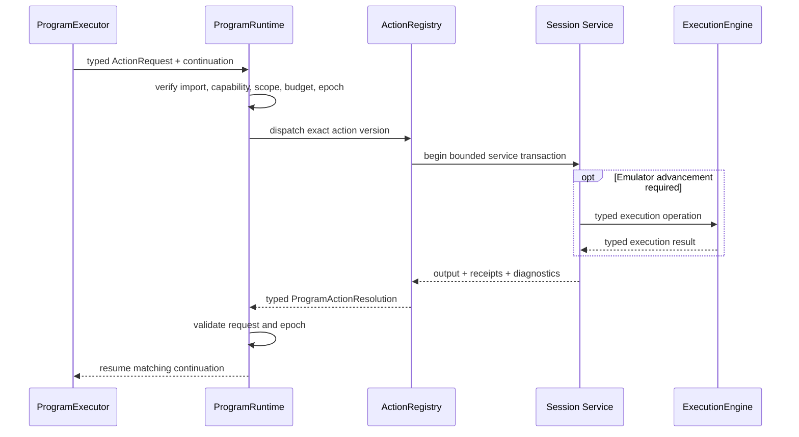

# Actions, Effects, and Session Services

## Scope

This document describes how programs request effects, how native extensions are bounded, which session
service owns each emulator facility, how resources are scoped, and how cancellation/restoration affect
session reuse. Concrete C++ signatures and worker transport encoding may adapt during implementation.
The package-wide SavorDb migration boundary applies: its physical schema, migrations, durable lifecycle
semantics, workflow persistence, result-projection transaction boundaries, and artifact-storage
interfaces remain unchanged. The pre-6A hard cutover removes obsolete timing fields from public
authoring interfaces and generated arguments; only private neutral insert shims satisfy the six
unchanged physical timing columns. Document 06 permits narrowly workset-specific execution-interface
changes for ordered batch claim, exact-set lease renewal, claim/start validation, and targeted terminal
reconciliation over those same records; the session services in this document neither depend on nor
broaden that allowance.

## Purpose and non-goals

Programs need reusable capabilities without turning every capability into an opcode or hiding whole
phases inside native C++. This contract supplies one typed action-await boundary, pure native reducers,
narrow session services, explicit resource ownership, epoch safety, and auditable cleanup.

This document defines:

- `ActionDescriptor`, request, completion, and handler constraints;
- the pure native reducer boundary;
- the service-side lowering and temporal contracts for semantic observations and interactions;
- action granularity and forbidden hidden-controller behavior;
- root/nested resource scopes, receipts, compensation, cancellation, and taint;
- the ownership of execution, stop points, input, state, guest memory/mutation, movies, capture,
  telemetry, and game packs; and
- stable logical action/reducer names used by migration planning.

This document does not:

- define exact C++ interfaces or serialized action records;
- make action handlers a second scheduler;
- permit programs to call Dolphin or workflow storage;
- define phase-specific algorithms or final domain schemas; or
- freeze individual guest addresses, routing priorities, or input tolerances; or
- design a replacement capture-profile language. Existing `savor.capture.profile/1` behavior is a
  compatibility input preserved behind `CaptureService`.

## Current code evidence

Current facilities are capable but their ownership overlaps:

- `SavorCore/Core/DolphinWrapper.h:44-157` combines game/state lifecycle, screenshots, raw memory,
  movies/input, poll receipts, input-tape playback, and frame/opcode stepping.
- `DolphinWrapper.h:202-240` also exposes physical PC breakpoint and memory-watchpoint mutation,
  capture-job lifecycle, and run-until behavior.
- `SavorCore/Runner/Script/PhaseScriptVM.h:35-77` gives one VM direct access to that facade while the VM
  also acts as three input-macro host/provider interfaces and owns breakpoint scopes and one snapshot.
- `SavorCore/Runner/Script/PhaseScriptVM.cpp:87-122` starts capture from job context, while
  `PhaseScriptVM.cpp:335-393` scopes capture and watchpoint cleanup around each VM run.
- `SavorCore/Runner/Script/PhaseScriptVMControl.cpp:65-103` arms and replaces PC breakpoint sets.
- `PhaseScriptVMControl.cpp:162-369` combines input publication, enabled-breakpoint replacement,
  stepping, run-until, timeout/movie/stall policy, and input acknowledgement.
- `SavorCore/Runner/Script/PhaseScriptVMInput.cpp:15-67` directly steps, toggles breakpoints, publishes
  pad state, starts/stops movies, and saves state.
- `SavorCore/Runner/Script/PhaseScriptVMMacro.cpp:136-346` implements a VM-local exclusive macro
  session, expected-only breakpoint scopes, neutral stepping, polling, memory watchpoint cleanup, and
  breakpoint restoration.
- `SavorCore/Runner/InputMacro/InputMacroRuntime.cpp:84-105` acquires that exclusive session.
  `InputMacroRuntime.cpp:401-427` cancels and performs a fixed neutral/watchpoint/session/breakpoint
  cleanup sequence.
- `SavorCore/Runner/Breakpoints/BPRegistry.h:15-43` encodes visibility and one owner/consumer
  classification with each static stop point. Those fields do not express concurrent logical routing.
- The former wrapper-level guest-state epoch advanced on savestate load. That behavior was removed:
  the current runtime has one immutable epoch per workset and treats restores as workset-local state
  operations.
- `DolphinWrapper.cpp:1666-1826` implements physical PC breakpoint and watchpoint mutation through the
  broad facade.
- `SavorProbe/ProbeProfile.h:21-225` and `SavorProbe/ProbeProfile.cpp:611-1142` define and validate the
  existing `savor.capture.profile/1` subscriptions, sampling, windows, flight recorders, and
  control-derived behaviors.
- `SavorProbe/ProbeRuntime.cpp:199-339` validates and starts that profile, while
  `ProbeRuntime.cpp:1083-1266` publishes ordinary and synthetic control-tagged capture events. Those
  profile semantics must survive even though control-wait authority moves to the router/engine.

The router analysis at
`D:\SoAInvestigate\Analyses\20260723_2107_savor_worker_breakpoint_router\20260723_2107_savor_worker_breakpoint_router_architecture_summary.txt`
provides the research basis for the target services:

- lines 267-396 define one `ExecutionEngine`, logical stop routing, physical-stop ownership, and
  structured child operations;
- lines 397-471 define capture, predicates, input arbitration, baseline restoration, and game ownership;
- lines 633-729 map current facilities and state the target invariants; and
- lines 812-840 describe a suitable fake-backend test architecture.

Slices 1 through 4 now implement the generic ownership seam described below. In particular,
`EmulationSession` composes the engine/router with `InputArbiter`, `SavestateService`, `GuestMemory`,
`GuestMutationService`, `MovieService`, one passive `CaptureService`, `ScreenshotService`,
`TelemetryBus`, and the standalone `SessionResourceLedger`. The legacy VM calls that formerly owned
these facilities are hard-disconnected. Slice 5 now adds canonical action descriptors and an
actor-marshalled request/resolution seam, program-resource binding onto the Slice 4 ledger, and the
concrete internal `SessionProgramActionHost` bindings from canonical requests to session-owned
services. Production worker composition constructs neither the runtime nor this host and does not
advertise worker `ProgramInvocation`.

## Core service and resource constraints

### Effect flow

`await action` is the only effectful program instruction.

The logical flow is:



An action request logically includes:

- invocation, request, and trace correlation identities;
- exact action ID, version, and signature hash;
- typed input conforming to the imported schema;
- current `WorksetEpoch`;
- active resource scope;
- cancellation token and structural-budget context;
- retry/idempotency identity where external publication is possible; and
- the caller's allowed capability/effect set.

The program-facing `ProgramActionResolution` logically includes:

- matching invocation and request identities;
- terminal infrastructure status;
- typed action output for successful execution;
- domain observation/outcome fields declared by the action;
- the one immutable active `WorksetEpoch`;
- resources acquired and restoration/finalization receipts;
- emitted observations declared by the action, but no host-owned staged artifact capture;
- structured diagnostics and causal error chain; and
- trace information sufficient to compare re-execution.

Action idempotency keys and commit receipts belong to runtime results or existing external
artifact/telemetry mechanisms. They do not create SavorDb columns, tables, interfaces, or queue records.

The actor may additionally return an `ActorActionResult` containing staged outputs. `WorkerRuntime`
must adopt or abandon those outputs before delivering its contained resolution; `ProgramRuntime` and
`ProgramExecutor` never receive their host capture receipts.

There is one outstanding program-level action per `ProgramInstance`. A handler may use structured child
operations inside its owning session service, but returns one resolution to the program. A handler
cannot resume the executor itself.

### ActionDescriptor

Every action registration has an immutable logical descriptor:

| Field | Required meaning |
|---|---|
| Action identity | Stable namespaced ID, immutable version, and exact signature hash |
| Types | Exact input, output, domain-observation, receipt, and diagnostic schemas |
| Capability pack | Pack and version that provides the action |
| Required capabilities | Narrow session interfaces the handler may receive |
| Effect declarations | Read guest, mutate guest, advance emulation, publish input, movie, capture, artifact I/O, telemetry |
| Resource behavior | Resources acquired, owning scope, release/finalization operation, and receipt type |
| Workset behavior | Active-workset requirement and immutable `WorksetEpoch` correlation |
| Determinism/replay | Replay class and fields that must be recorded or compared |
| Cancellation | Cancellation mode, safe points, maximum non-cancellable section, and cancellation completion |
| Timing class | `CancellationDriven` guest-dependent work or `BoundedHostOperation` with a finite infrastructure timeout |
| Cleanup guarantee | No resource, automatically scoped release, or verified compensation; taint rule on failure |
| Idempotency | Whether retry is safe and which key/receipt proves a prior commit |
| Diagnostics | Stable failure categories and source/trace fields |

The registry resolves exact imported identity. It never chooses an implementation by latest version,
`ProgramKind`, phase family, or arbitrary controller factory.

### Action granularity

An action is one structurally bounded reusable capability transaction. It may:

- perform one finite pure conversion that cannot be represented conveniently in IR;
- read one coherent observation;
- acquire/release one scoped resource;
- submit one typed execution operation and summarize its result;
- perform one checked guest mutation transaction;
- attach/finalize one capture or movie transaction; or
- synchronously create/finalize one immutable artifact, or capture/promote one immutable state artifact
  for the bounded completion-ledger finalization path below.

An action may contain service-internal polling or emulator advancement only when:

- it is part of one declared transaction;
- the completion condition, cancellation behavior, and structural bounds are declared;
- every emulator advance uses `ExecutionEngine`;
- cancellation safe points and partial-commit behavior are defined; and
- it performs no phase-level branching or scheduling.

An action may not:

- own a phase, workflow wave, frontier, or worker queue;
- interpret another program or invoke `ProgramExecutor`;
- call another action through a private action loop;
- choose arbitrary subsequent domain steps;
- create a private thread or nested event loop;
- own Dolphin run state, physical stop points, or pad publication;
- read ambient workflow/database state; or
- hide an unbounded state machine behind a name such as `RunNavmeshSurvey`,
  `ExploreOverworld`, or `FastForwardAllCutscenes`.

If behavior branches across multiple observations/effects, it belongs in IR. If its transition logic is
complex but pure, it belongs in a reducer called by IR. If it must survive worker loss or create more
jobs, existing program-kind transition handlers and workflow persistence own it. Generalized frontier
infrastructure is outside this refactor.

### Pure native reducers

A pure reducer is an exact imported callable registered alongside actions but invoked through the IR
`call` boundary, not `await action`.

Its logical contract is:

```text
(typed reducer state, typed completed observation/effect)
    -> (new typed state,
        zero-or-one requested next action/subprogram descriptor,
        zero-to-many typed domain events,
        optional typed completion)
```

Reducer rules:

- no session service, Dolphin, filesystem, database, clock, hidden random source, global mutable state,
  callback, or thread access;
- no blocking, suspension, or effect execution;
- deterministic output for byte-identical typed input;
- explicit state schema and transition/output schema;
- a finite descriptor-declared set of actions/subprograms that the transition is permitted to request;
- exact version/signature import and source-map trace location;
- finite computation under a reducer budget; and
- all requested work is validated and scheduled by the ordinary executor/action path.

The adaptive pattern now represented by `IInputMacroPlanDriver::Start/Advance` becomes a reusable IR
statechart calling a reducer after each completed action. There is no peer `InputMacroEngine`.

### Semantic-observation lowering and service boundaries

The semantic-observation composition library defined in document 03 has no runtime or session-service
capabilities. It lowers before verification to exact capability-pack imports and ordinary actions:

- a `SemanticAwaitDefinition` creates one scoped router subscription group and awaits
  `runtime.execution.continue_until`;
- a successful wait returns one `SemanticPointReceipt` containing the logical point, physical hit
  evidence, stop sequence, `WorksetEpoch`, and declared hit-time samples;
- `HitTimeSample` requirements compile only to the router's bounded, allocation-free registered sample
  subset;
- `PausedAtPoint` observations compile to registered `runtime.guest.read_*` or coherent game-query
  actions while `ExecutionEngine` keeps the core paused; and
- post-effect observation uses a declared later semantic point, or an explicit frame-step execution
  action when frame granularity is the actual contract, followed by a new paused observation. Guest
  PowerPC instruction stepping is not an observation mechanism.

The await use explicitly says whether an already-paused matching current point is acceptable. Otherwise
current-instruction suppression and rearm policy prevent the source stop from spuriously completing the
new wait. Unrelated stops may be observed or handled by their owners but cannot complete the await.
Movie-ended, cancellation, centrally confirmed `CoreStalled`, guard/interceptor failure, and backend
failure remain distinct completion statuses. A bounded host operation may additionally report its own
infrastructure timeout.

`GuestMemory` evaluates checked `AddressExpression<T>` definitions and registered coherent query
recipes. It distinguishes required evidence loss from optional `Unavailable` and from a successfully
observed false, zero, or domain-negative value. Ordered observation uses execute in declaration order;
coherent multi-field state is returned by one registered query. Every receipt, sample, baseline,
derived address, and guest-derived handle is bound to the active workset and rejected after it ends.

No service evaluates module branches, check policy, scoring, or authoritative progress. No
`ObservationRuntime`, query VM, observation opcode, dynamic action ID, filesystem access, or database
access is introduced.

### Interaction lowering and temporal contract

The interaction composition library defined in document 03 lowers each static or adaptive interaction
to an ordinary IR subprogram, one pure reducer/statechart where needed, semantic awaits/observations,
and existing execution/input actions. There is no whole-interaction action, private execution loop,
driver callback, or second cancellation path.

One interaction holds an `InputArbiter` lease in an outer lexical scope. Each segment uses a nested scope
for its semantic subscription and observation resources. Its required temporal order is:

1. Arm the exact semantic-gate alternatives and establish the segment's starting
   `SemanticPointReceipt`/epoch.
2. Publish the requested input and obtain its input epoch before departing a currently matched source
   stop.
3. For a future-only departure, arm the ordinary wait with suppression for the exact retained
   receipt/current instruction, then resume normally. The shared physical site remains enabled; normal
   continuation executes the source instruction with the new input without an explicit guest
   instruction-step action.
4. Accept a matched gate only with the declared logical point and matching PC/physical evidence, stop
   sequence, input epoch, and `WorksetEpoch`; an unrelated or stale hit cannot advance the segment.
5. Apply the declared semantic completion policy. `StopAtGate` leaves the matched gate paused.
   `ContinueWithRequestToDeclaredSuccessor` retains the request and input lease while continuing to one
   separately declared semantic successor, then leaves that successor paused. A requirement phrased
   only as "after exactly the next guest opcode," with no semantic successor or genuine frame boundary,
   is unsupported and must be re-authored rather than approximated.
6. Capture the request's guest-poll receipt after any declared successor continuation and before
   publishing neutral input.
7. Acquire the segment's ordered observations/checks at their declared hit-time or paused moments.
   Paused-at-point reads occur before any release witness advances the guest again.
8. Where release is required, publish neutral with a fresh input epoch and independently prove the
   guest observed that epoch through `runtime.input.await_guest_poll`. Publishing neutral or dropping a
   lease is not release proof. The interaction names the release-witness point or segment separately
   from the request segment.
9. Return one typed `InteractionSegmentResult` to the statechart/reducer.

Translated memory-change waits acquire/update their named baseline before advancement and execute one
neutral frame between polls. A `Latest` baseline is updated before the check at that same hit. The
reducer consumes only typed state plus the completed segment result and may select only a finite
verifier-declared next segment, emit declared records, or complete.

Unexpected point, unacknowledged requested input, unproven neutral release, unsatisfied check,
centrally confirmed `CoreStalled`, infrastructure failure, cancellation, and cleanup failure remain
distinct. A bounded host operation may additionally report its own infrastructure timeout. On every
terminal path, common unwind cancels outstanding execution, neutralizes through the still-valid lease,
proves release when the interaction requires it, removes only the interaction's subscription scopes,
and releases the lease. Cleanup continues after a failure; an unproven mandatory release or
restoration taints the session. The target preserves these semantic dependencies, not the incidental
order of current `IInputMacroHost` cleanup calls.

### Predicate lowering and service boundaries

The predicate composition library defined in document 03 has no runtime or session-service
capabilities. It consumes `ObservationDefinition`/`ObservationUse` results from the shared composition
boundary above. It does not independently define addresses, observation timing, baselines, guest reads,
or waits. Action handlers and session services return typed observations; they do not decide whether a
check should abort, branch, emit progress, or affect scoring.

A router registration's optional compiled predicate/sample requirement is only a bounded hit-time
filter or sampling qualification. It is not a module-level predicate executor and cannot advance program
control flow, select a domain result, or emit authoritative program output. Passive observations never
control execution. Foreground waits and separately reserved trusted interruption requests are the only
registrations with execution authority.

Predicate baselines, sampled addresses, and guest-derived witness handles inherit the observation
contract's workset binding. Programs do not restore guest state during an invocation; every such value
is discarded during item unwind before a later item restores the shared baseline.

Live predicate messages may use `TelemetryBus`, but progress or evidence needed by program results,
scoring, or adapters must also be a declared typed program emission. No `runtime.predicate.*` capability
family or whole-predicate action is introduced.

### Determinism and replay classes

Each descriptor declares one class:

| Class | Rule |
|---|---|
| `DeterministicFromState` | Re-execution from exact state/runtime/input is expected to match; completion is still traced |
| `RecordedObservation` | Control-flow replay may inject the recorded typed completion; live replay re-executes and compares declared witness fields |
| `IdempotentExternal` | External artifact/telemetry publication requires an idempotency key and durable commit receipt |
| `NonReplayable` | Exact replay policy rejects the module before invocation; use requires an explicitly permissive policy |

Pure reducers are deterministic by definition and do not use an action replay class.

Elapsed host time or poll count may appear in infrastructure diagnostics when useful. It becomes domain
evidence only when the action's domain schema explicitly declares it. Guest-dependent action resolution
is never converted into a phase execution deadline.

### Cancellation modes

Every action declares one:

- `ImmediateBeforeCommit`: cancellation prevents any effect from committing.
- `AtSafePoint`: the handler reaches a documented safe point within a bounded interval, then returns a
  cancelled completion and all receipts acquired so far.
- `CommitCritical`: a short declared commit section completes atomically before cancellation is
  acknowledged; the completion proves committed versus not committed.

Every action must have a cancellation contract. A `BoundedHostOperation` additionally declares a finite
infrastructure timeout; a `CancellationDriven` action must not declare an elapsed deadline. Cancellation
never calls arbitrary program code from a service thread.

### Resource scopes and receipts

`EmulationSession` owns one actor-thread-only `SessionResourceLedger` independent of
`ProgramRuntime`. Slice 4 initializes the session root and supports synthetic scopes; Slice 5 adds the
binding table and actor protocol that map future invocation resource identities onto it:

```text
Worker-global completion/acknowledgement ledger
  -> immutable promoted state captures, finalization state, and retained terminals

Session root scope
  -> transient workset scope
       -> composite ProgramBaselineDefinition/ProgramBaselineKey
       -> optional multi-item state handle
       -> one active invocation root scope
            -> lexical program scope
                 -> action transaction scope
                      -> service-owned resources and receipts
```

The workset scope owns the exact common-preparation receipts and, only for a multi-item savestate
workset, one in-memory handle. The
definition's ordered `ProgramBaselineComponent`s cover the savestate, exact movie continuation, and
runtime-facing program-kind adapter-declared derived state; `ProgramBaselineKey` identifies that whole
set. A one-item workset does not capture an unnecessary handle, and no handle survives workset
termination. The scope may not retain a live input lease, router wait, mutation, capture
writer, action continuation, guest-derived pointer, or other mutable invocation effect between items.
Only immutable artifact declarations and compiled definitions survive according to their contracts;
every mutable child resource is reacquired.

The active item's output transaction is host-only lifecycle state rather than another program or session
scope. Dolphin synchronously writes a native savestate file while paused; the runtime reads the completed
file back into immutable bytes and adopts those bytes plus exact movie metadata before resolving the save
action. Raw state-buffer bytes remain private to workset memory handles. Finalization may continue after
the `ProgramInstance` unwinds, but the item and workset stay active and no later guest activity begins
until the authoritative terminal has been retained.

Resources include:

- input leases and guest-observed neutral-release obligations;
- router subscription groups and physical-site derivations;
- foreground/child execution operations;
- state handles and epoch-bound guest handles;
- guest data mutations and executable patches;
- movie playback/recording sessions;
- capture attachments, buffers, and artifact writers; and
- temporary files or external artifact commits.

Every resource acquisition returns a typed receipt containing at least resource identity, owning
service, owning scope, acquisition epoch, prior-state/restoration evidence where applicable, release or
finalization status, and diagnostics.

Rules:

1. Batch registration is atomic and ledger identities/acquisition sequences are actor-assigned. A
   partially successful service transaction returns every receipt it created before the ledger records
   the batch.
2. Scope exit releases resources in reverse acquisition order.
3. Cleanup continues after a release failure to collect the complete resource disposition. A release
   that requires emulator work returns one typed cleanup continuation and resumes the same unwind later.
4. A cleanup-safe compensation action must be idempotent and operate only on its typed receipt.
5. Resource promotion to an enclosing scope is explicit and descriptor-authorized.
6. Live resource/opaque handles cannot be emitted as records or artifacts.
7. Return, explicit fail, action failure, cancellation, bounded-host timeout, structural-bound
   exhaustion, guard abort, and worker-requested shutdown use the same unwind machinery.
8. Optional cleanup failure records `CleanWithDiagnostics`; mandatory cleanup without a verified receipt
   records `TaintRequired` and blocks later acquisition.
9. The ledger belongs to one workset and one immutable `WorksetEpoch`. It contains no state-transition,
   supersession, or rebind mode; workset teardown is the lifecycle authority.
10. Every item fully unwinds its invocation root back to the workset scope before another item may
    restore the baseline or enter `ProgramRuntime`.
11. Workset cancellation or terminal completion releases the workset scope after the active invocation
    has unwound. A failed mandatory workset-scope release taints the session and prevents later item
    admission.
12. A multi-item savestate workset's private baseline handle is a scoped ledger resource. It cannot
    escape the active workset, and releasing it never changes guest state or `WorksetEpoch`.
13. Promotion into the completion/acknowledgement ledger is permitted only for immutable host-owned
    bytes and metadata whose synchronous capture succeeded. Before promotion, ordinary unwind owns
    abort/cleanup; after promotion, the global ledger owns finalization, terminal assembly, retryable
    publication cleanup, and eventual release.
14. `RestoreBaseline` is one composite transaction. It restores the state/movie pair and every declared
    derived-state component, returns one `PreparedProgramBaselineReceipt`, and admits no item from a
    partial preparation.
15. Workset acceptance proves claim/start authority for every finite member. Clean resource unwind,
    baseline preparation, local credits, and exact asynchronous cancellation govern later admission;
    no per-item coordinator authorization pause is a resource boundary.

### WorksetEpoch interaction

`EmulationSession::BeginWorkset` is the sole allocator of the monotonically increasing worker-local
`WorksetEpoch`. Infrastructure `Open` has no active epoch. The epoch is nonzero and immutable for the
entire active workset, including every item, every private baseline restore, and a TAS Movie guest-core
restart. `EndWorkset` tears down guest-dependent services and clears the active epoch without closing the
Dolphin wrapper.

Input, movie, execution, stop-point, capture, mutation, screenshot, savestate, and resource-ledger
services are constructed for that workset. Every receipt and live handle is bound to its one epoch.
There is no resource epoch policy, state-transition mode, or coordinator-supplied session/epoch input.
External controls identify the exact active workset and item; session and epoch remain outbound
diagnostic evidence.

`SavestateService` owns only savestate bytes, compatibility, lineage, bounded memory handles, and
immutable publication records. It does not allocate epochs or coordinate Dolphin lifecycle. The
`WorksetStateCoordinator` owns initial artifact restoration and later item restoration. Before a later
restore it proves the previous invocation is fully unwound, promoted savestate publication or
compensation has finished, execution is idle-paused, action/resource tables are empty, and native stop
ingress has drained to a stable boundary.

A savestate restore prepares the exact same-name DTM history and movie-input reservation, quiesces stop
ingress, loads the state, verifies the restored movie cursor, and force-reconciles the physical stop
plan while retaining the same `WorksetEpoch`. Preserved backend failure with successful rollback fails
the workset without taint. Unknown backend integrity, rollback failure, or failed reconciliation taints
the session while preserving the primary diagnostic.

For a movie-paired `Savestate` baseline,
`runtime.movie.adopt_restored_read_only_playback` validates the playback
session and cursor already established by restoration and places one handle in
the invocation resource scope. It performs no backend movie preparation, core
restart, state restore, or guest advancement. The handle may be consumed by a
later mode transition such as branching the restored playback into recording.
This is distinct from establishing a DTM-origin TAS Movie baseline.

`MovieService` owns the canonical movie state and cursor evidence for the
workset. `SnapshotState` returns the service-owned state and last authoritative
cursor without calling the backend. `ReconcilePausedState` is the only
physical inspection surface; it requires an already authoritatively paused
core and maps raw playback/recording flags, read-only status, frame, and input
count into the owned lifecycle. Running `ExecutionEngine` maintenance and
heartbeats use only `SnapshotState`.

Owned read-only playback installs a session-local CurrentRun override for
Dolphin's pause-at-movie-end setting and restores the exact prior presence and
value when playback stops or branches to recording. If Dolphin pauses at the
end, `ExecutionEngine` confirms that core pause through its existing pause
synchronizer, then performs one reconciliation. Only neither-native-mode with
retained read-only evidence becomes `PlaybackEnded`; ordinary breakpoint
pauses leave playback active. The terminal state retains its reservation, DTM
metadata, and final cursor until scoped cleanup calls `StopPlayback`. A
successful playback-to-recording branch verifies and commits `Recording`
before guest advancement and cannot satisfy `MovieEndedPolicy`.

`runtime.movie.observe_state` is the program-facing, host-only paused
reconciliation of that same authority. It returns the canonical `MovieState`, workset epoch,
read-only evidence, frame, and input cursor. It exposes no raw Dolphin flags,
creates no resource, advances no guest state, and performs no mode transition.
Programs that support multiple valid restored source shapes branch on this
typed result rather than on coordination metadata.

A multi-item savestate workset may hold one private in-memory baseline handle only until that workset
ends. A later workset must import its own declared artifact; no handle, guest observation, input receipt,
mutation, stop subscription, or movie authority crosses the boundary.

A TAS Movie phase may explicitly opt into a `ReadOnlyMovie` workset only when
starting from the DTM-declared origin; this baseline is not a TAS default and
is unavailable to non-TAS phases. Such a workset begins unestablished.
`MoviePrepareReadOnlyPlayback` stages the exact artifacts,
stops only Dolphin's guest core, and drains pre-stop ingress. The program then installs passive stop groups
while the core is uninitialized. `MovieStartPlayback` consumes that preparation, loads the DTM, boots
paused, and validates the exact physical plan without changing the workset epoch. Programs have no generic
capture/restore action and do not rewind guest state during an invocation.

## Failure and cleanup behavior
### Action failure protocol

- Validation failure before dispatch acquires no resource and returns a deterministic runtime rejection.
- A handler that fails after partial acquisition returns every receipt already created.
- Domain-negative observations use typed domain fields and may allow ordinary program branching.
- Backend, schema, stale-epoch, bounded-host timeout, cancellation, confirmed core-health, or capability
  failures are infrastructure statuses and cannot masquerade as domain values.
- A lost/duplicate completion cannot lose resource ownership: the runtime resource ledger, not the
  completion message alone, remains authoritative.
- A duplicate idempotent external request resolves from its commit receipt rather than repeating the
  side effect.
- A state artifact cannot produce an authoritative successful terminal until its promoted immutable
  capture has completed background publication/validation and the actor has assembled the exact
  `ArtifactRef`.
- Failure of a promoted background finalization produces one correlated item infrastructure result and
  does not retroactively recreate or resume its released `ProgramInstance`.

### Unwind and taint

Unwind cancels outstanding execution first, then releases resources in reverse acquisition order.
Service-specific releases include:

- drive input to required neutral state and verify the guest poll;
- finish/cancel movie and capture sessions;
- remove only the owning router subscription groups;
- restore checked data/executable mutations and repeat cache/JIT invalidation when required;
- abort unpromoted artifact captures and transfer promoted immutable state captures to the
  worker-global completion ledger without abandoning their finalization receipts;
- invalidate state/guest handles; and
- publish cleanup diagnostics.

Programs cannot replace or rewind guest state. A workset baseline restore occurs only after the prior
invocation has released every mutation and other action resource. If cleanup or restoration cannot be
proven, the workset fails and the session is tainted when integrity is unknown.

Any failed mandatory cleanup produces `Tainted` session disposition. Remaining cleanup is still
attempted. No later workset may consume that guest state; recovery requires an explicit clean boundary.

Within a workset, clean or clean-with-diagnostics item unwind returns ownership to the workset scope and
permits the next baseline restore. Tainted, uncertain, or incomplete mandatory cleanup closes admission
immediately; pending items remain unstarted, the workset baseline is released as far as safely possible,
and coordinator retry/requeue behavior remains authoritative.

An item whose immutable state capture was promoted may finish execution unwind before its authoritative
terminal exists. That promoted host-only work neither grants session reuse nor blocks it by itself:
session reuse depends on the completed invocation cleanup receipt, cache/workset scope state, available
completion credits, and session integrity. Failure to clean a temporary publication path is handled by
the artifact idempotency/cleanup contract; it taints the session only if session-owned integrity is also
uncertain.

### Service failure isolation

- Router/capture observation loss may be classified recoverable only when the action/module declares it
  non-authoritative. Required evidence loss fails the action.
- Unclaimed physical stops, guard violations, and backend state mismatches fail or abort the session
  through typed policy.
- Failure to reconcile physical stop points after an epoch change taints the session.
- Failure to observe neutral input release taints or fails according to the lease's mandatory cleanup
  policy; it is never silently ignored.
- A recoverable workset baseline-restore failure rolls back staged movie/input/ingress state without
  changing `WorksetEpoch`. Unknown backend integrity, failed rollback, or failed reconciliation taints
  the session.
- Executable patch verification or restoration failure is always session-tainting.

## Dependencies and migration implications

This contract depends on the serialized worker/session ownership in document 02 and the canonical
action-await/scoping IR in document 03.

Migration implications:

1. Split `DolphinWrapper` behind narrow session-owned adapters before exposing actions.
2. Move physical breakpoint/watchpoint mutation to `PhysicalStopPointManager`.
3. Convert current VM waits and macro waits to temporary router subscriptions plus
   `runtime.execution.continue_until`.
4. Before Slice 6A, bring direct continue, pause, and frame-step behavior under `ExecutionEngine`;
   remove phase elapsed deadlines and per-request VI-stall policy, add session-owned core health plus
   synchronous host-activity accounting, and hard-disconnect legacy guest-instruction-step and timed
   tape/macro advancement rather than creating a compatibility executor.
5. Keep the implemented `InputArbiter` opaque input-advance port beneath `ExecutionEngine`; re-author
   current input/macro behavior with its epoch-bound leases, borrow policy, and guest-observed release.
6. Use `EmulationSession::BeginWorkset` as the sole epoch authority. Keep `SavestateService` limited to
   active-workset bytes, bounded private handles, and caller-declared
   immutable artifacts with exact movie continuation. State-artifact publication uses synchronous
   paused capture followed by bounded asynchronous finalization through the worker-global completion
   ledger.
7. Translate raw writes to the implemented `GuestMutationService`; data is reversible unless explicitly
   committed and executable patches are always reversible with symmetric cache/JIT invalidation.
8. Use the implemented `MovieService`, one passive `CaptureService`, `ScreenshotService`, and
   `TelemetryBus` rather than VM-owned lifetimes.
9. Use the Slice 5 actor action seam, `SessionProgramActionHost`, and binding table to attach future
   invocation/action identities to the implemented standalone `SessionResourceLedger`; production
   runtime/host construction and capability activation remain part of invocation cutover.
10. Use the implemented field/battle/navigation semantic points, checked address definitions, and
    registered coherent queries as inputs to semantic-observation composition. Direct re-authoring of
    current program/predicate address expressions remains migration work, while capture-profile address
    programs remain opaque.
11. Express battle macros during migration through the implemented shared interaction composition and
    the canonical subprogram/reducer IDs rather than preserving `InputMacroEngine`.
12. Add source-backed cutscene or overworld packs only when a concrete migrated client defines their
    inventories; delete old domain opcodes only after phase parity.
13. Re-author current battle predicate arming, baseline capture, evaluation, and reporting through the
    implemented predicate and semantic-observation composers; consume existing stored records in memory
    through the production adapter and remove the VM-specific evaluator after parity.

Current programs are re-authored through the canonical builders and composition frontends. The old broad
host interfaces are not exposed to new modules.

## Service and cleanup checks

- An action cannot be registered without exact types, capabilities/effects, epoch, timing class,
  cancellation, replay, resource, cleanup, and idempotency declarations.
- Static dependencies prevent handlers/reducers/packs from obtaining `WorkerRuntime`,
  `ProgramExecutor`, workflow storage, or raw `DolphinBackend`.
- A pure-reducer harness proves byte-identical output for identical input and rejects access to clock,
  random, global mutable state, and session services.
- A descriptor review fixture rejects whole-phase or unbounded actions and demonstrates the replacement
  as IR plus bounded actions/reducer.
- Semantic-observation lowering tests cover canonical imports/source maps/hash sensitivity, hit-time
  versus paused acquisition, later-semantic-point and explicit frame-step behavior, ordered/coherent
  reads, current-point acceptance, unavailable evidence, baseline policies, and epoch invalidation.
- Interaction lowering tests cover static/adaptive definitions, exact verifier-known segment choices,
  input-before-continuation ordering, exact current-receipt suppression, both semantic completion
  policies, point/sequence/input-epoch matching, request versus neutral-release receipts, neutral
  witnesses, baseline-before-advance, cancellation, and unwind fault injection.
- Predicate composition tests prove that all observation effects, subscriptions, branches, and emissions
  are ordinary verified dependencies and that false remains distinct from unavailable evidence.
- Every supported production advancement action is observed passing through one `ExecutionEngine`.
  Tests prove that no guest PowerPC instruction-step action or backend facet exists and that exact
  source-receipt suppression preserves ordinary continuation behavior; `InputArbiter` supplies the
  production input-synchronized port without giving the engine publication authority.
- Interruption tests cover cancellation propagation, health rebaselining across parent/child
  suspension, declared nesting and recursion, the eight-level hard cap, and
  `ResumeParent`/`AbortParent` as the only policy outcomes.
- Visual-intent command tests use fake sessions and protocol fixtures without a window, GUI automation,
  screenshot comparison, desktop control, or manual observation.
- Multiple logical consumers share one physical PC/memory site; releasing one subscription group leaves
  the others intact.
- Input lease priority, suspendability, both interruption-borrow policies, fresh publication tokens,
  movie exclusivity, poll acknowledgement, typed arbiter-issued one-use neutral borrow witnesses, and
  input-advance retries pass deterministic tests.
- Multiple state handles can coexist within budgets; each successful replacement increments the sole
  `WorksetEpoch`; recoverable failure does not; stale handles reject; exact SHA/compatibility/lineage and
  state-plus-DTM continuation are checked.
- Workset-baseline tests prove exact artifact validation, active-workset-only handle ownership, fresh
  epoch on every restore, release at workset termination, and mandatory artifact reconstruction for
  every later workset.
- State-artifact finalization tests prove actor-owned paused byte/movie capture, promotion before
  invocation unwind, background-only hash/sidecar/file work, exact actor correlation, deterministic
  terminal order despite out-of-order background completion, bounded credits, crash/idempotency
  recovery, and no authoritative result before publication validation.
- External state imports require explicit no-movie/read-only mode; recording file-artifact
  capture/import/restore rejects before backend mutation, while same-session memory-handle recording
  rewind is accepted.
- Checked data writes fail on precondition/readback mismatch, restore their exact original value unless
  explicitly committed, and reject unrelated overlap.
- Executable patch tests prove expected-instruction validation, paused application, required cache/JIT
  invalidation, readback, symmetric restoration, inability to commit, and taint on failure.
- Capture can observe a site shared with a wake/interceptor without gaining control or owning a
  physical breakpoint.
- Existing `savor.capture.profile/1` compatibility tests cover every retained parser, sampling,
  retention, window, flight-recorder, queue/drop/coalescing, progress, ordering, and artifact behavior;
  control publication remains active-wake-only and shares the router event identity.
- Capture service tests prove one opaque attachment, stable actor-side reconciliation,
  exactly-once finalization, taint plus attachment/reuse blocking on mandatory finalization
  failure, and taint on unproven resume without a second router or controller.
- The workset-owned ledger tests atomic acquisition, actor ownership, promotion, reverse unwind,
  cleanup-execution continuation, optional diagnostics, mandatory taint, and complete teardown.
- Screenshot and telemetry tests cover synchronous actor ownership, request correlation, stale epoch,
  preserved backend failure, monotonic sequence order through coalescing, bounded loss, and
  authoritative overflow. They do not claim active screenshot cancellation before nonblocking backend
  and actor ingress exist.
- Cancellation and fault injection at every action phase return all receipts, unwind every scope, and
  taint only when cleanup cannot be proven.
- Current battle/context/navigation behavior can use the canonical IDs above without a new opcode or
  peer macro executor.
- A headless JIT64 executable-patch guard at recurring `0x801DC288` is the eventual live proof for
  expected-word validation, NOP/readback/invalidation, symmetric restore, and no advancement while
  patched. Live state-plus-DTM continuation and post-write capture remain deferred until deterministic
  execution/input reaches authoritative witnesses.
- Navmesh suppression can be built from generic checked mutation actions after capability packs exist,
  without a Survey-specific controller or binary editor.

## Deferred work

- Add future production modules to the exact catalog only as their Full Phase migrations land. Production
  worker construction of `ProgramRuntime`/`SessionProgramActionHost`, artifact-atomic `WorkerWorkset`
  dispatch, and the SeedProbe plus TAS Movie validation catalog are implemented.
- Migration-specific typed action payload schemas beyond the implemented canonical envelope and
  source-backed coherent query/reducer contracts.
- Concrete router priority values, subscription serialization, and CPU sampling bytecode.
- Measurement-driven tuning of two finalizer threads, eight pending captures/256 MiB, and 32 retained
  terminals/128 MiB, plus compression and future artifact-backend adapters. Caller-declared paths,
  immutable/hash/compatibility/lineage semantics, and actor-side authoritative terminal assembly are
  already fixed; none alters SavorDb storage or interfaces.
- Generalized `eventhook` trigger characterization and allowlisting.
- Source-backed `soa.cutscene` and `soa.overworld` packs, cutscene interception strategy,
  overworld-specific movement rules, collision-search objectives, and navigation settle tolerances.
- A generalized capture-plan language, alternate capture formats, telemetry retention, and UI
  presentation. Existing `savor.capture.profile/1` parsing and behavior remain compatibility
  requirements during this refactor.
- Additional controllers/ports beyond the initial standard pad, which must still use arbitration.

## Source references

- `SavorCore/Core/DolphinWrapper.h:44-157`
- `SavorCore/Core/DolphinWrapper.h:202-240`
- `SavorCore/Core/DolphinWrapper.h:301-304`
- `SavorCore/Core/DolphinWrapper.cpp:592-655`
- `SavorCore/Core/DolphinWrapper.cpp:1087-1100`
- `SavorCore/Core/DolphinWrapper.cpp:680-828`
- `SavorCore/Core/DolphinWrapper.cpp:984-1020`
- `SavorCore/Core/DolphinWrapper.cpp:1666-1826`
- `SavorCore/Runner/Script/PhaseScriptVM.h:35-130`
- `SavorCore/Runner/Script/PhaseScriptVM.cpp:87-122`
- `SavorCore/Runner/Script/PhaseScriptVM.cpp:335-393`
- `SavorCore/Runner/Script/PhaseScriptVMControl.cpp:65-103`
- `SavorCore/Runner/Script/PhaseScriptVMControl.cpp:162-369`
- `SavorCore/Runner/Script/PhaseScriptVMInput.cpp:15-67`
- `SavorCore/Runner/Script/PhaseScriptVMMacro.cpp:136-346`
- `SavorCore/Runner/InputMacro/IInputMacroHost.h:38-58`
- `SavorCore/Runner/InputMacro/IInputMacroPlanDriver.h:42-59`
- `SavorCore/Runner/InputMacro/InputMacroRuntime.cpp:84-105`
- `SavorCore/Runner/InputMacro/InputMacroRuntime.cpp:401-427`
- `SavorCore/Runner/Breakpoints/BPRegistry.h:15-93`
- `SavorProbe/ProbeProfile.h:21-225`
- `SavorProbe/ProbeProfile.cpp:611-1142`
- `SavorProbe/ProbeRuntime.cpp:199-339`
- `SavorProbe/ProbeRuntime.cpp:1083-1266`
- `SavorCore/Runner/Runtime/ProgramRuntime/Actions/ProgramActionProtocol.h`
- `SavorCore/Runner/Runtime/ProgramRuntime/Actions/SessionResourceBindingTable.*`
- `SavorCore/Runner/Runtime/ProgramRuntime/Registry/CanonicalActionCatalog.*`
- `SavorCore/Runner/Runtime/ProgramRuntime/Capabilities/SourceCapabilityPacks.*`
- `SavorCore/Runner/Runtime/ProgramRuntime/Capabilities/SourceReducers.*`
- `D:\SoAInvestigate\Analyses\20260723_2107_savor_worker_breakpoint_router\20260723_2107_savor_worker_breakpoint_router_architecture_summary.txt:267-471`
- `D:\SoAInvestigate\Analyses\20260723_2107_savor_worker_breakpoint_router\20260723_2107_savor_worker_breakpoint_router_architecture_summary.txt:633-729`
- `D:\SoAInvestigate\Analyses\20260723_2107_savor_worker_breakpoint_router\20260723_2107_savor_worker_breakpoint_router_architecture_summary.txt:812-840`
