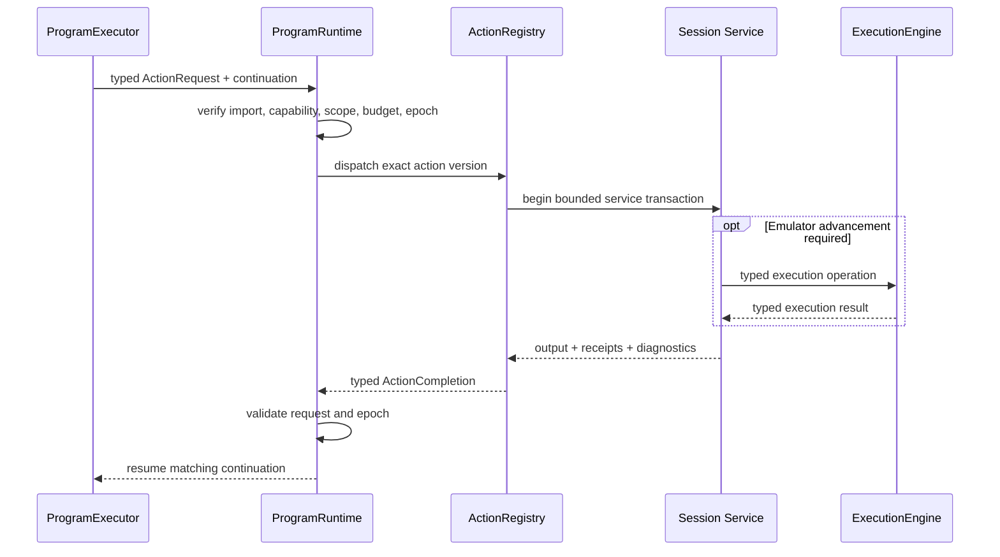

# Actions, Effects, and Session Services

## Scope

This document describes how programs request effects, how native extensions are bounded, which session
service owns each emulator facility, how resources are scoped, and how cancellation/restoration affect
session reuse. Concrete C++ signatures and worker transport encoding may adapt during implementation.
The package-wide SavorDb boundary applies: its schema, stored representations, durable lifecycle
semantics, workflow persistence, result-projection transaction boundaries, and artifact-storage
interfaces remain unchanged. Document 06 permits only narrowly workset-specific execution-interface
changes for ordered batch claim, exact-set lease renewal, claim/start validation, and targeted terminal
reconciliation over those same records; the session services in this document neither depend on nor
broaden that allowance.

## Purpose and non-goals

Programs need reusable capabilities without turning every capability into an opcode or hiding whole
phases inside native C++. This contract supplies one typed action-await boundary, pure native reducers,
narrow session services, explicit resource ownership, epoch safety, and auditable cleanup.

This document defines:

- `ActionDescriptor`, request, completion, and handler constraints;
- the pure native reducer boundary;
- the service-side lowering and temporal contracts for semantic observations and interactions;
- action granularity and forbidden hidden-controller behavior;
- root/nested resource scopes, receipts, compensation, cancellation, and taint;
- the ownership of execution, stop points, input, state, guest memory/mutation, movies, capture,
  telemetry, and game packs; and
- stable logical action/reducer names used by migration planning.

This document does not:

- define exact C++ interfaces or serialized action records;
- make action handlers a second scheduler;
- permit programs to call Dolphin or workflow storage;
- define phase-specific algorithms or final domain schemas; or
- freeze individual guest addresses, routing priorities, or input tolerances; or
- design a replacement capture-profile language. Existing `savor.capture.profile/1` behavior is a
  compatibility input preserved behind `CaptureService`.

## Current code evidence

Current facilities are capable but their ownership overlaps:

- `SavorCore/Core/DolphinWrapper.h:44-157` combines game/state lifecycle, screenshots, raw memory,
  movies/input, poll receipts, input-tape playback, and frame/opcode stepping.
- `DolphinWrapper.h:202-240` also exposes physical PC breakpoint and memory-watchpoint mutation,
  capture-job lifecycle, and run-until behavior.
- `SavorCore/Runner/Script/PhaseScriptVM.h:35-77` gives one VM direct access to that facade while the VM
  also acts as three input-macro host/provider interfaces and owns breakpoint scopes and one snapshot.
- `SavorCore/Runner/Script/PhaseScriptVM.cpp:87-122` starts capture from job context, while
  `PhaseScriptVM.cpp:335-393` scopes capture and watchpoint cleanup around each VM run.
- `SavorCore/Runner/Script/PhaseScriptVMControl.cpp:65-103` arms and replaces PC breakpoint sets.
- `PhaseScriptVMControl.cpp:162-369` combines input publication, enabled-breakpoint replacement,
  stepping, run-until, timeout/movie/stall policy, and input acknowledgement.
- `SavorCore/Runner/Script/PhaseScriptVMInput.cpp:15-67` directly steps, toggles breakpoints, publishes
  pad state, starts/stops movies, and saves state.
- `SavorCore/Runner/Script/PhaseScriptVMMacro.cpp:136-346` implements a VM-local exclusive macro
  session, expected-only breakpoint scopes, neutral stepping, polling, memory watchpoint cleanup, and
  breakpoint restoration.
- `SavorCore/Runner/InputMacro/InputMacroRuntime.cpp:84-105` acquires that exclusive session.
  `InputMacroRuntime.cpp:401-427` cancels and performs a fixed neutral/watchpoint/session/breakpoint
  cleanup sequence.
- `SavorCore/Runner/Breakpoints/BPRegistry.h:15-43` encodes visibility and one owner/consumer
  classification with each static stop point. Those fields do not express concurrent logical routing.
- `SavorCore/Core/DolphinWrapper.cpp:680-828` already advances a probe guest-state epoch on savestate
  load and in-memory restore, demonstrating the need for epoch-aware observations.
- `DolphinWrapper.cpp:1666-1826` implements physical PC breakpoint and watchpoint mutation through the
  broad facade.
- `SavorProbe/ProbeProfile.h:21-225` and `SavorProbe/ProbeProfile.cpp:611-1142` define and validate the
  existing `savor.capture.profile/1` subscriptions, sampling, windows, flight recorders, and
  control-derived behaviors.
- `SavorProbe/ProbeRuntime.cpp:199-339` validates and starts that profile, while
  `ProbeRuntime.cpp:1083-1266` publishes ordinary and synthetic control-tagged capture events. Those
  profile semantics must survive even though control-wait authority moves to the router/engine.

The router analysis at
`D:\SoAInvestigate\Analyses\20260723_2107_savor_worker_breakpoint_router\20260723_2107_savor_worker_breakpoint_router_architecture_summary.txt`
provides the research basis for the target services:

- lines 267-396 define one `ExecutionEngine`, logical stop routing, physical-stop ownership, and
  structured child operations;
- lines 397-471 define capture, predicates, input arbitration, state replacement, and game ownership;
- lines 633-729 map current facilities and state the target invariants; and
- lines 812-840 describe a suitable fake-backend test architecture.

Slices 1 through 4 now implement the generic ownership seam described below. In particular,
`EmulationSession` composes the engine/router with `InputArbiter`, `StateService`, `GuestMemory`,
`GuestMutationService`, `MovieService`, one passive `CaptureService`, `ScreenshotService`,
`TelemetryBus`, and the standalone `SessionResourceLedger`. The legacy VM calls that formerly owned
these facilities are hard-disconnected. Slice 5 now adds canonical action descriptors and an
actor-marshalled request/completion seam, program-resource binding onto the Slice 4 ledger, and the
concrete internal `SessionProgramActionHost` bindings from canonical requests to session-owned
services. Production worker composition constructs neither the runtime nor this host and does not
advertise worker `ProgramInvocation`.

## Core service and resource constraints

### Effect flow

`await action` is the only effectful program instruction.

The logical flow is:



An action request logically includes:

- invocation, request, and trace correlation identities;
- exact action ID, version, and signature hash;
- typed input conforming to the imported schema;
- current `StateEpoch`;
- active resource scope;
- remaining deadline and cancellation token;
- retry/idempotency identity where external publication is possible; and
- the caller's allowed capability/effect set.

An action completion logically includes:

- matching invocation and request identities;
- terminal infrastructure status;
- typed action output for successful execution;
- domain observation/outcome fields declared by the action;
- origin and resulting `StateEpoch`;
- resources acquired and restoration/finalization receipts;
- emitted observation/artifact references, if declared;
- structured diagnostics and causal error chain; and
- trace information sufficient to compare re-execution.

Action idempotency keys and commit receipts belong to runtime results or existing external
artifact/telemetry mechanisms. They do not create SavorDb columns, tables, interfaces, or queue records.

There is one outstanding program-level action per `ProgramInstance`. A handler may use structured child
operations inside its owning session service, but returns one completion to the program. A handler
cannot resume the executor itself.

### ActionDescriptor

Every action registration has an immutable logical descriptor:

| Field | Required meaning |
|---|---|
| Action identity | Stable namespaced ID, immutable version, and exact signature hash |
| Types | Exact input, output, domain-observation, receipt, and diagnostic schemas |
| Capability pack | Pack and version that provides the action |
| Required capabilities | Narrow session interfaces the handler may receive |
| Effect declarations | Read guest, mutate guest, advance emulation, publish input, replace state, movie, capture, artifact I/O, telemetry |
| Resource behavior | Resources acquired, owning scope, release/finalization operation, and receipt type |
| Epoch behavior | Epoch requirement, whether the action may replace state, and handle invalidation/rebinding rules |
| Determinism/replay | Replay class and fields that must be recorded or compared |
| Cancellation | Cancellation mode, safe points, maximum non-cancellable section, and cancellation completion |
| Deadline | Required/default upper bound and whether a caller may narrow it |
| Cleanup guarantee | No resource, automatically scoped release, or verified compensation; taint rule on failure |
| Idempotency | Whether retry is safe and which key/receipt proves a prior commit |
| Diagnostics | Stable failure categories and source/trace fields |

The registry resolves exact imported identity. It never chooses an implementation by latest version,
`ProgramKind`, phase family, or arbitrary controller factory.

### Action granularity

An action is one bounded reusable capability transaction. It may:

- perform one finite pure conversion that cannot be represented conveniently in IR;
- read one coherent observation;
- acquire/release one scoped resource;
- submit one typed execution operation and summarize its result;
- perform one checked guest mutation transaction;
- attach/finalize one capture or movie transaction; or
- synchronously create/finalize one immutable artifact, or capture/promote one immutable state artifact
  for the bounded completion-ledger finalization path below.

An action may contain service-internal polling or emulator advancement only when:

- it is part of one declared transaction;
- the completion condition and hard deadline are declared;
- every emulator advance uses `ExecutionEngine`;
- cancellation safe points and partial-commit behavior are defined; and
- it performs no phase-level branching or scheduling.

An action may not:

- own a phase, workflow wave, frontier, or worker queue;
- interpret another program or invoke `ProgramExecutor`;
- call another action through a private action loop;
- choose arbitrary subsequent domain steps;
- create a private thread or nested event loop;
- own Dolphin run state, physical stop points, or pad publication;
- read ambient workflow/database state; or
- hide an unbounded state machine behind a name such as `RunNavmeshSurvey`,
  `ExploreOverworld`, or `FastForwardAllCutscenes`.

If behavior branches across multiple observations/effects, it belongs in IR. If its transition logic is
complex but pure, it belongs in a reducer called by IR. If it must survive worker loss or create more
jobs, existing program-kind transition handlers and workflow persistence own it. Generalized frontier
infrastructure is outside this refactor.

### Pure native reducers

A pure reducer is an exact imported callable registered alongside actions but invoked through the IR
`call` boundary, not `await action`.

Its logical contract is:

```text
(typed reducer state, typed completed observation/effect)
    -> (new typed state,
        zero-or-one requested next action/subprogram descriptor,
        zero-to-many typed domain events,
        optional typed completion)
```

Reducer rules:

- no session service, Dolphin, filesystem, database, clock, hidden random source, global mutable state,
  callback, or thread access;
- no blocking, suspension, or effect execution;
- deterministic output for byte-identical typed input;
- explicit state schema and transition/output schema;
- a finite descriptor-declared set of actions/subprograms that the transition is permitted to request;
- exact version/signature import and source-map trace location;
- finite computation under a reducer budget; and
- all requested work is validated and scheduled by the ordinary executor/action path.

The adaptive pattern now represented by `IInputMacroPlanDriver::Start/Advance` becomes a reusable IR
statechart calling a reducer after each completed action. There is no peer `InputMacroEngine`.

### Semantic-observation lowering and service boundaries

The semantic-observation composition library defined in document 03 has no runtime or session-service
capabilities. It lowers before verification to exact capability-pack imports and ordinary actions:

- a `SemanticAwaitDefinition` creates one scoped router subscription group and awaits
  `runtime.execution.continue_until`;
- a successful wait returns one `SemanticPointReceipt` containing the logical point, physical hit
  evidence, stop sequence, `StateEpoch`, and declared hit-time samples;
- `HitTimeSample` requirements compile only to the router's bounded, allocation-free registered sample
  subset;
- `PausedAtPoint` observations compile to registered `runtime.guest.read_*` or coherent game-query
  actions while `ExecutionEngine` keeps the core paused; and
- post-effect observation uses a declared later semantic point, or an explicit frame-step execution
  action when frame granularity is the actual contract, followed by a new paused observation. Guest
  PowerPC instruction stepping is not an observation mechanism.

The await use explicitly says whether an already-paused matching current point is acceptable. Otherwise
current-instruction suppression and rearm policy prevent the source stop from spuriously completing the
new wait. Unrelated stops may be observed or handled by their owners but cannot complete the await.
Timeout, stall, movie-ended, cancellation, guard/interceptor failure, and backend failure remain
distinct completion statuses.

`GuestMemory` evaluates checked `AddressExpression<T>` definitions and registered coherent query
recipes. It distinguishes required evidence loss from optional `Unavailable` and from a successfully
observed false, zero, or domain-negative value. Ordered observation uses execute in declaration order;
coherent multi-field state is returned by one registered query. Every receipt, sample, baseline,
derived address, and guest-derived handle is epoch-bound and rejected after state replacement.

No service evaluates module branches, check policy, scoring, or authoritative progress. No
`ObservationRuntime`, query VM, observation opcode, dynamic action ID, filesystem access, or database
access is introduced.

### Interaction lowering and temporal contract

The interaction composition library defined in document 03 lowers each static or adaptive interaction
to an ordinary IR subprogram, one pure reducer/statechart where needed, semantic awaits/observations,
and existing execution/input actions. There is no whole-interaction action, private execution loop,
driver callback, or second cancellation path.

One interaction holds an `InputArbiter` lease in an outer lexical scope. Each segment uses a nested scope
for its semantic subscription and observation resources. Its required temporal order is:

1. Arm the exact semantic-gate alternatives and establish the segment's starting
   `SemanticPointReceipt`/epoch.
2. Publish the requested input and obtain its input epoch before departing a currently matched source
   stop.
3. For a future-only departure, arm the ordinary wait with suppression for the exact retained
   receipt/current instruction, then resume normally. The shared physical site remains enabled; normal
   continuation executes the source instruction with the new input without an explicit guest
   instruction-step action.
4. Accept a matched gate only with the declared logical point and matching PC/physical evidence, stop
   sequence, input epoch, and `StateEpoch`; an unrelated or stale hit cannot advance the segment.
5. Apply the declared semantic completion policy. `StopAtGate` leaves the matched gate paused.
   `ContinueWithRequestToDeclaredSuccessor` retains the request and input lease while continuing to one
   separately declared semantic successor, then leaves that successor paused. A requirement phrased
   only as "after exactly the next guest opcode," with no semantic successor or genuine frame boundary,
   is unsupported and must be re-authored rather than approximated.
6. Capture the request's guest-poll receipt after any declared successor continuation and before
   publishing neutral input.
7. Acquire the segment's ordered observations/checks at their declared hit-time or paused moments.
   Paused-at-point reads occur before any release witness advances the guest again.
8. Where release is required, publish neutral with a fresh input epoch and independently prove the
   guest observed that epoch through `runtime.input.await_guest_poll`. Publishing neutral or dropping a
   lease is not release proof. The interaction names the release-witness point or segment separately
   from the request segment.
9. Return one typed `InteractionSegmentResult` to the statechart/reducer.

Translated memory-change waits acquire/update their named baseline before advancement and execute one
neutral frame between polls. A `Latest` baseline is updated before the check at that same hit. The
reducer consumes only typed state plus the completed segment result and may select only a finite
verifier-declared next segment, emit declared records, or complete.

Timeout, unexpected point, unacknowledged requested input, unproven neutral release, unsatisfied check,
infrastructure failure, cancellation, and cleanup failure remain distinct. On every terminal path,
common unwind cancels outstanding execution, neutralizes through the still-valid lease, proves release
when the interaction requires it, removes only the interaction's subscription scopes, and releases the
lease. Cleanup continues after a failure; an unproven mandatory release or restoration taints the
session. The target preserves these semantic dependencies, not the incidental order of current
`IInputMacroHost` cleanup calls.

### Predicate lowering and service boundaries

The predicate composition library defined in document 03 has no runtime or session-service
capabilities. It consumes `ObservationDefinition`/`ObservationUse` results from the shared composition
boundary above. It does not independently define addresses, observation timing, baselines, guest reads,
or waits. Action handlers and session services return typed observations; they do not decide whether a
check should abort, branch, emit progress, or affect scoring.

A router subscription's optional compiled predicate/sample requirement is only a bounded hit-time
filter or sampling qualification. It is not a module-level predicate executor and cannot advance program
control flow, select a domain result, or emit authoritative program output. Router `Guard` delivery
remains a session-safety mechanism; an unsatisfied program predicate does not become a router guard
unless a separate safety contract explicitly requires it.

Predicate baselines, sampled addresses, and guest-derived witness handles inherit the observation
contract's epoch binding. Lowered code must reacquire them after state replacement rather than retaining
them across `StateEpoch`.

Live predicate messages may use `TelemetryBus`, but progress or evidence needed by program results,
scoring, or adapters must also be a declared typed program emission. No `runtime.predicate.*` capability
family or whole-predicate action is introduced.

### Determinism and replay classes

Each descriptor declares one class:

| Class | Rule |
|---|---|
| `DeterministicFromState` | Re-execution from exact state/runtime/input is expected to match; completion is still traced |
| `RecordedObservation` | Control-flow replay may inject the recorded typed completion; live replay re-executes and compares declared witness fields |
| `IdempotentExternal` | External artifact/telemetry publication requires an idempotency key and durable commit receipt |
| `NonReplayable` | Exact replay policy rejects the module before invocation; use requires an explicitly permissive policy |

Pure reducers are deterministic by definition and do not use an action replay class.

Elapsed host time, poll count, or safety deadline may appear in infrastructure diagnostics when useful.
It becomes domain evidence only when the action's domain schema explicitly declares it. Navmesh Survey
actions do not declare timing as spatial evidence.

### Cancellation modes

Every action declares one:

- `ImmediateBeforeCommit`: cancellation prevents any effect from committing.
- `AtSafePoint`: the handler reaches a documented safe point within a bounded interval, then returns a
  cancelled completion and all receipts acquired so far.
- `CommitCritical`: a short declared commit section completes atomically before cancellation is
  acknowledged; the completion proves committed versus not committed.

An action with no bounded cancellation or deadline contract cannot be registered for worker programs.
Cancellation never calls arbitrary program code from a service thread.

### Resource scopes and receipts

`EmulationSession` owns one actor-thread-only `SessionResourceLedger` independent of
`ProgramRuntime`. Slice 4 initializes the session root and supports synthetic scopes; Slice 5 adds the
binding table and actor protocol that map future invocation resource identities onto it:

```text
Worker-global completion/acknowledgement ledger
  -> immutable promoted state captures, finalization state, and retained terminals

Session root scope
  -> bounded immutable state cache
  -> transient workset scope
       -> scoped state-cache lease
       -> one active invocation root scope
            -> lexical program scope
                 -> action transaction scope
                      -> service-owned resources and receipts
```

The workset scope owns the exact common-preparation receipts and, only for a multi-item workset, the
scoped cache lease for the immutable reusable baseline needed to admit its static ordered items. A
one-item workset does not capture an unnecessary reusable baseline. The session-owned state cache may
retain immutable serialized state bytes across worksets, but no workset obtains restore authority
without its own lease. The scope may not retain a live input lease, router wait, mutation, capture
writer, action continuation, guest-derived pointer, or other mutable invocation effect between items.
Only immutable cache entries and compiled definitions survive according to their contracts; every
mutable child resource is reacquired.

The worker-global completion/acknowledgement ledger is host-only lifecycle state rather than another
program or session scope. An invocation may promote a synchronously captured immutable state buffer and
its exact movie metadata into that ledger during terminal preparation. Promotion transfers ownership
out of the invocation before its root unwinds; it does not promote a backend handle, guest pointer,
current epoch, or service authority. Background finalization and retained terminal results may
therefore outlive the invocation and workset scopes that produced them without keeping a
`ProgramInstance` active.

Resources include:

- input leases and guest-observed neutral-release obligations;
- router subscription groups and physical-site derivations;
- foreground/child execution operations;
- state handles and epoch-bound guest handles;
- guest data mutations and executable patches;
- movie playback/recording sessions;
- capture attachments, buffers, and artifact writers; and
- temporary files or external artifact commits.

Every resource acquisition returns a typed receipt containing at least resource identity, owning
service, owning scope, acquisition epoch, prior-state/restoration evidence where applicable, release or
finalization status, and diagnostics.

Rules:

1. Batch registration is atomic and ledger identities/acquisition sequences are actor-assigned. A
   partially successful service transaction returns every receipt it created before the ledger records
   the batch.
2. Scope exit releases resources in reverse acquisition order.
3. Cleanup continues after a release failure to collect the complete resource disposition. A release
   that requires emulator work returns one typed cleanup continuation and resumes the same unwind later.
4. A cleanup-safe compensation action must be idempotent and operate only on its typed receipt.
5. Resource promotion to an enclosing scope is explicit and descriptor-authorized.
6. Live resource/opaque handles cannot be emitted as records or artifacts.
7. Return, explicit fail, action failure, cancellation, timeout, budget exhaustion, guard abort, and
   worker-requested shutdown use the same unwind machinery.
8. Optional cleanup failure records `CleanWithDiagnostics`; mandatory cleanup without a verified receipt
   records `TaintRequired` and blocks later acquisition.
9. State replacement is a ledger transaction: epoch-agnostic resources survive, end-on-change resources
   close as superseded, stable rebindable resources produce typed rebind requests, and state-replacing
   resources cannot be treated as ordinary handles.
10. Every item fully unwinds its invocation root back to the workset scope before another item may
    restore the baseline or enter `ProgramRuntime`.
11. Workset cancellation or terminal completion releases the workset scope after the active invocation
    has unwound. A failed mandatory workset-scope release taints the session and prevents later item
    admission.
12. State-cache leases are ordinary scoped ledger resources. Eviction cannot remove a leased entry, and
    release of the last lease never changes guest state or `StateEpoch`.
13. Promotion into the completion/acknowledgement ledger is permitted only for immutable host-owned
    bytes and metadata whose synchronous capture succeeded. Before promotion, ordinary unwind owns
    abort/cleanup; after promotion, the global ledger owns finalization, terminal assembly, retryable
    publication cleanup, and eventual release.

### StateEpoch interaction

`StateService` is the sole authority that creates the monotonically increasing worker-local
`StateEpoch`. No router, capture, movie, input, mutation, session helper, or backend callback may advance
its own epoch.

Resource descriptors declare one epoch policy:

- `EpochAgnostic`: artifact writers or pure host resources do not depend on guest state.
- `EndOnEpochChange`: the default for guest-derived handles, observations, mutations, input
  acknowledgements, and transient waits.
- `RebindAfterRestore`: a session service may recreate a semantic subscription from stable identifiers
  after restore; the old physical/opaque handle is never reused.
- `ReplacesState`: the action is allowed to perform the state transaction and must return the new epoch.

Before state replacement, services are notified and active execution is safely paused. Old-epoch
mutations are closed as superseded by replacement rather than written into the newly loaded state.
Input poll receipts, predicate baselines, dynamic guest addresses, current-instruction suppression, and
opaque pointers are invalidated. A successful boot, reboot, in-memory restore, or file-artifact restore
advances the epoch exactly once. A recoverable backend failure rolls every prepared participant back and
does not advance it. If backend replacement succeeded but participant commit or integrity proof fails,
the new epoch remains authoritative and the session is tainted. Any later use of an old handle is
rejected before service execution.

Workset item templates deliberately omit the actor-owned exact session/epoch guard. After common state
preparation, the first item is bound to that prepared epoch. Before each later item, `StateService`
restores the workset baseline and advances `StateEpoch` exactly once; only after the restore commits does
`WorkerRuntime` bind the item to the resulting exact `SessionId` and `StateEpoch` and submit the resolved
`ProgramInvocation`. This just-in-time binding fills only actor-owned runtime identity. It cannot change
the template's module, entrypoint, dependencies, inputs, policy, limits, or provenance.

No receipt, observation, address, acknowledgement, mutation, suppression state, or guest-derived handle
from one item can be supplied to another. The host-owned immutable baseline remains a valid restore
source for its workset lifetime, but its captured epoch is provenance rather than permission to reuse
guest-epoch-bound objects.

The private `DolphinWrapper::stepBootCoreForStateLoadBlocking` helper is an isolated backend preflight
exception used only inside a `StateService` boot/load transaction when Dolphin requires one bootstrap
opcode before loading state. It is not exposed to `ExecutionEngine`, actions, program or visual
debugging, semantic observation, or interaction composition, and it is never a general post-open
advancement mechanism. The state-replacement receipt and new epoch are committed only after the entire
transaction, including this preflight and the load, succeeds. The current helper ignores the boolean
result of its bounded completion wait and returns success unconditionally; that is a known backend gap.
Before production cutover, the private preflight must propagate timeout/failure into the typed
state-replacement failure path without becoming a public execution operation.

### Canonical logical capability IDs

These names are stable planning identities. Exact signatures and version numbers are defined by
implementation slices without changing their responsibility.

| Capability | Logical action/reducer IDs |
|---|---|
| State | `runtime.state.capture_baseline`, `runtime.state.restore`, `runtime.state.restore_baseline`, `runtime.state.save_artifact` |
| Execution | `runtime.execution.continue_until`, `runtime.execution.step_frames` |
| Stop subscriptions | `runtime.stop.subscribe_group`, `runtime.stop.replace_group` |
| Input | `runtime.input.acquire_lease`, `runtime.input.set_held`, `runtime.input.pulse`, `runtime.input.neutralize`, `runtime.input.play_sequence`, `runtime.input.await_guest_poll` |
| Movie | `runtime.movie.play`, `runtime.movie.stop`, `runtime.movie.record_start`, `runtime.movie.record_stop` |
| Guest reads | `runtime.guest.read_u8`, `runtime.guest.read_u16`, `runtime.guest.read_u32`, `runtime.guest.read_u64`, `runtime.guest.read_f32`, `runtime.guest.read_f64` |
| Guest mutation | `runtime.guest.write_checked`, `runtime.guest.patch_executable` |
| Capture/telemetry | `runtime.capture.attach`, `runtime.capture.marker`, `runtime.capture.screenshot`, `runtime.capture.finalize`, `runtime.telemetry.emit` |
| Game observations | `soa.battle.capture_context`, `soa.navigation.capture_context` |
| Pure game conversion | reducer/callable `soa.battle.materialize_turn_input` |
| Adaptive battle subprograms | `soa.battle.command_macro`, `soa.battle.completion_macro`, `soa.battle.results_screen_macro`, with pure reducers using the corresponding `.reduce` identity |

Semantic-observation and interaction composition introduce no additional action family. They lower to
the exact IDs above plus capability-pack-owned point/query definitions and ordinary IR.

`runtime.execution.continue_until` accepts logical completion conditions. The owning handler creates
temporary wake subscriptions through the router; programs never manipulate physical PCs.

### ExecutionEngine

`ExecutionEngine` is the sole owner of supported post-open program and interactive emulator advancement.
The private state-load bootstrap above remains part of the backend-owned replacement preflight, not a
second execution owner. The engine accepts typed operations corresponding to:

- continue until logical completion conditions;
- step a bounded number of frames;
- advance through an opaque input relationship supplied by `InputArbiter`;
- reach a safe pause;
- interactively resume a Ready visual-intent session; and
- execute verifier-known bounded interruption handlers requested by router interceptors.

It owns operation IDs, deadlines, remaining-time accounting, VI-stall policy, movie-ended policy,
throttle mode, cancellation, current-instruction suppression, pause confirmation, and resumption after
routing. Every operation carries `StateEpoch` and remains interceptor-aware.

Only one foreground operation advances the core. Interruption-handler child operations structurally
suspend the parent and return to it; they do not start a nested runtime.

The engine is an actor-owned state machine, not a thread. Bounded requests carry remaining active
wall-clock time rather than a deadline that expires while structurally suspended. Parent wall-clock and
VI-stall budgets freeze while a handler child is active; a child freezes while a declared nested child is
active. Ready-session `InteractiveResume` is the sole unbounded operation and terminates at a safe pause,
routed terminal, shutdown, or failure.

An immutable trusted handler descriptor declares its allowed child operation kinds, child budget,
permitted nested keys, recursion policy, and maximum depth. The engine additionally enforces an absolute
depth cap of eight. A child may return only `ResumeParent` or `AbortParent`; unknown handlers,
undeclared nesting, forbidden recursion, depth overflow, and infrastructure failure remain distinct
typed failures. The parent retains its exact completion condition, active budget, stall baseline,
temporary wake group, input relationship, suppression state, and `StateEpoch`.

The private backend facet available to the engine contains only primitive pause/resume, frame-step,
core/PC/VI/movie/throttle observation, and throttle apply/restore operations. Movie observation here
does not own playback or recording lifecycle. Neither the facet nor an action, worker control, or visual
control exposes guest PowerPC instruction stepping.

A future `StepProgramInstruction` belongs wholly to `ProgramRuntime`: it advances one verified IR
instruction or terminator and treats an awaited action as one atomic request-to-completion debugger
step. It is not a `runtime.execution.*` action, gives no service or backend capability, and cannot weaken
cancellation or structured unwind. Its implementation, worker protocol, and UI are deferred.

### StopPointRouter and PhysicalStopPointManager

Programs/actions acquire logical subscription-group resources. A subscription declares:

- source identity and diagnostics label;
- semantic PC/memory/synthetic stop-point specification;
- `Observe`, `Progress`, `Wake`, `Intercept`, or `Guard` delivery;
- priority and `Pass`, `Consume`, `RequestInterruptionHandler`, or `Fail` routing policy;
- lifetime/scope and epoch policy;
- optional compiled predicate/sample requirements; and
- rearm/current-instruction suppression behavior.

Routing order is deterministic: synchronous hit-time samples, passive observe/progress delivery, guards,
interceptors by priority, then the foreground wake condition.

`RequestInterruptionHandler` keeps the core stopped, suppresses lower-priority interceptors and the
foreground wake, and emits a typed `StopInterruptionHandlerRequest` containing the source, group,
subscription, and verifier-known interruption-handler key. The routed-stop identity remains on the
enclosing receipt. The router does not execute the handler. `ExecutionEngine` consumes the request in
Slice 3, suspends the foreground operation, and either resumes or terminates it according to the bounded
handler result.

For one physical hit, the router creates one immutable routed-event identity containing sequence,
snapshot/sample identity, and `StateEpoch`. Control/wake, capture, progress, and semantic-point receipts
project that same identity rather than independently resampling or resequencing the event. The router
also determines whether a foreground wake/control condition was active for that hit; passive consumers
may observe that fact but cannot create or upgrade it.

`PhysicalStopPointManager` alone derives and reconciles the union of physical Dolphin PC breakpoints and
memchecks. It reference-counts logical needs and publishes an immutable CPU-thread dispatch snapshot.
No program/action can clear another source's subscription or enabled state.

### GuestMemory and GuestMutationService

The Slice 4 `GuestMemory` owns paused-safe epoch-checked scalar and byte reads through a private backend
facet. Slice 5 adds source-backed field/battle/navigation address definitions and coherent
battle/navigation query descriptors over this seam. Register access and later pack-specific queries
remain future capability work rather than reasons to broaden `GuestMemory`. CPU-hit-time samples
continue to use the separate bounded sampling path configured by the router.

`GuestMutationService` owns all program-requested writes:

- checked `u8`, `u16`, and `u32` data writes;
- masked read-modify-write operations;
- executable instruction patches;
- named mutation profiles and nested scopes; and
- restoration receipts.

A data mutation transaction declares the owner, scope, epoch, target, width, expected original value or
masked precondition, new value, and readback requirement. It fails closed when the precondition or
readback differs. Overlapping unrelated mutations are rejected; an explicitly parented nested mutation
from the same owner restores in reverse order. A data mutation is reversible by default and may become
part of the current guest state only through explicit `Commit`. State replacement supersedes active
old-epoch mutations without writing their old bytes into the new state.

An executable patch additionally requires:

- aligned executable target and declared instruction width;
- exact expected instruction bytes/value;
- paused-core application;
- the backend's required instruction-cache/JIT invalidation;
- post-invalidation readback/verification;
- a receipt containing original and replacement values; and
- symmetric restoration/invalidation on scope exit.

Executable patches can never use `Commit`; they are always reversible. Mutation profiles are generic.
Navmesh encounter suppression and trigger patching use the same service as battle RNG or future
collision probes; there is no Survey-only binary editor.

### InputArbiter

`InputArbiter` alone publishes controller state. An input lease declares:

- owner identity and scope;
- priority;
- whether it is suspendable;
- whether an interruption handler requested by a router interceptor may borrow it;
- restoration/neutralization policy;
- whether guest-poll acknowledgement is required;
- whether the lease is an unsuspendable movie-exclusive reservation; and
- one explicit interruption-borrow policy: preserve the parent's held state until the borrower first
  publishes, or require a fresh typed `InputNeutralWitnessId` issued by `InputArbiter` after it proves
  guest acknowledgement of the exact current neutral publication.

Held state, pulses, sequences, and neutral release are operations on a valid epoch-bound lease. Each
publication creates a fresh token; guest-poll observation creates a distinct acknowledgement receipt.
Release is two-phase when required: publish neutral, then prove that exact publication was observed
before completing release and resuming a suspended parent. Dropping a C++ object or merely publishing
neutral is not sufficient cleanup. A neutral borrow witness is bound to the parent lease, publication,
and `StateEpoch`; missing, fabricated, wrong-lease, stale, non-neutral, or superseded witnesses reject,
and a successful borrow consumes the witness.

Slice 4 implements the opaque `IInputAdvancePort` collaboration required by `ExecutionEngine`: validate
the lease binding, prepare a fresh publication before advancement, return its token, observe
acknowledgement afterward, and request a bounded retry or completion. The engine never publishes pad
state itself.

Emergency neutralization may preempt ordinary owners only under cancellation/guard/shutdown policy and
must record what was preempted. An unsuspendable movie/input owner cannot be silently overwritten by a
dialog or visual command.

### StateService

`StateService` owns boot/reboot, disk state artifacts, multiple in-memory state handles, restore, save,
compatibility validation, state lineage, movie checkpoint association, and `StateEpoch`. It is the sole
epoch authority; `EmulationSession` mirrors its receipts rather than independently incrementing an
epoch.

It replaces the VM's one implicit snapshot with explicit handles:

- a baseline handle may be captured and restored repeatedly within its declared lifetime;
- arbitrary state handles may coexist within budget;
- immutable state artifacts use new caller-declared paths and may be loaded by invocation policy or
  explicit action;
- every handle/artifact records exact state SHA-256, compatibility (`game_id`, ISO SHA-256, emulator
  build, and optional runtime revision), captured epoch, and parent/edge/producer lineage; and
- a read-only-playback checkpoint embeds the exact DTM history bytes and verified SHA-256, game ID,
  frame/input counters, and starts-from-savestate fact. A read-only file artifact publishes that exact
  DTM companion with the state rather than relying on ambient Dolphin movie state; and
- an in-progress recording checkpoint is never a file artifact. It may be rewound only from a
  same-session in-memory handle carrying the process-local recording generation and exact embedded DTM
  history.

`StateService` also owns one bounded session-local immutable state cache. `StateCacheKey` contains the
state content hash, exact game/ISO/emulator/runtime compatibility, lineage and source-artifact identity,
the complete no-movie or read-only movie-continuation identity needed to interpret the bytes, and any
session-generation constraint required by the backend/runtime profile. Recording-generation handles are
deliberately excluded. A cache entry contains immutable serialized state bytes plus the verified movie
metadata/DTM bytes required by that key; it contains no live backend object, guest handle, router
receipt, input acknowledgement, or `StateEpoch` permission.

Cache use is always explicit through a scoped lease:

- common workset preparation may acquire an existing entry after validating the exact
  `StateCacheKey`, or populate one from a hash-validated artifact or newly captured baseline;
- a completed output state may populate the cache only after asynchronous artifact publication has
  established its final content hash and complete compatibility/lineage/movie key;
- a multi-item workset holds its baseline lease until no later child can start;
- a later workset or durable successor may acquire a fresh lease to the same immutable entry, but still
  performs an ordinary `StateService` restore and receives a fresh `StateEpoch`;
- eviction is bounded and deterministic with respect to active leases, but cache presence, eviction
  order, compression, and storage tier are never correctness inputs; and
- a miss falls back to the declared immutable artifact or normal boot/load path without changing
  invocation semantics.

An incompatible reboot, runtime/backend replacement, movie-generation change, or integrity uncertainty
invalidates every affected entry before another lease may be acquired. A compatible replacement may
retain only entries whose complete key and session-generation constraint remain valid.

A restore transaction:

1. reaches a safe pause and blocks new execution operations;
2. prepares the registered session, router, input, capture, mutation, movie, and resource-ledger
   participants;
3. loads/reboots the backend;
4. increments `StateEpoch`;
5. invalidates or rebinds resources according to descriptor policy;
6. reconciles physical stop points;
7. returns a typed replacement receipt that later actions/telemetry may project; and
8. returns only after the new epoch is internally consistent.

Loading state is never an unannounced helper side effect of VM initialization or a normal opcode.

For one accepted workset, common preparation is a bounded state transaction:

1. validate the `WorkerWorksetExecutionKey`, derive the exact `StateCacheKey` when state bytes are
   reusable, and prepare its declared boot/load/continue state;
2. when the workset has more than one item, acquire or create one immutable cache entry after that state
   is confirmed clean and paused, then bind a workset-scoped lease to it; skip this reusable-baseline
   capture and lease for a one-item workset unless its declared source is already satisfied by an
   ordinary cache-assisted load;
3. admit the first item against the already-prepared current epoch without a redundant restore;
4. after that item fully unwinds, restore the exact bytes named by the same cache lease before each later
   non-cancelled item, creating one fresh epoch per successful restore; and
5. release the workset lease when no later item can be admitted. The underlying cache entry may remain
   only as bounded immutable session cache state.

A recoverable restore failure does not advance the epoch, produces an infrastructure terminal for the
affected item, and stops the workset because the next item's required starting state was not
established. Any uncertain restore or cleanup taints the session and likewise stops all later admission.

External state import is explicit and hash-checked before backend mutation. The caller must declare
`NoMovie` or `ReadOnlyPlayback`; `Unspecified` and `Recording` are rejected. A read-only import names and
hashes the exact DTM companion, but it does not require a caller-supplied frame/input cursor. Every
read-only restore materializes the embedded DTM history, verifies its SHA-256 and DTM structure, and
stages it before backend restore. If read-only playback is already active, the backend's tracked active
DTM SHA-256 must match the checkpoint; commit then verifies the expected movie mode, prepared DTM
identity, and any known cursor before accepting the new epoch. Dolphin restores an unknown cursor from
the savestate, and `MovieService` records the authoritative observed frame/input position afterward.
File-artifact capture/import/restore never represents an in-progress recording; recording rewind is
available only through a same-session in-memory handle carrying the process-local recording generation.

#### Asynchronous immutable state-artifact finalization

State capture must remain synchronized with the paused guest, but compression, hashing, sidecar/file
I/O, and validation do not need to occupy the session actor or keep a `ProgramInstance` alive. A state
artifact therefore uses this fixed sequence:

1. While safely paused on the actor, `StateService` captures immutable state bytes and the exact
   no-movie or read-only movie metadata/DTM continuation required by the declared artifact role.
2. The actor validates the synchronous capture receipt and promotes only those host-owned immutable
   bytes and metadata into the worker-global completion/acknowledgement ledger. The promotion reserves
   the already-admitted item's bounded count/byte credit. No `ArtifactRef` or authoritative item
   terminal exists yet.
3. A bounded background finalizer computes the content hash, writes the caller-declared new state and
   required sidecar/DTM files through the existing artifact mechanism, and validates the published
   bytes, hashes, compatibility, and lineage. It cannot access Dolphin, session services, router/input
   state, `ProgramRuntime`, or workflow persistence.
4. The finalizer enqueues one typed completion. On the actor, the global ledger correlates it to the
   exact workset/item/invocation/attempt and actor-assigned terminal-order ordinal, constructs the final
   `StateArtifact` reference or typed failure, and only then permits authoritative `ProgramResult`
   assembly and publication.

The state-save action returns a typed pending-publication receipt bound to a declared artifact role,
not a fabricated final hash or durable `ArtifactRef`. Program control may record that the synchronous
capture committed, but it cannot branch on publication success or consume the final artifact from the
same invocation. Any phase whose subsequent behavior genuinely depends on the durable artifact keeps
that dependency in terminal/result handling or a later durable workflow step.

Once step 2 succeeds, the producing `ProgramInstance` may finish its ordinary unwind and a later child
may become the sole active invocation if completion-ledger and item-capacity bounds allow it. Pending
finalization is completion data, not a suspended action or second active program. Final state terminals
are released in actor-assigned deterministic completion order even if background tasks finish in a
different order.

Cancellation before promotion follows ordinary action unwind. After promotion, the bounded finalizer
continues draining the captured output to exactly one success or infrastructure-failure terminal;
cancellation closes later admission but cannot discard or retract the promoted bytes. Publication
failure is an infrastructure failure for that item; it taints the session only when session integrity or
mandatory cleanup cannot be proven. A worker crash leaves no authoritative artifact without the
existing final validation/publication evidence and recovers through the item's existing attempt and
idempotency rules.

### MovieService, CaptureService, ScreenshotService, and TelemetryBus

`MovieService` owns playback/recording lifecycle and an unsuspendable movie-exclusive input reservation.
Initial read-only playback may be supplied in `SessionOpenOptions`; that path validates and stages the
DTM so the backend calls `Movie::PlayInput` before the session's single boot. Starting playback after the
session is already open performs the same preparation and legitimately uses a `StateService` reboot.
Both paths propagate any DTM starting savestate into the state transaction, verify the resulting movie
mode, and hold the reservation until stop/unwind. Recording finalization publishes a caller-declared new
DTM and, when applicable, its `<dtm>.sav` starting-state companion. Movie-related execution termination
remains an `ExecutionEngine` policy, not a string guessed by a caller.

`CaptureService` owns at most one opaque profile attachment, passive router subscriptions,
service-internal recorder queues/threads, sampling windows, trace buffers, and capture artifact
finalization. Attaching capture cannot grant control authority. The attachment belongs to
`EmulationSession`, prepares before state replacement, rebinds its stable group at the new epoch, and
survives a successful restore; detach/shutdown releases the group and finalizes artifacts exactly once.
Artifact finalization is mandatory cleanup: any finalization failure requires session taint, leaves the
capture service unable to accept a new attachment, and blocks session/worker reuse until a full rebuild.

For the initial refactor, `runtime.capture.attach` passes the existing versioned
`savor.capture.profile/1` artifact/configuration opaquely to `CaptureService`. The service preserves its
current parser, validation, subscriptions, filters/predicate bytecode, probe/sample/address-program
behavior, activation and dynamic watchpoints, PC and post-write memory sampling, sampling order and
policies, one-shot/max-hit behavior, changed-only and related retention rules, windows, flight
recorders, trace buffers, queues, drops/coalescing, progress formatting/publication, event order, and
artifact finalization. Observation/interaction composition may attach, mark, screenshot, or finalize
such a profile through ordinary actions, but does not reinterpret or lower profile internals into
program IR.

Profile `control` subscriptions and control-triggered windows, recorders, flags, metrics, and synthetic
events retain their observable meaning without retaining `ProbeRuntime` control authority.
`StopPointRouter`/`ExecutionEngine` owns the foreground wake and reports the already-determined active
control fact on the shared routed event. `CaptureService` passively consumes that same event and
publishes a control-tagged or synthetic profile event only when the routed hit had an active foreground
wake/control condition. A capture profile alone cannot pause, resume, arm a foreground wait, step the
core, or turn an observe-only hit into control.

`TelemetryBus` accepts typed, bounded progress and diagnostics and feeds one serialized worker
publisher. Telemetry is not authoritative program output unless the program also emits a declared
record/artifact. Lossy events may coalesce or drop under the declared policy; required-event overflow is
an authoritative failure. Every accepted event receives a monotonic sequence. When coalescing replaces
an older queued event, the replacement keeps its fresh sequence and moves to that chronological
position rather than retaining the older slot, so drain order remains sequence order. Background
callbacks never write worker protocol frames directly.

Workset item terminals are not telemetry. The worker-global completion/acknowledgement ledger owns
promoted immutable state captures, background-finalization correlation, terminal assembly, and
non-lossy retention across workset boundaries. When an executed item completes synchronous session work
or an unstarted item receives its final disposition, the actor assigns one monotonic terminal-order
ordinal across worksets. This ordinal is distinct from the serialized publisher's outbound sequence.
Background completions may arrive in another order, but the actor publishes authoritative terminals in
terminal-order. A later item may start while an earlier state artifact finalizes, so its correlated
start/progress events may appear before the earlier terminal; the publisher assigns those events their
normal monotonic outbound sequence at publication, and they cannot change terminal order or completion
authority.

Each assembled `ProgramResult` receives the next outbound sequence through the one serialized protocol
publisher and remains
replayable until the parent acknowledges durable handling of that exact
workset/item/invocation/attempt/terminal-order tuple. Telemetry drop/coalescing policy can never
discard or replace a completion-ledger entry or terminal. Pending finalization, ready-but-order-blocked
terminals, unacknowledged terminals, resident items, and the one immutable staged successor package all
consume negotiated item/count/byte credits. When no credit remains, the actor keeps Dolphin paused and
does not restore or admit another item. Once an executed workset has released its session resources, its
completion entries may continue draining while the next workset is promoted; acknowledgement retention
does not keep the old baseline or workset scope alive.

`ScreenshotService` owns one correlated, actor-thread, synchronous bounded screenshot call, validates
the expected `StateEpoch`, and preserves backend integrity/failure in its terminal receipt. The positive
timeout is passed to the backend, and screenshot capture does not advance Dolphin. Because the current
backend call occupies the actor until it returns, cancellation cannot preempt an active request after
dispatch. Nonblocking backend/actor ingress and active in-flight cancellation are explicitly deferred.

### Modular GameRuntime packs

Dependency Slice 5 now supplies `runtime.session` plus the first source-backed game packs:
`soa.field`, `soa.battle`, and `soa.navigation`. They register exact:

- types/schemas;
- exact generic action descriptors through `runtime.session`;
- semantic stop-point and symbolic address definitions;
- bounded coherent battle/navigation query descriptors;
- pure reducers and reusable subprogram dependencies; and
- compatibility requirements.

The catalog is pinned to the supported USA game/executable/address-map identity. It includes the pure
`soa.battle.materialize_turn_input` reducer backed by the current battle command materializer. It does
not translate or execute a macro.

A pack receives only the narrow generic services needed by each registered handler. It cannot depend on
`WorkerRuntime`, `ProgramExecutor`, workflow persistence, or a raw `DolphinBackend`. Packs are
independently versioned so adding overworld behavior does not invalidate battle-only modules.
`soa.cutscene` and `soa.overworld` remain deferred rather than appearing as placeholders, and
battle-specific behavior did not move into the generic services.

## Interfaces and ownership affected

The target decomposes present authority as follows:

| Current surface | Target owner |
|---|---|
| `DolphinWrapper::runUntilBreakpointFlexible`, frame stepping, tape stepping | `ExecutionEngine` via `runtime.execution.*` actions |
| `armPcBreakpoints`, `setEnabledPcBreakpointsOnly`, watchpoint clear/arm | `PhysicalStopPointManager`, derived from router subscriptions |
| VM canonical/gated/predicate/macro sets | Scoped `StopPointRouter` subscription groups |
| `DolphinWrapper::setInput`, playback epochs, VM macro exclusivity | `InputArbiter` leases and operations |
| VM `snapshot_`, `loadSavestate`, raw buffer load/save, reboot | `StateService` typed handles, scoped `StateCacheKey` leases, and caller-declared immutable artifacts; read-only restores carry exact DTM history, recording rewind is memory-handle-only, and raw buffer/file escape hatches are disconnected |
| Synchronous state-file hashing/publication on the execution path | Synchronous paused immutable-byte/movie-metadata capture followed by worker-global completion-ledger ownership and bounded background finalization |
| VM `writeU32` and future executable patches | `GuestMutationService` reversible checked transactions; only data writes may be explicitly committed |
| VM-owned probe/capture job | One session-owned `CaptureService` attachment that passively rebinds across restore |
| VM movie start/stop | `MovieService` resource paired with `InputArbiter`'s unsuspendable movie reservation, hash-verified DTM history, and active-DTM identity |
| VM screenshot/progress helpers | Synchronous actor-owned `ScreenshotService` and sequence-ordered bounded `TelemetryBus` receipts |
| `PSContext` domain extraction opcodes | Typed actions from the relevant `soa.*` capability pack |
| VM breakpoint/address/baseline observation machinery | Shared semantic-observation composition lowers to scoped router, execution, and registered read/query actions |
| `InputMacroRuntime` and providers as control engine | Shared interaction composition lowers to IR subprograms, pure reducers, semantic observations, and ordinary actions |
| VM predicate arming, baseline capture, evaluation, progress, and `AbortOnFail` | Shared compile-time predicate composition consumes semantic observations; pure IR evaluates them and the composing module owns branch/fail/emission policy |
| Probe profile control waits and profile capture behavior | Router/engine owns wake authority; `CaptureService` passively preserves opaque `savor.capture.profile/1` semantics from the same routed event |

Action handlers are constructed with declared narrow service capabilities. Service implementations may
use `DolphinBackend`; action code cannot acquire it through downcast, global singleton, or transitive
facade.

## Failure and cleanup behavior

### Action failure protocol

- Validation failure before dispatch acquires no resource and returns a deterministic runtime rejection.
- A handler that fails after partial acquisition returns every receipt already created.
- Domain-negative observations use typed domain fields and may allow ordinary program branching.
- Backend, schema, stale-epoch, deadline, cancellation, or capability failures are infrastructure
  statuses and cannot masquerade as domain values.
- A lost/duplicate completion cannot lose resource ownership: the runtime resource ledger, not the
  completion message alone, remains authoritative.
- A duplicate idempotent external request resolves from its commit receipt rather than repeating the
  side effect.
- A state artifact cannot produce an authoritative successful terminal until its promoted immutable
  capture has completed background publication/validation and the actor has assembled the exact
  `ArtifactRef`.
- Failure of a promoted background finalization produces one correlated item infrastructure result and
  does not retroactively recreate or resume its released `ProgramInstance`.

### Unwind and taint

Unwind cancels outstanding execution first, then releases resources in reverse acquisition order.
Service-specific releases include:

- drive input to required neutral state and verify the guest poll;
- finish/cancel movie and capture sessions;
- remove only the owning router subscription groups;
- restore checked data/executable mutations and repeat cache/JIT invalidation when required;
- abort unpromoted artifact captures and transfer promoted immutable state captures to the
  worker-global completion ledger without abandoning their finalization receipts;
- invalidate state/guest handles; and
- publish cleanup diagnostics.

If a state replacement has already superseded an old-epoch mutation, its receipt closes as
`SupersededByStateReplacement`; the service must not write old bytes into the new state. If restoration
cannot be proven and no state replacement safely supersedes it, cleanup is failed.

Any failed mandatory cleanup produces `Tainted` session disposition. Remaining cleanup is still
attempted. No later invocation, especially `ContinueSession`, may run until a full backend/session
rebuild succeeds.

Within a workset, clean or clean-with-diagnostics item unwind returns ownership to the workset scope and
permits the next baseline restore. Tainted, uncertain, or incomplete mandatory cleanup closes admission
immediately; pending items remain unstarted, the workset baseline is released as far as safely possible,
and coordinator retry/requeue behavior remains authoritative.

An item whose immutable state capture was promoted may finish execution unwind before its authoritative
terminal exists. That promoted host-only work neither grants session reuse nor blocks it by itself:
session reuse depends on the completed invocation cleanup receipt, cache/workset scope state, available
completion credits, and session integrity. Failure to clean a temporary publication path is handled by
the artifact idempotency/cleanup contract; it taints the session only if session-owned integrity is also
uncertain.

### Service failure isolation

- Router/capture observation loss may be classified recoverable only when the action/module declares it
  non-authoritative. Required evidence loss fails the action.
- Unclaimed physical stops, guard violations, and backend state mismatches fail or abort the session
  through typed policy.
- Failure to reconcile physical stop points after an epoch change taints the session.
- Failure to observe neutral input release taints or fails according to the lease's mandatory cleanup
  policy; it is never silently ignored.
- A recoverable state replacement failure rolls participants back and does not advance `StateEpoch`.
  Failure after backend replacement, failed rollback, or any other unproven integrity taints the session.
- Executable patch verification or restoration failure is always session-tainting.

## Dependencies and migration implications

This contract depends on the serialized worker/session ownership in document 02 and the canonical
action-await/scoping IR in document 03.

Migration implications:

1. Split `DolphinWrapper` behind narrow session-owned adapters before exposing actions.
2. Move physical breakpoint/watchpoint mutation to `PhysicalStopPointManager`.
3. Convert current VM waits and macro waits to temporary router subscriptions plus
   `runtime.execution.continue_until`.
4. Bring direct continue, pause, and frame-step behavior under `ExecutionEngine`; hard-disconnect legacy
   guest-instruction-step and tape/macro advancement rather than creating a compatibility executor.
5. Keep the implemented `InputArbiter` opaque input-advance port beneath `ExecutionEngine`; re-author
   current input/macro behavior with its epoch-bound leases, borrow policy, and guest-observed release.
6. Use the implemented `StateService` as the sole epoch authority and translate raw savestate/buffer
   operations to explicit handles, `StateCacheKey`-validated scoped cache leases, or caller-declared
   immutable artifacts with exact movie continuation. State-artifact publication uses synchronous
   paused capture followed by bounded asynchronous finalization through the worker-global completion
   ledger.
7. Translate raw writes to the implemented `GuestMutationService`; data is reversible unless explicitly
   committed and executable patches are always reversible with symmetric cache/JIT invalidation.
8. Use the implemented `MovieService`, one passive `CaptureService`, `ScreenshotService`, and
   `TelemetryBus` rather than VM-owned lifetimes.
9. Use the Slice 5 actor action seam, `SessionProgramActionHost`, and binding table to attach future
   invocation/action identities to the implemented standalone `SessionResourceLedger`; production
   runtime/host construction and capability activation remain part of invocation cutover.
10. Use the implemented field/battle/navigation semantic points, checked address definitions, and
    registered coherent queries as inputs to semantic-observation composition. Direct re-authoring of
    current program/predicate address expressions remains migration work, while capture-profile address
    programs remain opaque.
11. Express battle macros during migration through the implemented shared interaction composition and
    the canonical subprogram/reducer IDs rather than preserving `InputMacroEngine`.
12. Add source-backed cutscene or overworld packs only when a concrete migrated client defines their
    inventories; delete old domain opcodes only after phase parity.
13. Re-author current battle predicate arming, baseline capture, evaluation, and reporting through the
    implemented predicate and semantic-observation composers; consume existing stored records in memory
    through the production adapter and remove the VM-specific evaluator after parity.

Current programs are re-authored through the canonical builders and composition frontends. The old broad
host interfaces are not exposed to new modules.

## Service and cleanup checks

- An action cannot be registered without exact types, capabilities/effects, epoch, deadline,
  cancellation, replay, resource, cleanup, and idempotency declarations.
- Static dependencies prevent handlers/reducers/packs from obtaining `WorkerRuntime`,
  `ProgramExecutor`, workflow storage, or raw `DolphinBackend`.
- A pure-reducer harness proves byte-identical output for identical input and rejects access to clock,
  random, global mutable state, and session services.
- A descriptor review fixture rejects whole-phase or unbounded actions and demonstrates the replacement
  as IR plus bounded actions/reducer.
- Semantic-observation lowering tests cover canonical imports/source maps/hash sensitivity, hit-time
  versus paused acquisition, later-semantic-point and explicit frame-step behavior, ordered/coherent
  reads, current-point acceptance, unavailable evidence, baseline policies, and epoch invalidation.
- Interaction lowering tests cover static/adaptive definitions, exact verifier-known segment choices,
  input-before-continuation ordering, exact current-receipt suppression, both semantic completion
  policies, point/sequence/input-epoch matching, request versus neutral-release receipts, neutral
  witnesses, baseline-before-advance, cancellation, and unwind fault injection.
- Predicate composition tests prove that all observation effects, subscriptions, branches, and emissions
  are ordinary verified dependencies and that false remains distinct from unavailable evidence.
- Every supported production advancement action is observed passing through one `ExecutionEngine`.
  Tests prove that no guest PowerPC instruction-step action or backend facet exists and that exact
  source-receipt suppression preserves ordinary continuation behavior; `InputArbiter` supplies the
  production input-synchronized port without giving the engine publication authority.
- Interruption tests cover frozen parent/child active-time budgets, declared nesting and recursion, the
  eight-level hard cap, and `ResumeParent`/`AbortParent` as the only policy outcomes.
- Visual-intent command tests use fake sessions and protocol fixtures without a window, GUI automation,
  screenshot comparison, desktop control, or manual observation.
- Multiple logical consumers share one physical PC/memory site; releasing one subscription group leaves
  the others intact.
- Input lease priority, suspendability, both interruption-borrow policies, fresh publication tokens,
  movie exclusivity, poll acknowledgement, typed arbiter-issued one-use neutral borrow witnesses, and
  input-advance retries pass deterministic tests.
- Multiple state handles can coexist within budgets; each successful replacement increments the sole
  `StateEpoch`; recoverable failure does not; stale handles reject; exact SHA/compatibility/lineage and
  state-plus-DTM continuation are checked.
- State-cache tests prove exact `StateCacheKey` matching, scoped leases, lease-safe eviction, cache-hit
  versus artifact-load equivalence, fresh epoch on every restore, miss fallback, exclusion of recording
  handles, and complete absence of guest/resource authority in cached entries.
- State-artifact finalization tests prove actor-owned paused byte/movie capture, promotion before
  invocation unwind, background-only hash/sidecar/file work, exact actor correlation, deterministic
  terminal order despite out-of-order background completion, bounded credits, crash/idempotency
  recovery, and no authoritative result before publication validation.
- External state imports require explicit no-movie/read-only mode; recording file-artifact
  capture/import/restore rejects before backend mutation, while same-session memory-handle recording
  rewind is accepted.
- Checked data writes fail on precondition/readback mismatch, restore their exact original value unless
  explicitly committed, and reject unrelated overlap.
- Executable patch tests prove expected-instruction validation, paused application, required cache/JIT
  invalidation, readback, symmetric restoration, inability to commit, and taint on failure.
- Capture can observe a site shared with a wake/interceptor without gaining control or owning a
  physical breakpoint.
- Existing `savor.capture.profile/1` compatibility tests cover every retained parser, sampling,
  retention, window, flight-recorder, queue/drop/coalescing, progress, ordering, and artifact behavior;
  control publication remains active-wake-only and shares the router event identity.
- Capture service tests prove one opaque attachment, stable actor-side reconciliation, restore rebind,
  rollback, exactly-once finalization, taint plus attachment/reuse blocking on mandatory finalization
  failure, and taint on unproven resume without a second router or controller.
- The standalone ledger tests atomic acquisition, actor ownership, promotion, reverse unwind,
  cleanup-execution continuation, optional diagnostics, mandatory taint, and epoch end/rebind.
- Screenshot and telemetry tests cover synchronous actor ownership, request correlation, stale epoch,
  preserved backend failure, monotonic sequence order through coalescing, bounded loss, and
  authoritative overflow. They do not claim active screenshot cancellation before nonblocking backend
  and actor ingress exist.
- Cancellation and fault injection at every action phase return all receipts, unwind every scope, and
  taint only when cleanup cannot be proven.
- Current battle/context/navigation behavior can use the canonical IDs above without a new opcode or
  peer macro executor.
- A headless JIT64 executable-patch guard at recurring `0x801DC288` is the eventual live proof for
  expected-word validation, NOP/readback/invalidation, symmetric restore, and no advancement while
  patched. Live state-plus-DTM continuation and post-write capture remain deferred until deterministic
  execution/input reaches authoritative witnesses.
- Navmesh suppression can be built from generic checked mutation actions after capability packs exist,
  without a Survey-specific controller or binary editor.

## Deferred work

- Production worker construction of the implemented `ProgramRuntime` and `SessionProgramActionHost`,
  plus unified `WorkerWorkset` execution capability and limit advertisement.
- Migration-specific typed action payload schemas beyond the implemented canonical envelope and
  source-backed coherent query/reducer contracts.
- Concrete router priority values, subscription serialization, and CPU sampling bytecode.
- Numeric tuning for worker-local state-cache/finalization count and byte limits, compression, eviction,
  and future artifact-backend adapters. Scoped `StateCacheKey` leases, caller-declared paths,
  immutable/hash/compatibility/lineage semantics, and actor-side authoritative terminal assembly are
  already fixed; none alters SavorDb storage or interfaces.
- Generalized `eventhook` trigger characterization and allowlisting.
- Source-backed `soa.cutscene` and `soa.overworld` packs, cutscene interception strategy,
  overworld-specific movement rules, collision-search objectives, and navigation settle tolerances.
- A generalized capture-plan language, alternate capture formats, telemetry retention, and UI
  presentation. Existing `savor.capture.profile/1` parsing and behavior remain compatibility
  requirements during this refactor.
- Additional controllers/ports beyond the initial standard pad, which must still use arbitration.

## Source references

- `SavorCore/Core/DolphinWrapper.h:44-157`
- `SavorCore/Core/DolphinWrapper.h:202-240`
- `SavorCore/Core/DolphinWrapper.h:301-304`
- `SavorCore/Core/DolphinWrapper.cpp:592-655`
- `SavorCore/Core/DolphinWrapper.cpp:1087-1100`
- `SavorCore/Core/DolphinWrapper.cpp:680-828`
- `SavorCore/Core/DolphinWrapper.cpp:984-1020`
- `SavorCore/Core/DolphinWrapper.cpp:1666-1826`
- `SavorCore/Runner/Script/PhaseScriptVM.h:35-130`
- `SavorCore/Runner/Script/PhaseScriptVM.cpp:87-122`
- `SavorCore/Runner/Script/PhaseScriptVM.cpp:335-393`
- `SavorCore/Runner/Script/PhaseScriptVMControl.cpp:65-103`
- `SavorCore/Runner/Script/PhaseScriptVMControl.cpp:162-369`
- `SavorCore/Runner/Script/PhaseScriptVMInput.cpp:15-67`
- `SavorCore/Runner/Script/PhaseScriptVMMacro.cpp:136-346`
- `SavorCore/Runner/InputMacro/IInputMacroHost.h:38-58`
- `SavorCore/Runner/InputMacro/IInputMacroPlanDriver.h:42-59`
- `SavorCore/Runner/InputMacro/InputMacroRuntime.cpp:84-105`
- `SavorCore/Runner/InputMacro/InputMacroRuntime.cpp:401-427`
- `SavorCore/Runner/Breakpoints/BPRegistry.h:15-93`
- `SavorProbe/ProbeProfile.h:21-225`
- `SavorProbe/ProbeProfile.cpp:611-1142`
- `SavorProbe/ProbeRuntime.cpp:199-339`
- `SavorProbe/ProbeRuntime.cpp:1083-1266`
- `SavorCore/Runner/Runtime/ProgramRuntime/Actions/ProgramActionProtocol.h`
- `SavorCore/Runner/Runtime/ProgramRuntime/Actions/SessionResourceBindingTable.*`
- `SavorCore/Runner/Runtime/ProgramRuntime/Registry/CanonicalActionCatalog.*`
- `SavorCore/Runner/Runtime/ProgramRuntime/Capabilities/SourceCapabilityPacks.*`
- `SavorCore/Runner/Runtime/ProgramRuntime/Capabilities/SourceReducers.*`
- `D:\SoAInvestigate\Analyses\20260723_2107_savor_worker_breakpoint_router\20260723_2107_savor_worker_breakpoint_router_architecture_summary.txt:267-471`
- `D:\SoAInvestigate\Analyses\20260723_2107_savor_worker_breakpoint_router\20260723_2107_savor_worker_breakpoint_router_architecture_summary.txt:633-729`
- `D:\SoAInvestigate\Analyses\20260723_2107_savor_worker_breakpoint_router\20260723_2107_savor_worker_breakpoint_router_architecture_summary.txt:812-840`
