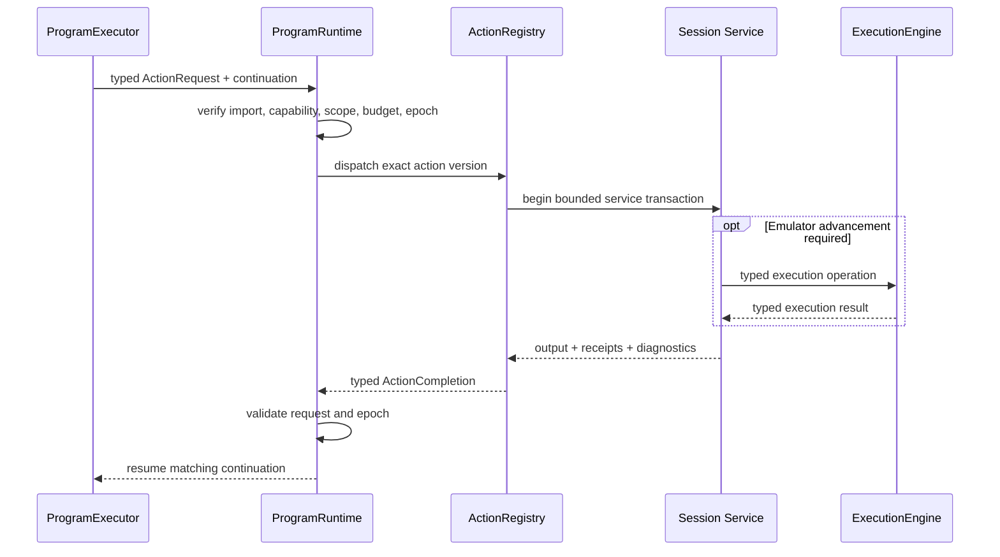

# Actions, Effects, and Session Services

## Scope

This document describes how programs request effects, how native extensions are bounded, which session
service owns each emulator facility, how resources are scoped, and how cancellation/restoration affect
session reuse. Concrete C++ signatures and worker transport encoding may adapt during implementation.
The package-wide SavorDb boundary applies: its schema, stored representations, service interfaces,
queues, claims, workflow persistence, transaction boundaries, and artifact-storage interfaces remain
unchanged.

## Purpose and non-goals

Programs need reusable capabilities without turning every capability into an opcode or hiding whole
phases inside native C++. This contract supplies one typed action-await boundary, pure native reducers,
narrow session services, explicit resource ownership, epoch safety, and auditable cleanup.

This document defines:

- `ActionDescriptor`, request, completion, and handler constraints;
- the pure native reducer boundary;
- the service-side lowering and temporal contracts for semantic observations and interactions;
- action granularity and forbidden hidden-controller behavior;
- root/nested resource scopes, receipts, compensation, cancellation, and taint;
- the ownership of execution, stop points, input, state, guest memory/mutation, movies, capture,
  telemetry, and game packs; and
- stable logical action/reducer names used by migration planning.

This document does not:

- define exact C++ interfaces or serialized action records;
- make action handlers a second scheduler;
- permit programs to call Dolphin or workflow storage;
- define phase-specific algorithms or final domain schemas; or
- freeze individual guest addresses, routing priorities, or input tolerances; or
- design a replacement capture-profile language. Existing `savor.capture.profile/1` behavior is a
  compatibility input preserved behind `CaptureService`.

## Current code evidence

Current facilities are capable but their ownership overlaps:

- `SavorCore/Core/DolphinWrapper.h:44-157` combines game/state lifecycle, screenshots, raw memory,
  movies/input, poll receipts, input-tape playback, and frame/opcode stepping.
- `DolphinWrapper.h:202-240` also exposes physical PC breakpoint and memory-watchpoint mutation,
  capture-job lifecycle, and run-until behavior.
- `SavorCore/Runner/Script/PhaseScriptVM.h:35-77` gives one VM direct access to that facade while the VM
  also acts as three input-macro host/provider interfaces and owns breakpoint scopes and one snapshot.
- `SavorCore/Runner/Script/PhaseScriptVM.cpp:87-122` starts capture from job context, while
  `PhaseScriptVM.cpp:335-393` scopes capture and watchpoint cleanup around each VM run.
- `SavorCore/Runner/Script/PhaseScriptVMControl.cpp:65-103` arms and replaces PC breakpoint sets.
- `PhaseScriptVMControl.cpp:162-369` combines input publication, enabled-breakpoint replacement,
  stepping, run-until, timeout/movie/stall policy, and input acknowledgement.
- `SavorCore/Runner/Script/PhaseScriptVMInput.cpp:15-67` directly steps, toggles breakpoints, publishes
  pad state, starts/stops movies, and saves state.
- `SavorCore/Runner/Script/PhaseScriptVMMacro.cpp:136-346` implements a VM-local exclusive macro
  session, expected-only breakpoint scopes, neutral stepping, polling, memory watchpoint cleanup, and
  breakpoint restoration.
- `SavorCore/Runner/InputMacro/InputMacroRuntime.cpp:84-105` acquires that exclusive session.
  `InputMacroRuntime.cpp:401-427` cancels and performs a fixed neutral/watchpoint/session/breakpoint
  cleanup sequence.
- `SavorCore/Runner/Breakpoints/BPRegistry.h:15-43` encodes visibility and one owner/consumer
  classification with each static stop point. Those fields do not express concurrent logical routing.
- `SavorCore/Core/DolphinWrapper.cpp:680-828` already advances a probe guest-state epoch on savestate
  load and in-memory restore, demonstrating the need for epoch-aware observations.
- `DolphinWrapper.cpp:1666-1826` implements physical PC breakpoint and watchpoint mutation through the
  broad facade.
- `SavorProbe/ProbeProfile.h:21-225` and `SavorProbe/ProbeProfile.cpp:611-1142` define and validate the
  existing `savor.capture.profile/1` subscriptions, sampling, windows, flight recorders, and
  control-derived behaviors.
- `SavorProbe/ProbeRuntime.cpp:199-339` validates and starts that profile, while
  `ProbeRuntime.cpp:1083-1266` publishes ordinary and synthetic control-tagged capture events. Those
  profile semantics must survive even though control-wait authority moves to the router/engine.

The router analysis at
`D:\SoAInvestigate\Analyses\20260723_2107_savor_worker_breakpoint_router\20260723_2107_savor_worker_breakpoint_router_architecture_summary.txt`
provides the research basis for the target services:

- lines 267-396 define one `ExecutionEngine`, logical stop routing, physical-stop ownership, and
  structured child operations;
- lines 397-471 define capture, predicates, input arbitration, state replacement, and game ownership;
- lines 633-729 map current facilities and state the target invariants; and
- lines 812-840 describe a suitable fake-backend test architecture.

## Core service and resource constraints

### Effect flow

`await action` is the only effectful program instruction.

The logical flow is:



An action request logically includes:

- invocation, request, and trace correlation identities;
- exact action ID, version, and signature hash;
- typed input conforming to the imported schema;
- current `StateEpoch`;
- active resource scope;
- remaining deadline and cancellation token;
- retry/idempotency identity where external publication is possible; and
- the caller's allowed capability/effect set.

An action completion logically includes:

- matching invocation and request identities;
- terminal infrastructure status;
- typed action output for successful execution;
- domain observation/outcome fields declared by the action;
- origin and resulting `StateEpoch`;
- resources acquired and restoration/finalization receipts;
- emitted observation/artifact references, if declared;
- structured diagnostics and causal error chain; and
- trace information sufficient to compare re-execution.

Action idempotency keys and commit receipts belong to runtime results or existing external
artifact/telemetry mechanisms. They do not create SavorDb columns, tables, interfaces, or queue records.

There is one outstanding program-level action per `ProgramInstance`. A handler may use structured child
operations inside its owning session service, but returns one completion to the program. A handler
cannot resume the executor itself.

### ActionDescriptor

Every action registration has an immutable logical descriptor:

| Field | Required meaning |
|---|---|
| Action identity | Stable namespaced ID, immutable version, and exact signature hash |
| Types | Exact input, output, domain-observation, receipt, and diagnostic schemas |
| Capability pack | Pack and version that provides the action |
| Required capabilities | Narrow session interfaces the handler may receive |
| Effect declarations | Read guest, mutate guest, advance emulation, publish input, replace state, movie, capture, artifact I/O, telemetry |
| Resource behavior | Resources acquired, owning scope, release/finalization operation, and receipt type |
| Epoch behavior | Epoch requirement, whether the action may replace state, and handle invalidation/rebinding rules |
| Determinism/replay | Replay class and fields that must be recorded or compared |
| Cancellation | Cancellation mode, safe points, maximum non-cancellable section, and cancellation completion |
| Deadline | Required/default upper bound and whether a caller may narrow it |
| Cleanup guarantee | No resource, automatically scoped release, or verified compensation; taint rule on failure |
| Idempotency | Whether retry is safe and which key/receipt proves a prior commit |
| Diagnostics | Stable failure categories and source/trace fields |

The registry resolves exact imported identity. It never chooses an implementation by latest version,
`ProgramKind`, phase family, or arbitrary controller factory.

### Action granularity

An action is one bounded reusable capability transaction. It may:

- perform one finite pure conversion that cannot be represented conveniently in IR;
- read one coherent observation;
- acquire/release one scoped resource;
- submit one typed execution operation and summarize its result;
- perform one checked guest mutation transaction;
- attach/finalize one capture or movie transaction; or
- create/finalize one immutable artifact.

An action may contain service-internal polling or stepping only when:

- it is part of one declared transaction;
- the completion condition and hard deadline are declared;
- every emulator advance uses `ExecutionEngine`;
- cancellation safe points and partial-commit behavior are defined; and
- it performs no phase-level branching or scheduling.

An action may not:

- own a phase, workflow wave, frontier, or worker queue;
- interpret another program or invoke `ProgramExecutor`;
- call another action through a private action loop;
- choose arbitrary subsequent domain steps;
- create a private thread or nested event loop;
- own Dolphin run state, physical stop points, or pad publication;
- read ambient workflow/database state; or
- hide an unbounded state machine behind a name such as `RunNavmeshSurvey`,
  `ExploreOverworld`, or `FastForwardAllCutscenes`.

If behavior branches across multiple observations/effects, it belongs in IR. If its transition logic is
complex but pure, it belongs in a reducer called by IR. If it must survive worker loss or create more
jobs, existing program-kind transition handlers and workflow persistence own it. Generalized frontier
infrastructure is outside this refactor.

### Pure native reducers

A pure reducer is an exact imported callable registered alongside actions but invoked through the IR
`call` boundary, not `await action`.

Its logical contract is:

```text
(typed reducer state, typed completed observation/effect)
    -> (new typed state,
        zero-or-one requested next action/subprogram descriptor,
        zero-to-many typed domain events,
        optional typed completion)
```

Reducer rules:

- no session service, Dolphin, filesystem, database, clock, hidden random source, global mutable state,
  callback, or thread access;
- no blocking, suspension, or effect execution;
- deterministic output for byte-identical typed input;
- explicit state schema and transition/output schema;
- a finite descriptor-declared set of actions/subprograms that the transition is permitted to request;
- exact version/signature import and source-map trace location;
- finite computation under a reducer budget; and
- all requested work is validated and scheduled by the ordinary executor/action path.

The adaptive pattern now represented by `IInputMacroPlanDriver::Start/Advance` becomes a reusable IR
statechart calling a reducer after each completed action. There is no peer `InputMacroEngine`.

### Semantic-observation lowering and service boundaries

The semantic-observation composition library defined in document 03 has no runtime or session-service
capabilities. It lowers before verification to exact capability-pack imports and ordinary actions:

- a `SemanticAwaitDefinition` creates one scoped router subscription group and awaits
  `runtime.execution.continue_until`;
- a successful wait returns one `SemanticPointReceipt` containing the logical point, physical hit
  evidence, stop sequence, `StateEpoch`, and declared hit-time samples;
- `HitTimeSample` requirements compile only to the router's bounded, allocation-free registered sample
  subset;
- `PausedAtPoint` observations compile to registered `runtime.guest.read_*` or coherent game-query
  actions while `ExecutionEngine` keeps the core paused; and
- an observation after an instruction/frame step requires that explicit execution action followed by a
  new paused observation.

The await use explicitly says whether an already-paused matching current point is acceptable. Otherwise
current-instruction suppression and rearm policy prevent the source stop from spuriously completing the
new wait. Unrelated stops may be observed or handled by their owners but cannot complete the await.
Timeout, stall, movie-ended, cancellation, guard/interceptor failure, and backend failure remain
distinct completion statuses.

`GuestMemory` evaluates checked `AddressExpression<T>` definitions and registered coherent query
recipes. It distinguishes required evidence loss from optional `Unavailable` and from a successfully
observed false, zero, or domain-negative value. Ordered observation uses execute in declaration order;
coherent multi-field state is returned by one registered query. Every receipt, sample, baseline,
derived address, and guest-derived handle is epoch-bound and rejected after state replacement.

No service evaluates module branches, check policy, scoring, or authoritative progress. No
`ObservationRuntime`, query VM, observation opcode, dynamic action ID, filesystem access, or database
access is introduced.

### Interaction lowering and temporal contract

The interaction composition library defined in document 03 lowers each static or adaptive interaction
to an ordinary IR subprogram, one pure reducer/statechart where needed, semantic awaits/observations,
and existing execution/input actions. There is no whole-interaction action, private execution loop,
driver callback, or second cancellation path.

One interaction holds an `InputArbiter` lease in an outer lexical scope. Each segment uses a nested scope
for its semantic subscription and observation resources. Its required temporal order is:

1. Arm the exact semantic-gate alternatives and establish the segment's starting
   `SemanticPointReceipt`/epoch.
2. Publish the requested input and obtain its input epoch before stepping off a currently matched source
   stop.
3. When stepping off that source stop, execute exactly one source instruction with the new input before
   beginning the ordinary wait.
4. Complete only on the declared logical point and matching PC/physical evidence, stop sequence, input
   epoch, and `StateEpoch`; an unrelated or stale hit cannot complete the segment.
5. Apply the declared reached-instruction policy: either leave the reached instruction paused or
   execute it under the held request.
6. Capture the request's guest-poll receipt after any held-through-hit execution and before publishing
   neutral input.
7. Acquire the segment's ordered observations/checks at their declared hit-time or paused moments.
   Paused-at-point reads occur before any release witness advances the guest again.
8. Where release is required, publish neutral with a fresh input epoch and independently prove the
   guest observed that epoch through `runtime.input.await_guest_poll`. Publishing neutral or dropping a
   lease is not release proof. The interaction names the release-witness point or segment separately
   from the request segment.
9. Return one typed `InteractionSegmentResult` to the statechart/reducer.

Translated memory-change waits acquire/update their named baseline before advancement and execute one
neutral frame between polls. A `Latest` baseline is updated before the check at that same hit. The
reducer consumes only typed state plus the completed segment result and may select only a finite
verifier-declared next segment, emit declared records, or complete.

Timeout, unexpected point, unacknowledged requested input, unproven neutral release, unsatisfied check,
infrastructure failure, cancellation, and cleanup failure remain distinct. On every terminal path,
common unwind cancels outstanding execution, neutralizes through the still-valid lease, proves release
when the interaction requires it, removes only the interaction's subscription scopes, and releases the
lease. Cleanup continues after a failure; an unproven mandatory release or restoration taints the
session. The target preserves these semantic dependencies, not the incidental order of current
`IInputMacroHost` cleanup calls.

### Predicate lowering and service boundaries

The predicate composition library defined in document 03 has no runtime or session-service
capabilities. It consumes `ObservationDefinition`/`ObservationUse` results from the shared composition
boundary above. It does not independently define addresses, observation timing, baselines, guest reads,
or waits. Action handlers and session services return typed observations; they do not decide whether a
check should abort, branch, emit progress, or affect scoring.

A router subscription's optional compiled predicate/sample requirement is only a bounded hit-time
filter or sampling qualification. It is not a module-level predicate executor and cannot advance program
control flow, select a domain result, or emit authoritative program output. Router `Guard` delivery
remains a session-safety mechanism; an unsatisfied program predicate does not become a router guard
unless a separate safety contract explicitly requires it.

Predicate baselines, sampled addresses, and guest-derived witness handles inherit the observation
contract's epoch binding. Lowered code must reacquire them after state replacement rather than retaining
them across `StateEpoch`.

Live predicate messages may use `TelemetryBus`, but progress or evidence needed by program results,
scoring, or adapters must also be a declared typed program emission. No `runtime.predicate.*` capability
family or whole-predicate action is introduced.

### Determinism and replay classes

Each descriptor declares one class:

| Class | Rule |
|---|---|
| `DeterministicFromState` | Re-execution from exact state/runtime/input is expected to match; completion is still traced |
| `RecordedObservation` | Control-flow replay may inject the recorded typed completion; live replay re-executes and compares declared witness fields |
| `IdempotentExternal` | External artifact/telemetry publication requires an idempotency key and durable commit receipt |
| `NonReplayable` | Exact replay policy rejects the module before invocation; use requires an explicitly permissive policy |

Pure reducers are deterministic by definition and do not use an action replay class.

Elapsed host time, poll count, or safety deadline may appear in infrastructure diagnostics when useful.
It becomes domain evidence only when the action's domain schema explicitly declares it. Navmesh Survey
actions do not declare timing as spatial evidence.

### Cancellation modes

Every action declares one:

- `ImmediateBeforeCommit`: cancellation prevents any effect from committing.
- `AtSafePoint`: the handler reaches a documented safe point within a bounded interval, then returns a
  cancelled completion and all receipts acquired so far.
- `CommitCritical`: a short declared commit section completes atomically before cancellation is
  acknowledged; the completion proves committed versus not committed.

An action with no bounded cancellation or deadline contract cannot be registered for worker programs.
Cancellation never calls arbitrary program code from a service thread.

### Resource scopes and receipts

The runtime owns a hierarchical resource ledger:

```text
Invocation root scope
  -> lexical program scope
       -> action transaction scope
            -> service-owned resources and receipts
```

Resources include:

- input leases and guest-observed neutral-release obligations;
- router subscription groups and physical-site derivations;
- foreground/child execution operations;
- state handles and epoch-bound guest handles;
- guest data mutations and executable patches;
- movie playback/recording sessions;
- capture attachments, buffers, and artifact writers; and
- temporary files or external artifact commits.

Every resource acquisition returns a typed receipt containing at least resource identity, owning
service, owning scope, acquisition epoch, prior-state/restoration evidence where applicable, release or
finalization status, and diagnostics.

Rules:

1. Registration in the current scope is atomic with action completion. A partially successful handler
   returns all acquired receipts even when its primary operation fails.
2. Scope exit releases resources in reverse acquisition order.
3. Cleanup continues after a release failure to collect the complete resource disposition.
4. A cleanup-safe compensation action must be idempotent and operate only on its typed receipt.
5. Resource promotion to an enclosing scope is explicit and descriptor-authorized.
6. Live resource/opaque handles cannot be emitted as records or artifacts.
7. Return, explicit fail, action failure, cancellation, timeout, budget exhaustion, guard abort, and
   worker-requested shutdown use the same unwind machinery.
8. Mandatory cleanup without a verified receipt marks the session tainted.

### StateEpoch interaction

Every guest-state replacement creates a new monotonically increasing worker-local `StateEpoch`.

Resource descriptors declare one epoch policy:

- `EpochAgnostic`: artifact writers or pure host resources do not depend on guest state.
- `EndOnEpochChange`: the default for guest-derived handles, observations, mutations, input
  acknowledgements, and transient waits.
- `RebindAfterRestore`: a session service may recreate a semantic subscription from stable identifiers
  after restore; the old physical/opaque handle is never reused.
- `ReplacesState`: the action is allowed to perform the state transaction and must return the new epoch.

Before state replacement, services are notified and active execution is safely paused. Old-epoch
mutations are closed as superseded by replacement rather than written into the newly loaded state.
Input poll receipts, predicate baselines, dynamic guest addresses, current-instruction suppression, and
opaque pointers are invalidated. Any later use of an old handle is rejected before service execution.

### Canonical logical capability IDs

These names are stable planning identities. Exact signatures and version numbers are defined by
implementation slices without changing their responsibility.

| Capability | Logical action/reducer IDs |
|---|---|
| State | `runtime.state.capture_baseline`, `runtime.state.restore`, `runtime.state.restore_baseline`, `runtime.state.save_artifact` |
| Execution | `runtime.execution.continue_until`, `runtime.execution.step_instructions`, `runtime.execution.step_frames` |
| Stop subscriptions | `runtime.stop.subscribe_group`, `runtime.stop.replace_group` |
| Input | `runtime.input.acquire_lease`, `runtime.input.set_held`, `runtime.input.pulse`, `runtime.input.neutralize`, `runtime.input.play_sequence`, `runtime.input.await_guest_poll` |
| Movie | `runtime.movie.play`, `runtime.movie.stop`, `runtime.movie.record_start`, `runtime.movie.record_stop` |
| Guest reads | `runtime.guest.read_u8`, `runtime.guest.read_u16`, `runtime.guest.read_u32`, `runtime.guest.read_u64`, `runtime.guest.read_f32`, `runtime.guest.read_f64` |
| Guest mutation | `runtime.guest.write_checked`, `runtime.guest.patch_executable` |
| Capture/telemetry | `runtime.capture.attach`, `runtime.capture.marker`, `runtime.capture.screenshot`, `runtime.capture.finalize`, `runtime.telemetry.emit` |
| Game observations | `soa.battle.capture_context`, `soa.navigation.capture_context` |
| Pure game conversion | reducer/callable `soa.battle.materialize_turn_input` |
| Adaptive battle subprograms | `soa.battle.command_macro`, `soa.battle.completion_macro`, `soa.battle.results_screen_macro`, with pure reducers using the corresponding `.reduce` identity |

Semantic-observation and interaction composition introduce no additional action family. They lower to
the exact IDs above plus capability-pack-owned point/query definitions and ordinary IR.

`runtime.execution.continue_until` accepts logical completion conditions. The owning handler creates
temporary wake subscriptions through the router; programs never manipulate physical PCs.

### ExecutionEngine

`ExecutionEngine` is the sole emulator-advancement owner. It accepts typed operations corresponding to:

- continue until logical completion conditions;
- step a bounded number of instructions;
- step a bounded number of frames;
- advance while an input sequence is owned by an `InputArbiter` lease;
- reach a safe pause; and
- execute bounded child operations for router interceptors.

It owns operation IDs, deadlines, remaining-time accounting, VI-stall policy, movie-ended policy,
throttle mode, cancellation, current-instruction suppression, pause confirmation, and resumption after
routing. Every operation carries `StateEpoch` and remains interceptor-aware.

Only one foreground operation advances the core. Interceptor child operations structurally suspend the
parent and return to it; they do not start a nested runtime.

### StopPointRouter and PhysicalStopPointManager

Programs/actions acquire logical subscription-group resources. A subscription declares:

- source identity and diagnostics label;
- semantic PC/memory/synthetic stop-point specification;
- `Observe`, `Progress`, `Wake`, `Intercept`, or `Guard` delivery;
- priority and consume/pass/replace/fail policy;
- lifetime/scope and epoch policy;
- optional compiled predicate/sample requirements; and
- rearm/current-instruction suppression behavior.

Routing order is deterministic: synchronous hit-time samples, passive observe/progress delivery, guards,
interceptors by priority, then the foreground wake condition.

For one physical hit, the router creates one immutable routed-event identity containing sequence,
snapshot/sample identity, and `StateEpoch`. Control/wake, capture, progress, and semantic-point receipts
project that same identity rather than independently resampling or resequencing the event. The router
also determines whether a foreground wake/control condition was active for that hit; passive consumers
may observe that fact but cannot create or upgrade it.

`PhysicalStopPointManager` alone derives and reconciles the union of physical Dolphin PC breakpoints and
memchecks. It reference-counts logical needs and publishes an immutable CPU-thread dispatch snapshot.
No program/action can clear another source's subscription or enabled state.

### GuestMemory and GuestMutationService

`GuestMemory` owns paused-safe typed reads, register reads, symbolic address resolution, and coherent
game-query input. Program access occurs through declared read/query actions. CPU-hit-time samples use a
separate bounded sampling path configured by the router.

`GuestMutationService` owns all program-requested writes:

- checked `u8`, `u16`, and `u32` data writes;
- masked read-modify-write operations;
- executable instruction patches;
- named mutation profiles and nested scopes; and
- restoration receipts.

A data mutation transaction declares the target, width, expected original value or masked precondition,
new value, scope, and readback requirement. It fails closed when the precondition or readback differs.

An executable patch additionally requires:

- aligned executable target and declared instruction width;
- exact expected instruction bytes/value;
- paused-core application;
- the backend's required instruction-cache/JIT invalidation;
- post-invalidation readback/verification;
- a receipt containing original and replacement values; and
- symmetric restoration/invalidation on scope exit.

Mutation profiles are generic. Navmesh encounter suppression and trigger patching use the same service
as battle RNG or future collision probes; there is no Survey-only binary editor.

### InputArbiter

`InputArbiter` alone publishes controller state. An input lease declares:

- owner identity and scope;
- priority;
- whether it is suspendable;
- whether a modal interceptor may borrow it;
- restoration/neutralization policy; and
- whether guest-poll acknowledgement is required.

Held state, pulses, sequences, and neutral release are operations on a valid lease. Each publication
creates an input epoch and poll receipt. Release completion is a first-class observation; dropping a C++
object without neutralizing the guest is not sufficient cleanup.

Emergency neutralization may preempt ordinary owners only under cancellation/guard/shutdown policy and
must record what was preempted. An unsuspendable movie/input owner cannot be silently overwritten by a
dialog or visual command.

### StateService

`StateService` owns boot/reboot, disk state artifacts, multiple in-memory state handles, restore, save,
compatibility validation, state lineage, and `StateEpoch`.

It replaces the VM's one implicit snapshot with explicit handles:

- a baseline handle may be captured and restored repeatedly within its declared lifetime;
- arbitrary state handles may coexist within budget;
- immutable state artifacts may be loaded by invocation policy or explicit action; and
- saving an artifact records parent/edge lineage and runtime/disc compatibility in runtime artifact
  metadata or its receipt; any SavorDb projection uses the existing artifact/domain representation.

A restore transaction:

1. reaches a safe pause and blocks new execution operations;
2. notifies router, input, capture, mutation, movie, and game services;
3. loads/reboots the backend;
4. increments `StateEpoch`;
5. invalidates or rebinds resources according to descriptor policy;
6. reconciles physical stop points;
7. emits a state-restored observation; and
8. returns only after the new epoch is internally consistent.

Loading state is never an unannounced helper side effect of VM initialization or a normal opcode.

### MovieService, CaptureService, and TelemetryBus

`MovieService` owns playback/recording lifecycle and returns scoped receipts. Movie-related execution
termination remains an `ExecutionEngine` policy, not a string guessed by a caller.

`CaptureService` owns profile validation, passive router subscriptions, service-internal recorder
queues/threads,
sampling windows, trace buffers, and capture artifact finalization. Attaching capture cannot grant
control authority. A job may attach a profile resource, but the service lifetime belongs to
`EmulationSession`.

For the initial refactor, `runtime.capture.attach` passes the existing versioned
`savor.capture.profile/1` artifact/configuration opaquely to `CaptureService`. The service preserves its
current parser, validation, subscriptions, filters/predicate bytecode, probe/sample/address-program
behavior, activation and dynamic watchpoints, PC and post-write memory sampling, sampling order and
policies, one-shot/max-hit behavior, changed-only and related retention rules, windows, flight
recorders, trace buffers, queues, drops/coalescing, progress formatting/publication, event order, and
artifact finalization. Observation/interaction composition may attach, mark, screenshot, or finalize
such a profile through ordinary actions, but does not reinterpret or lower profile internals into
program IR.

Profile `control` subscriptions and control-triggered windows, recorders, flags, metrics, and synthetic
events retain their observable meaning without retaining `ProbeRuntime` control authority.
`StopPointRouter`/`ExecutionEngine` owns the foreground wake and reports the already-determined active
control fact on the shared routed event. `CaptureService` passively consumes that same event and
publishes a control-tagged or synthetic profile event only when the routed hit had an active foreground
wake/control condition. A capture profile alone cannot pause, resume, arm a foreground wait, step the
core, or turn an observe-only hit into control.

`TelemetryBus` accepts typed, bounded progress and diagnostics and feeds one serialized worker
publisher. Telemetry is not authoritative program output unless the program also emits a declared
record/artifact. Background callbacks never write worker protocol frames directly.

### Modular GameRuntime packs

Game packs register exact:

- types/schemas;
- semantic stop-point and symbolic address definitions;
- bounded observation/mutation actions;
- pure reducers and reusable subprogram dependencies; and
- compatibility requirements.

The initial namespaces are `soa.battle`, `soa.field`, `soa.navigation`, `soa.cutscene`, and
`soa.overworld`.

A pack receives only the narrow generic services needed by each registered handler. It cannot depend on
`WorkerRuntime`, `ProgramExecutor`, workflow persistence, or a raw `DolphinBackend`. Packs are
independently versioned so adding overworld behavior does not invalidate battle-only modules.

## Interfaces and ownership affected

The target decomposes present authority as follows:

| Current surface | Target owner |
|---|---|
| `DolphinWrapper::runUntilBreakpointFlexible`, instruction/frame stepping, tape stepping | `ExecutionEngine` via `runtime.execution.*` actions |
| `armPcBreakpoints`, `setEnabledPcBreakpointsOnly`, watchpoint clear/arm | `PhysicalStopPointManager`, derived from router subscriptions |
| VM canonical/gated/predicate/macro sets | Scoped `StopPointRouter` subscription groups |
| `DolphinWrapper::setInput`, playback epochs, VM macro exclusivity | `InputArbiter` leases and operations |
| VM `snapshot_`, `loadSavestate`, buffer load/save, reboot | `StateService` handles/artifacts and state policy |
| VM `writeU32` and future executable patches | `GuestMutationService` checked transactions |
| VM-owned probe/capture job | Session-owned `CaptureService` attachment resource |
| VM movie start/stop | `MovieService` resource |
| `PSContext` domain extraction opcodes | Typed actions from the relevant `soa.*` capability pack |
| VM breakpoint/address/baseline observation machinery | Shared semantic-observation composition lowers to scoped router, execution, and registered read/query actions |
| `InputMacroRuntime` and providers as control engine | Shared interaction composition lowers to IR subprograms, pure reducers, semantic observations, and ordinary actions |
| VM predicate arming, baseline capture, evaluation, progress, and `AbortOnFail` | Shared compile-time predicate composition consumes semantic observations; pure IR evaluates them and the composing module owns branch/fail/emission policy |
| Probe profile control waits and profile capture behavior | Router/engine owns wake authority; `CaptureService` passively preserves opaque `savor.capture.profile/1` semantics from the same routed event |

Action handlers are constructed with declared narrow service capabilities. Service implementations may
use `DolphinBackend`; action code cannot acquire it through downcast, global singleton, or transitive
facade.

## Failure and cleanup behavior

### Action failure protocol

- Validation failure before dispatch acquires no resource and returns a deterministic runtime rejection.
- A handler that fails after partial acquisition returns every receipt already created.
- Domain-negative observations use typed domain fields and may allow ordinary program branching.
- Backend, schema, stale-epoch, deadline, cancellation, or capability failures are infrastructure
  statuses and cannot masquerade as domain values.
- A lost/duplicate completion cannot lose resource ownership: the runtime resource ledger, not the
  completion message alone, remains authoritative.
- A duplicate idempotent external request resolves from its commit receipt rather than repeating the
  side effect.

### Unwind and taint

Unwind cancels outstanding execution first, then releases resources in reverse acquisition order.
Service-specific releases include:

- drive input to required neutral state and verify the guest poll;
- finish/cancel movie and capture sessions;
- remove only the owning router subscription groups;
- restore checked data/executable mutations and repeat cache/JIT invalidation when required;
- finalize or abort artifact writers;
- invalidate state/guest handles; and
- publish cleanup diagnostics.

If a state replacement has already superseded an old-epoch mutation, its receipt closes as
`SupersededByStateReplace`; the service must not write old bytes into the new state. If restoration
cannot be proven and no state replacement safely supersedes it, cleanup is failed.

Any failed mandatory cleanup produces `Tainted` session disposition. Remaining cleanup is still
attempted. No later invocation, especially `ContinueSession`, may run until a full backend/session
rebuild succeeds.

### Service failure isolation

- Router/capture observation loss may be classified recoverable only when the action/module declares it
  non-authoritative. Required evidence loss fails the action.
- Unclaimed physical stops, guard violations, and backend state mismatches fail or abort the session
  through typed policy.
- Failure to reconcile physical stop points after an epoch change taints the session.
- Failure to observe neutral input release taints or fails according to the lease's mandatory cleanup
  policy; it is never silently ignored.
- State restore failure leaves the session tainted because the loaded guest state is unproven.
- Executable patch verification or restoration failure is always session-tainting.

## Dependencies and migration implications

This contract depends on the serialized worker/session ownership in document 02 and the canonical
action-await/scoping IR in document 03.

Migration implications:

1. Split `DolphinWrapper` behind narrow session-owned adapters before exposing actions.
2. Move physical breakpoint/watchpoint mutation to `PhysicalStopPointManager`.
3. Convert current VM waits and macro waits to temporary router subscriptions plus
   `runtime.execution.continue_until`.
4. Bring direct stepping and input-tape playback under `ExecutionEngine`.
5. Convert current input/macro ownership to `InputArbiter` leases and guest-observed release.
6. Move savestate/baseline ownership to `StateService` and introduce explicit epoch-tagged handles.
7. Move raw writes to checked `GuestMutationService`; add executable patch verification and cache/JIT
   invalidation before Navmesh Survey trigger suppression.
8. Move movie/progress lifetimes out of VM runs and into scoped session services.
9. Move capture lifetime behind `CaptureService`, passing existing `savor.capture.profile/1`
   configurations through unchanged and adapting their control observations to router-owned routed
   events.
10. Define semantic points, checked address expressions, registered coherent queries, baselines, and
    observation uses in capability packs; translate current program/predicate address expressions in
    memory while leaving capture-profile address programs opaque.
11. Express battle macros through shared interaction composition and the canonical
    subprogram/reducer IDs rather than preserving `InputMacroEngine`.
12. Register game observations in modular packs and delete their domain opcodes after phase parity.
13. Translate current battle predicate arming, baseline capture, evaluation, and reporting through the
    shared composition libraries; preserve existing stored records through in-memory adapter translation
    and remove the VM-specific evaluator after parity.

The temporary legacy adapter may call these actions while translating old programs. It cannot expose
the old broad host interfaces to new modules.

## Service and cleanup checks

- An action cannot be registered without exact types, capabilities/effects, epoch, deadline,
  cancellation, replay, resource, cleanup, and idempotency declarations.
- Static dependencies prevent handlers/reducers/packs from obtaining `WorkerRuntime`,
  `ProgramExecutor`, workflow storage, or raw `DolphinBackend`.
- A pure-reducer harness proves byte-identical output for identical input and rejects access to clock,
  random, global mutable state, and session services.
- A descriptor review fixture rejects whole-phase or unbounded actions and demonstrates the replacement
  as IR plus bounded actions/reducer.
- Semantic-observation lowering tests cover canonical imports/source maps/hash sensitivity, hit-time
  versus paused acquisition, explicit post-step behavior, ordered/coherent reads, current-point
  acceptance, unavailable evidence, baseline policies, and epoch invalidation.
- Interaction lowering tests cover static/adaptive definitions, exact verifier-known segment choices,
  input-before-step ordering, both reached-instruction policies, point/sequence/input-epoch matching,
  request versus neutral-release receipts, neutral witnesses, baseline-before-advance, cancellation,
  and unwind fault injection.
- Predicate composition tests prove that all observation effects, subscriptions, branches, and emissions
  are ordinary verified dependencies and that false remains distinct from unavailable evidence.
- Every advancement action is observed passing through one `ExecutionEngine`, including stepping and
  input sequences.
- Multiple logical consumers share one physical PC/memory site; releasing one subscription group leaves
  the others intact.
- Input lease priority, suspendability, modal borrowing, poll acknowledgement, and neutral cleanup pass
  deterministic tests.
- Multiple state handles can coexist; each restore increments `StateEpoch`; every old opaque handle is
  rejected; declared semantic subscriptions rebind safely.
- Checked data writes fail on precondition/readback mismatch and restore their exact original value.
- Executable patch tests prove expected-instruction validation, paused application, required cache/JIT
  invalidation, readback, symmetric restoration, and taint on failure.
- Capture can observe a site shared with a wake/interceptor without gaining control or owning a
  physical breakpoint.
- Existing `savor.capture.profile/1` compatibility tests cover every retained parser, sampling,
  retention, window, flight-recorder, queue/drop/coalescing, progress, ordering, and artifact behavior;
  control publication remains active-wake-only and shares the router event identity.
- Cancellation and fault injection at every action phase return all receipts, unwind every scope, and
  taint only when cleanup cannot be proven.
- Current battle/context/navigation behavior can use the canonical IDs above without a new opcode or
  peer macro executor.
- Navmesh suppression can be built from generic checked mutation actions without a Survey-specific
  controller or binary editor.

## Deferred work

- Exact C++ descriptor/request/completion/receipt types and registration API.
- Exact action signature schemas, version numbers, and capability negotiation encoding.
- Concrete router priority values, subscription serialization, and CPU sampling bytecode.
- Backend-specific JIT/instruction-cache invalidation calls, provided the locked patch transaction
  semantics are preserved.
- Worker-local state-handle memory limits/compression and external artifact-backend details. These do not
  alter SavorDb storage or interfaces.
- Generalized `eventhook` trigger characterization and allowlisting.
- Cutscene interception strategy, overworld-specific movement rules, collision-search objectives, and
  navigation settle tolerances.
- A generalized capture-plan language, alternate capture formats, telemetry retention, and UI
  presentation. Existing `savor.capture.profile/1` parsing and behavior remain compatibility
  requirements during this refactor.
- Additional controllers/ports beyond the initial standard pad, which must still use arbitration.

## Source references

- `SavorCore/Core/DolphinWrapper.h:44-157`
- `SavorCore/Core/DolphinWrapper.h:202-240`
- `SavorCore/Core/DolphinWrapper.cpp:680-828`
- `SavorCore/Core/DolphinWrapper.cpp:984-1020`
- `SavorCore/Core/DolphinWrapper.cpp:1666-1826`
- `SavorCore/Runner/Script/PhaseScriptVM.h:35-130`
- `SavorCore/Runner/Script/PhaseScriptVM.cpp:87-122`
- `SavorCore/Runner/Script/PhaseScriptVM.cpp:335-393`
- `SavorCore/Runner/Script/PhaseScriptVMControl.cpp:65-103`
- `SavorCore/Runner/Script/PhaseScriptVMControl.cpp:162-369`
- `SavorCore/Runner/Script/PhaseScriptVMInput.cpp:15-67`
- `SavorCore/Runner/Script/PhaseScriptVMMacro.cpp:136-346`
- `SavorCore/Runner/InputMacro/IInputMacroHost.h:38-58`
- `SavorCore/Runner/InputMacro/IInputMacroPlanDriver.h:42-59`
- `SavorCore/Runner/InputMacro/InputMacroRuntime.cpp:84-105`
- `SavorCore/Runner/InputMacro/InputMacroRuntime.cpp:401-427`
- `SavorCore/Runner/Breakpoints/BPRegistry.h:15-93`
- `SavorProbe/ProbeProfile.h:21-225`
- `SavorProbe/ProbeProfile.cpp:611-1142`
- `SavorProbe/ProbeRuntime.cpp:199-339`
- `SavorProbe/ProbeRuntime.cpp:1083-1266`
- `D:\SoAInvestigate\Analyses\20260723_2107_savor_worker_breakpoint_router\20260723_2107_savor_worker_breakpoint_router_architecture_summary.txt:267-471`
- `D:\SoAInvestigate\Analyses\20260723_2107_savor_worker_breakpoint_router\20260723_2107_savor_worker_breakpoint_router_architecture_summary.txt:633-729`
- `D:\SoAInvestigate\Analyses\20260723_2107_savor_worker_breakpoint_router\20260723_2107_savor_worker_breakpoint_router_architecture_summary.txt:812-840`
