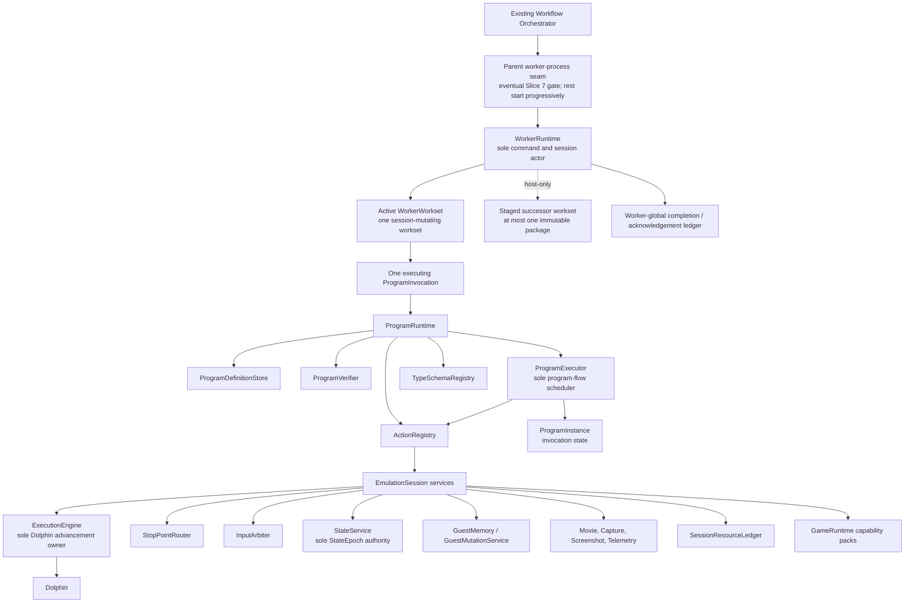

# Execution Runtime Refactor Guidance

## How to use this guidance

This package is working target guidance for the breaking Execution Runtime refactor. It was prepared
from the repository state around SAVOR commit `b584920ffad8dbe770f343e532d7f7386c82fadf`.
Current code and executable behavior are the source of truth for what exists. If implementation evidence
conflicts with these plans, adapt the plan and implementation together rather than preserving stale
wording or inventing a compatibility layer for it.

Dependency slices 1 through 5 now exist as hard-cutover implementation checkpoints. Slice 5 establishes
the canonical typed program model/runtime foundation, but production worker composition still does not
advertise program execution. A pre-6A worker-process and dispatch prelude adds progressive compatible
worker startup plus bounded pipelined `WorkerWorkset` dispatch before Dependency Slice 6 is divided into
direct native-builder migrations for the nine supported current phases:

- 6A SeedProbe;
- 6B Navigation Context;
- 6C TAS Movie playback/checkpoint;
- 6D TAS Frame Detector;
- 6E Battle Context;
- 6F Battle Macro Probe;
- 6G Battle Single Turn;
- 6H Battle Completion; and
- 6I Battle Results Screen.

These slices build typed modules directly from current domain behavior. They do not compile
`PhaseScript`, add a temporary `PhaseScript` translator, or require a parallel old/new differential
harness. The disconnected legacy multi-turn `BattleRunner` remains orientation and deletion evidence,
not a migration target. `BattleEndResults` is likewise not a phase: its surviving names are compatibility
or container names for the separate Battle Completion and Battle Results Screen phases.

The remaining documents guide these current-program migrations and the adapter cutover that restores
behavior. Component names and concrete API shapes may continue to evolve. The ownership and safety
boundaries below are the constraints to preserve:

- worker-side program execution and session ownership;
- the universal typed program model;
- native action, effect, reducer, and resource-scope boundaries;
- invocation, result, artifact, and versioning contracts;
- the boundary between bounded program execution and durable workflow/frontier orchestration; and
- migration from the current `PhaseScriptVM` runtime.

It supersedes the target-runtime portions of:

- `planning/DBMigrateWorkflows/12-user-defined-script-payload-system-plan.md`; and
- `D:\SoAInvestigate\Analyses\20260723_2107_savor_worker_breakpoint_router`.

Those sources remain useful current-state and research evidence. Current SavorDb code defines the
persisted job, workflow, artifact, and domain-storage contracts this refactor must preserve. Separate DB
migration/workflow plans are orientation for their own projects; they are not requirements for this
refactor. Program-kind handlers or adjacent integration adapters construct per-item invocation templates
from existing persisted job/domain data; `WorkerRuntime` binds each template into a
`ProgramInvocation` only at active admission, and existing adapters project each `ProgramResult`
through existing persistence operations. Workset support may change coordinator grouping,
staged/resident-capacity accounting, lease maintenance, completion acknowledgement, progressive worker
startup, and use of the current claim/start lifecycle. It does not add a SavorDb SQL migration,
persistent workset record, aggregate job/result representation, unrelated database interface change,
durable workflow redesign, result-projection transaction change, per-item lifecycle change, or
artifact-storage interface. The one documented transaction-granularity exception is claiming an ordered
set in one transaction instead of looping scalar claim transactions.
In this package, an unqualified **schema** is a runtime program/type schema, not a database schema.

The Navigation Context workflow package describes the intended Navmesh Survey domain behavior; this
package supplies its execution foundation.

## Purpose and non-goals

The purpose is to make a new phase an ordinary composition of programs, actions, runtime type schemas,
and program-kind integration adapters over the existing workflow contracts. Navmesh Survey is the first
demanding new reference design, not a special architecture. The bounded worker portions of navigation
replay, collision-oddity search, cutscene fast-forward, phase switching, and overworld expansion must fit
the same runtime foundation; generalized durable orchestration remains separate work.

This package does not:

- implement the refactor;
- claim that Navmesh Survey or the other future phases exist;
- add a SavorDb SQL/schema migration, persistent workset representation, aggregate durable job/result,
  or unrelated database-service, workflow, transaction, or artifact-storage redesign;
- freeze concrete C++ declarations or byte-level worker transport layouts;
- choose a user-authored source language or editor;
- replace durable workflow orchestration with an in-worker scheduler; a bounded transient workset is
  only admission and drain of already-independent jobs; or
- preserve legacy worker-runtime APIs or messages merely to avoid breaking worker-side changes. The
  narrowed SavorDb compatibility boundary above is not waived.

## Current code evidence

At the inspected commit, `SavorWorker` reconstructs a compiled `PhaseScript` from a wire `ProgramKind`,
decodes a program-specific payload into `PSContext`, and calls one `PhaseScriptVM`. The VM directly owns
Dolphin integration, breakpoint/run state, one mutable snapshot, visual-debug gates, input-macro runtime,
and domain-specific operations. SavorDb already provides pluggable persistence/result/transition adapters
and `WorkflowTransitionDecision::spawn_steps` for dynamic workflow expansion.

Those facts establish both a useful single-VM precedent and the coupling this refactor must remove.
Navmesh Survey is not present in the registry or worker runtime and remains unimplemented.

### Implemented Slice 5 checkpoint

Current code now contains one canonical little-endian version-1 program boundary:

- `SPRM` encodes an immutable `ProgramModule`, `SPRI` encodes `ProgramInvocation`, and `SPRR` encodes
  `ProgramResult`;
- the module identity is SHA-256 over canonical `SPRM` bytes with the declared hash omitted;
- `ProgramDefinitionStore`, `ProgramVerifier`, `ProgramExecutor`, the type/action/capability registries,
  the actor-queued program-action protocol, and the concrete internal `SessionProgramActionHost` form
  the one typed `ProgramRuntime`/session-service foundation; and
- invocation/action resource identities bind to the existing Slice 4 `SessionResourceLedger` rather
  than creating an executor-private cleanup authority.

The initial source-backed catalog registers generic `runtime.session` plus `soa.field`, `soa.battle`,
and `soa.navigation` for the supported USA executable/address-map compatibility. It also supplies
coherent battle/navigation queries, the pure `soa.battle.materialize_turn_input` reducer, and reusable
semantic-observation, interaction, and predicate composition frontends that lower to ordinary IR before
verification.

This is a development checkpoint, not restored production behavior. The production worker constructs
neither `ProgramRuntime` nor `SessionProgramActionHost` and does not advertise `ProgramInvocation`.
`soa.cutscene` and `soa.overworld`, direct native-builder migration of the supported current phases,
production worker construction and capability activation, a live program smoke, and production-worker
SavorE2E remain deferred. No SavorDb schema, persistence, interface, queue, claim, workflow, transaction,
or artifact-store contract changed.

## Core architectural constraints

### Target architecture

The names have precise meanings:

- **WorkerWorkset** is the one production dispatch envelope for one or more independent invocations. It
  is finite, static, ordered, bounded, worker-resident, and non-durable. A singleton job is a one-item
  workset. One workset may own session mutation while at most one immutable successor package performs
  host-only staging; staging grants no epoch, baseline, session-resource, or emulator authority.
- **Worker-global completion/acknowledgement ledger** is the bounded non-lossy owner of completed
  execution records, promoted immutable output captures and their host-only finalizers, assembled item
  terminals, and acknowledgements across worksets. It permits a clean workset handoff while earlier
  outputs finalize or terminals await durable acknowledgement, but full count/byte capacity stops later
  admission.
- **StateCacheKey** is the exact identity for a bounded process/session-owned cache of immutable
  serialized state plus metadata. It covers state hash and lineage, disc/runtime/backend/movie
  compatibility, and session generation; it never identifies live guest state or an epoch-bound handle.
- **ProgramBaselineDefinition** is the complete reusable starting condition for a multi-item workset.
  Its ordered **ProgramBaselineComponent** values cover the savestate, its exact movie continuation,
  and any runtime-facing program-kind adapter-declared derived state. **ProgramBaselineKey** identifies
  that complete definition, and **PreparedProgramBaselineReceipt** proves every component was prepared
  together before an item is admitted.
- **ProgramRuntime** is the worker subsystem containing definition storage, verification, execution,
  action registration, and type registration.
- **ProgramExecutor** is the one interpreter and scheduler for program control flow.
- **ProgramModule** is an immutable, verified definition with named entrypoints.
- **ProgramInstance** is mutable state for one invocation: program counter, call stack, locals, pending
  continuation, resource scopes, state epoch, and result construction. It is not a controller subclass.
- **Action** is a bounded registered capability transaction. It may suspend and later complete.
- **Reducer** is a pure native state transition that requests effects through the executor. It owns no
  Dolphin, input, stop points, threads, or event loops.
- **Predicate composition library** is a reusable builder/frontend facility. A pure typed predicate and
  each explicit use of it lower before verification into ordinary IR, registered actions, scoped router
  subscriptions, branches or returns, and declared emissions. The use site decides whether false records
  progress, contributes to a result, branches, or returns a clean domain rejection.
- **Semantic-observation composition** is a reusable builder/frontend facility for naming logical game
  points, awaiting them, and acquiring typed evidence there. Semantic points, awaits, address
  expressions, observations, and use policies lower before verification into ordinary IR, exact imports,
  router subscriptions, registered read/query actions, and emissions.
- **Interaction composition** is a reusable builder/frontend facility for static or adaptive input
  sequences. Typed interaction reducers select only verifier-known segments, which lower into ordinary
  subprogram control flow, input scopes, semantic awaits, observations, checks, and emissions.
- **Interruption handler** is a verifier-known bounded handler requested by an `Intercept` subscription
  using `RequestInterruptionHandler`. The router emits a typed request but never executes it;
  `ExecutionEngine` suspends the foreground operation while the handler runs. This supports session-local
  events such as known short cutscenes and text boxes, not durable workflow transitions.
- **Capture profile** means the existing opaque `savor.capture.profile/1` configuration interpreted by
  `CaptureService`. Its current parser, sampling, window, recorder, queue, progress, and artifact
  semantics remain intact initially; it is not replaced by another composition language in this
  refactor.
- **SessionResourceLedger** is the actor-owned, service-neutral ledger for session and future invocation
  scopes. It records typed receipts, reverse-order unwind, state-epoch policy, promotion, rebind, cleanup
  continuations, and whether cleanup remains clean, clean with diagnostics, or requires taint.
- **State artifact** is a caller-named immutable state file paired with its SHA-256, compatibility token,
  lineage, and, for read-only playback, exact embedded/hash-verified DTM history plus continuation
  counters. Importing an external state is explicit; the runtime never guesses ambient or latest
  state/movie data. In-progress recording checkpoints are same-session memory handles, not file
  artifacts.
- **Workflow orchestration** remains the existing durable owner for jobs, waves, phase changes, retries,
  and recovery. It may group independently durable attempts into a transient workset, but workset order
  cannot encode a dependency or durable transition. Generalized frontier persistence is a separate
  project, not part of this refactor.

## Non-negotiable invariants

1. `WorkerRuntime` is the sole actor for external commands and emulation-session lifecycle.
2. `ExecutionEngine` is the only component allowed to perform supported post-open program or interactive
   Dolphin advancement. The private state-load bootstrap remains confined to the backend-owned
   replacement preflight whose transient guest state is immediately overwritten.
3. `ProgramExecutor` is the only component allowed to advance program control flow.
4. Programs, actions, reducers, and capability packs do not create private worker controllers or nested
   execution loops.
5. Domain behavior is registered through typed actions and composed through programs; it is never added
   to a central interpreter opcode switch.
6. Every effectful resource is scoped. Return, failure, cancellation, timeout, and guard abort unwind the
   same resource stack.
7. A failed mandatory cleanup taints the session and prevents worker reuse.
8. `StateService` is the sole authority that establishes and advances `StateEpoch`. Every successful
   boot, reboot, or restore advances it exactly once; a recoverable replacement failure does not.
   Stale epoch-bound handles cannot be used.
9. A program invocation is bounded to one emulation session. It may emit successor artifacts but cannot
   enqueue workers, mutate durable workflow state, or choose the next workflow phase.
10. Exact program identity includes module ID, immutable revision/hash, entrypoint, and dependency closure.
11. `ProgramKind` may remain SavorDb job, handler, queue/affinity, semantic, or UI metadata. After the
    program-kind integration adapter constructs the runtime invocation, it does not select a worker
    controller, worker-side payload decoder, or interpreter.
12. A phase that uses existing capabilities requires no change to `WorkerRuntime`, `ProgramRuntime`,
    `ProgramExecutor`, `ExecutionEngine`, the stop-point router, transport core, or a central opcode table.
13. C++ builders and future authored formats compile to the same `ProgramModule`; there is no separate
    `PK_UserScript` execution path.
14. Runtime deadlines may prevent hangs, but domain schemas decide whether time is evidence. Navmesh Survey
    evidence is spatial and contains no inferred probe timing.
15. SavorDb storage and orchestration contracts are fixed inputs. Runtime integration must adapt to them;
    this refactor does not migrate or redesign them.
16. Predicate composition introduces no predicate executor, runtime service, domain opcode, hidden effect
    channel, or persistence model. Failure to obtain required evidence remains distinct from a predicate
    evaluating false, and all generated effects and emissions remain visible to verification and tracing.
17. Semantic-observation and interaction composition introduce no peer runtime, controller, scheduler,
    query VM, domain opcode family, hidden effect channel, filesystem access, database access, or
    persistence model. Their complete lowering is visible to verification, hashing, tracing, and unwind.
18. A semantic-point receipt, observation, derived guest handle, or baseline is bound to one
    `StateEpoch`. Hit-time sampling is a bounded router concern and ordinary typed reads occur while
    paused. Exact guest-opcode stepping is not a forward execution contract: breakpoint departure uses
    router suppression and behavior that must occur after a guest instruction uses an explicit semantic
    witness or other routed continuation. A future debugger may step `ProgramRuntime` IR instructions,
    which is a distinct facility and remains deferred.
19. `CaptureService` remains passive. `StopPointRouter` and `ExecutionEngine` own wake and control
    authority, while capture observes the same routed hit identity and preserves existing profile-visible
    control, window, recorder, progress, and artifact behavior.
20. State and movie continuation are one exact transaction. Caller-declared immutable state artifacts
    carry compatibility, SHA-256, lineage, and exact embedded/hash-verified read-only DTM history.
    Restore materializes that history before state mutation and requires any already-active DTM identity
    to match. External movie imports must declare `NoMovie` or `ReadOnlyPlayback`; recording
    file-artifact capture/import/restore is unsupported, while same-session recording rewind may use a
    process-local memory handle. A cold external read-only state/DTM pair does not require a
    caller-supplied frame/input cursor: Dolphin restores that cursor from the savestate and
    `MovieService` records the authoritative observed position. Exact cursor equality is required only
    for an internally captured checkpoint that already carries a known cursor.
21. `InputArbiter` alone publishes pad state. Its leases, publications, poll acknowledgements, neutral
    release, interruption borrowing, typed arbiter-issued one-use neutral borrow witnesses, and
    movie-exclusive reservations are epoch-bound resources.
22. Guest data mutations are reversible by default and may survive only through an explicit commit.
    Executable patches are always reversible and require symmetric JIT/cache invalidation and readback.
23. One session may have at most one opaque capture attachment. It is rebound across a successful state
    replacement and remains passive throughout. Mandatory finalization failure taints the session,
    blocks another attachment, and prevents reuse until a full rebuild.
24. `ScreenshotService` currently owns one synchronous actor-thread bounded call; active in-flight
    cancellation is deferred until nonblocking backend/actor ingress. `TelemetryBus` preserves
    monotonic sequence order when coalescing places a replacement at its fresh chronological position.
25. `SubmitWorkset` is the sole production program-dispatch path. It accepts one or more item templates;
    WRMS remains version 1, and both the old direct `SubmitInvocation` and removed guest-step
    discriminators remain reserved and reject before session mutation.
26. One worker owns at most one active session-mutating workset, at most one immutable host-only staged
    successor package, and at most one executing child `ProgramInvocation`/`ProgramInstance`.
    `ProgramRuntime` neither sees nor schedules pending or staged items.
27. A multi-item workset has one exact module, entrypoint, dependency, runtime, state/movie, and service
    compatibility key plus one exact `ProgramBaselineKey`. Each child retains an independent job, claim,
    lease, invocation, attempt, budget, cancellation, result, retry, and transition identity.
28. Workset-specific coordinator grouping, resident-capacity accounting, and lease maintenance may
    change. Workset identity and membership are not persisted, and unrelated SavorDb storage, workflow,
    transaction, and artifact contracts remain fixed.
29. Host-only staging may decode envelopes, resolve cached modules, validate typed inputs, read and hash
    immutable artifacts, and acquire bounded cache leases. It may not restore state, bind `StateEpoch`,
    capture a baseline, acquire session-effect resources, construct a `ProgramInstance`, or advance
    Dolphin.
30. Completed execution records and synchronously captured immutable outputs leave workset/session
    ownership through the worker-global bounded completion ledger. After every child has completed
    session work or is classified unstarted, all required immutable captures are promoted, invocation
    and baseline scopes release, and the session is proven clean, the staged successor may promote while
    prior outputs finalize or terminals remain unacknowledged if global ledger capacity remains.
31. Claim/start authority for every member is validated before the finite workset is accepted. After
    acceptance, the worker runs its ordered children without a coordinator authorization pause between
    items. Lease loss or supersession reaches the worker as exact item/workset cancellation.
32. The configurable production defaults are 16 items and 32 MiB encoded bytes per workset, four hours
    of aggregate declared active budget, 64 total worker item credits, and 32 active-plus-staged items.
    State caching is limited to 16 entries/512 MiB; two finalizer threads may own at most eight pending
    captures/256 MiB; the terminal ledger retains at most 32 terminals/128 MiB. At most two workers
    start concurrently, and the coordinator buffers at most one additional workset per negotiated Ready
    worker.

## Interfaces and ownership affected

The implemented session seam already replaces direct VM ownership of state replacement, pad
publication, guest mutation, capture attachment, movies, screenshots, telemetry, and scoped cleanup.
Slice 5 now supplies the canonical model, store, verifier, executor, registries, action queue seam,
initial capability packs, and composition frontends. The remaining target replaces production worker
activation/result, current program construction and worker-side payload switches, `PSContext` as a
public runtime contract, the VM-owned input-macro mini-runtime, and the runtime-facing behavior of
program-kind handlers. The pre-6A process/workset prelude establishes the replacement for scalar
production dispatch and supports direct one-item process tests. It implements the eventual
one-compatible-worker startup gate, at-most-two progressive startup for the remaining desired pool,
active/staged independent-job accounting, and per-item durable handling through the worker-global
completion ledger. Its initial `Partial` smoke transfers one canonical test-only module that is never
one of the nine production modules. It does not open the coordinator data plane during the hard-cutover
interval. Slice 7 applies that gate only after `CompleteExact` proves exactly the nine planned module
IDs/hashes, their dependency manifest, and no extras. Existing SavorDb handler registration, stored representations, workflow definitions,
result-projection and per-item transaction semantics, and artifact contracts remain unchanged.

## Reading order

1. [Current System and Pressure Points](01-current-system-and-pressure-points.md)
2. [Target Execution Architecture](02-target-execution-architecture.md)
3. [Program Modules, IR, and Types](03-program-modules-ir-and-types.md)
4. [Actions, Effects, and Session Services](04-actions-effects-and-session-services.md)
5. [Invocation, Result, Versioning, and Artifacts](05-invocation-result-versioning-and-artifacts.md)
6. [Workflow Boundary and Phase Composition](06-workflows-frontiers-and-phase-composition.md)
7. [Current Phase Migration Matrix](07-current-phase-migration-matrix.md)
8. [Future Phase Reference Designs](08-future-phase-reference-designs.md)
9. [Breaking-Change Cutover Plan](09-breaking-change-cutover-plan.md)
10. [Verification and Acceptance](10-verification-and-acceptance.md)
11. [Decisions, Risks, and Deferred Work](11-decisions-risks-and-deferred-work.md)
12. [Source Orientation](12-source-evidence-map.md)

## Working conventions

Use **must** and **shall** for the ownership and safety invariants that implementation must preserve.
Use **may** for implementation choices inside those boundaries. A deferred item should remain outside
the current slice unless code or test evidence shows that it must be decided.

Source references are navigation aids, not a documentation ledger. Check the current implementation
before relying on a current-state claim, and update the relevant guidance when a decision materially
changes.

## Failure and cleanup behavior

The architecture distinguishes infrastructure execution, domain outcome, and cleanup/session status.
Program success cannot hide failed restoration of input, stop-point subscriptions, movies, captures,
guest data writes, or executable patches. Cleanup is attempted on every terminal path. A session that
cannot be proven clean is tainted and retired or rebuilt before another invocation. Within a workset,
every child fully unwinds before the next begins; taint stops admission and leaves pending children
unstarted. A staged successor has not acquired session authority and therefore remains unstarted when
the active session taints. Already promoted immutable outputs continue to one terminal, and published
item terminals remain replayable from the worker-global completion ledger until acknowledged or process
loss transfers recovery to their ordinary durable attempt rules.

## Dependencies and migration implications

The explicit `EmulationSession` boundary and its scoped generic services are established. The canonical
typed program IR, codec, verifier, executor, registry/action seam, initial packs, and composition
frontends are also established. Before native phase migration, the process/workset prelude adds
progressive pool startup, unified 1..N production dispatch, one host-only staged successor, bounded
cross-workset immutable state caching by `StateCacheKey`, just-in-time child epoch binding, a
multi-item-active-workset-owned composite `ProgramBaselineDefinition` (skipped for one-item worksets),
non-lossy per-item
terminals in a worker-global acknowledgement ledger, and coordinator staged/resident-job accounting.
The remaining target then reconstructs supported current behavior in direct native typed-module builders
and actor-owned registered effects before final production activation. Existing payload and result
representations are adapted in memory at that boundary; the disconnected `PhaseScript` corpus is
read-only orientation and deletion evidence, not compiler input.

Navmesh Survey is a useful first net-new client after current phases migrate, but it is not required to
complete this refactor. If implemented, its bounded entrypoints and reusable navigation actions exercise
the new runtime through a harness or unchanged existing SavorDb contracts. End-to-end durable two-wave
orchestration remains separate work unless the current contracts already support it.

## Validation while implementing

Apply the dependency order in this package incrementally. Each slice should run focused checks for the
ownership, cleanup, protocol, and phase behavior it touches; the plans do not require a separate
architecture sign-off or evidence-update ceremony for every change.

Dependency Slice 5 remains inside the deliberate hard-cutover interval: the typed runtime exists as a
development surface with concrete internal session-service bindings, but the production worker
constructs neither the runtime nor its action host and does not advertise program/workset execution.
Production-worker SavorE2E is not an intermediate acceptance signal. Its
development guards are full solution compilation plus focused model/codec/store/registry/verifier,
executor/action-seam, capability-pack, and composition tests. A live program smoke, live movie
continuation, post-write capture, and rendered behavior remain deferred until migrated deterministic
program execution exists.

The pre-6A process seam implements and directly tests the one-compatible-worker gate, at-most-two
progressive startup, and unified one-item process path while keeping `data_plane_enabled` false. Slice 7
requires one completely negotiated compatible worker in `CompleteExact` state, including exactly the
nine planned module IDs/hashes with no extra module, the production
dependency manifest plus pipelined-workset and staging/cache/ledger limits, before production data-plane
activation. The remaining desired workers then start progressively with at most two concurrent
startups. Slice 7
runs a full Release `SAVOR.sln` build, the production-worker SavorE2E `all` matrix, separate
`battle_end` and `navigation_context` scenarios, and focused direct diagnostics before Slice 8 deletes
the already disconnected legacy sources. Slice 8 then receives the normal complete Debug and Release
solution builds plus deletion/architecture guards; the full E2E matrix is repeated only if that
deletion unexpectedly changes active production composition. Focused tests remain development tools for
risky seams; they are not a separate approval process. Future-design and workflow-persistence examples
do not gate completion.

## Deferred work

Future C++ API evolution, production worker activation, authored source language, authoring UI, and
game-specific algorithms listed in document 11 remain deferred. The `SPRM`/`SPRI`/`SPRR` version-1
encoding, SHA-256 module identity, and logical pipelined `WorkerWorkset` behavior are no longer open
design questions. The initial workset/staging/cache/finalizer/ledger/startup limits above are
configurable defaults; later tuning is measurement-driven without weakening those bounded contracts.
SavorDb SQL/storage
and unrelated interfaces remain fixed inputs, not deferred design choices in this refactor. A generalized
replacement for `savor.capture.profile/1` is also deferred; the existing profile remains an opaque
`CaptureService` contract during the initial architecture cutover. The initial field, battle, and
navigation packs exist; cutscene and overworld packs wait for concrete migrated clients.

## Source references

- `SavorWorker/SavorWorker.cpp`
- `SavorCore/Phases/Programs/ProgramRegistry.cpp`
- `SavorCore/Runner/Script/PhaseScriptVM.h`
- `SavorCore/Runner/Script/PhaseScriptOpcodeTable.inc`
- `SavorCore/Runner/InputMacro`
- `SavorCore/Runner/Breakpoints/Predicate.*`
- `SavorCore/Runner/Runtime/ProgramRuntime`
- `SavorProbe/ProbeProfile.*`
- `SavorProbe/ProbeRuntime.*`
- `SavorProbe/AddressProgramEvaluator.h`
- `SavorCore/Runner/IPC/Wire.h`
- `SavorDb/Execution/ProgramDB/ProgramKindDescriptor.h`
- `planning/NavigationPhase/NavigationContextWorkflow/README.md`
- `planning/NavigationPhase/NavigationContextWorkflow/04-suppressed-exploration-and-world-refinement.md`
- `planning/DBMigrateWorkflows/12-user-defined-script-payload-system-plan.md`
- `D:\SoAInvestigate\Analyses\20260723_2107_savor_worker_breakpoint_router`
