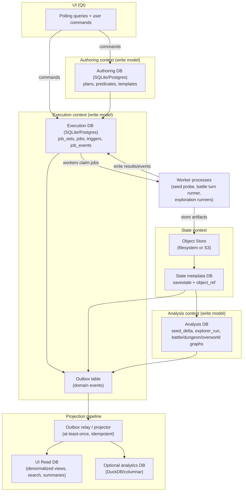

# Database Choices for SAVOR Bounded Contexts and Domain Splits

## Executive summary

SAVOR’s current storage design is already strongly “relational-core + blob store” oriented: a single embedded **SQLite** file (with WAL enabled) holds most operational and analytical metadata, while a filesystem-backed, content-addressed “ObjectStore” holds large artifacts such as savestates and input tapes. fileciteturn105file0 fileciteturn75file0 fileciteturn52file0 This is a very sound baseline for a desktop-style tool and explains why most of the bounded contexts can remain relational without performance cliffs—until you scale the worker/process concurrency and event volume beyond what a single-writer database file comfortably supports. fileciteturn104file0 citeturn4search1

For the bounded contexts you listed (State, Execution, Analysis, Authoring, UI Read), the “best” database types map cleanly to:

- **State:** object store (filesystem or S3) + small relational metadata DB (SQLite/Postgres) for dedupe, indexing, and lifecycle. fileciteturn75file0 fileciteturn52file0 citeturn6search6
- **Execution:** relational DB (SQLite for local/small; Postgres for multi-worker/high-throughput). SAVOR’s core scheduler semantics are relational (jobs/job_sets/leases/events), and Postgres’ row locks + `SKIP LOCKED` are the industry-standard building blocks for queue-like tables at scale. fileciteturn70file0 fileciteturn100file0 citeturn4search0
- **Analysis:** still primarily relational (turn graphs, encounter graphs, provenance), augmented by specialized indexes (e.g., R-tree for spatial) or by a secondary analytical store (DuckDB) for heavy aggregations. fileciteturn94file0 citeturn8search0turn6search2
- **Authoring:** relational with “document columns” (text/JSON/INI) is a best fit because authoring has stable identities, dedupe/fingerprints, and relationships (plans↔turns↔atoms, predicates, templates). fileciteturn76file0turn83file0 citeturn7search3
- **UI Read:** CQRS-style read model(s) refreshed by an outbox/projection pipeline; the read DB engine can be chosen for query performance and UX (often SQLite for local UI; could be Postgres read replica, or DuckDB for “analytics panels”). fileciteturn68file0turn92file0 citeturn8search2turn7search0turn6search2

On the “battle vs dungeon vs overworld” question: **splitting those into three different DB *types* is usually not beneficial early**. It increases operational complexity and projection cost, while most of the structural needs (graphs, spatial, logs, provenance) can be served inside one relational engine using normal tables + recursive queries + specialized indexes (e.g., SQLite R-tree or PostGIS later). citeturn8search0turn4search0 The more defensible split is **by bounded context and write/read responsibility (CQRS)**, not by game mode.

## What the repo shows about current access patterns and storage needs

### The “one SQLite + object store” reality

The current DB layer is explicitly built around a single **SQLite** database service that serializes DB work through a single worker thread per process (“Central database service for coordinating SQLite access”). fileciteturn104file0 Writes are executed inside `BEGIN IMMEDIATE` transactions and the DB is configured with WAL + `synchronous=NORMAL` + `busy_timeout`. fileciteturn105file0

That combination implies:

- **Concurrency profile:** many readers can proceed while a writer commits in WAL mode, but SQLite still fundamentally has one writer at a time (locking occurs at commit/checkpoint boundaries). citeturn4search1
- **Durability profile:** in WAL mode, `synchronous=NORMAL` maintains transactional atomicity/consistency but may lose the last committed transaction after power loss (acceptable for many “tool” workflows, but it is an explicit tradeoff). citeturn4search7
- **Throughput chokepoint:** any workload with frequent write transactions (job claiming, job events, derived state writes) becomes bounded by the single-writer nature of SQLite and your own DBService serialization pattern. fileciteturn104file0turn100file0 citeturn4search1

Large binary artifacts are deliberately not stored in SQLite rows. Instead, the schema contains an `object_ref` table keyed by SHA-256 and an on-disk object store that finalizes files and deduplicates by hash. fileciteturn75file0turn52file0 This is an important “State bounded context” design choice that should be preserved even if you move to server databases.

### Execution context patterns already present

The **Execution** bounded context is already modeled like a durable job queue:

- `job_sets` define a run tree and include `program_kind`, optional `domain_ref_kind/domain_ref_id`, `meta_text`, and `expected_total` for progress estimation. fileciteturn69file0
- `jobs` include `state`, `attempts`, `max_attempts`, `claimed_by_token`, `lease_expires_at`, `priority`, and a unique `fingerprint` for idempotent enqueue. fileciteturn70file0turn100file0
- `job_events` are append-only event log rows (kind + payload) with indexes tuned for per-job and global time-ordered paging. fileciteturn67file0turn68file0turn65file0
- `triggers` are persisted “when X then enqueue Y” rules chained across jobs/job_sets. fileciteturn79file0turn72file0

The claim/lease algorithm is implemented as: pick best queued candidate (priority + aging; optionally prefer a savestate affinity), update its state to CLAIMED, and set its lease expiry. fileciteturn100file0 This is classic relational-queue behavior.

### Analysis context patterns already present

SAVOR’s **Analysis** context is currently stored as (a) run metadata tables plus (b) job_events payloads, rather than as a separate “analytics database”:

- Seed probe lifecycle: `seed_probe` (with `neutral_seed`) and `seed_delta` rows containing the input frame (blob) and `is_grid/is_unique` metadata. fileciteturn75file0
- “Winner” dedupe keyed by `(job_set_id, result_delta)` in `seed_probe_winners` (WITHOUT ROWID), which is effectively a uniqueness constraint to avoid re-discovering the same delta. fileciteturn77file0
- Battle run / turn-run results: stored in `job_events` under kinds like `RESULTS` and often compacted by moving large payloads (e.g., applied input tapes) into the object store. fileciteturn88file0turn65file0
- `explorer_run` has been intentionally “shrunk” to a minimal identity record keyed by `(root_job_set_id, settings_id, plan_id, delta_seed_id)` with a `has_victory` flag—suggesting the DB is being nudged toward a provenance spine rather than a result warehouse. fileciteturn94file0turn96file0

This strongly suggests your future dungeon/overworld exploration will also want a “provenance spine” (nodes, edges, state hashes, outcome summaries) plus large artifacts in object storage, rather than enormous nested documents.

### Authoring context patterns already present

The **Authoring** context is already relational and relationship-heavy:

- `battle_plan` header + `battle_plan_turn` and `battle_plan_turn_actor`, with action atoms in `battle_plan_atom`. fileciteturn76file0
- Predicates and address programs (`predicate_spec`, `address_program`) allow reusable condition logic, and authoring templates / presets are stored as INI text. fileciteturn76file0turn83file0turn82file0

This is a natural fit for relational storage even if you later store template/config bodies as JSON/INI text columns (or as JSONB in Postgres). citeturn7search3

### UI Read patterns already explicit in code

The UI layer needs fast:

- **Recent lists** by time and status for jobs/job_sets/job_events (keyset paging indexes were explicitly added “for UI lists”). fileciteturn68file0turn92file0
- **Polling** snapshots every interval for job lists and event tails. fileciteturn92file0
- **Log/event rendering** that avoids pulling huge payloads (`substr(payload,1,128)` is used for previews). fileciteturn65file0

These are exactly the symptoms that push systems toward CQRS read models: the UI wants fast, indexed, denormalized tables; the write side wants correctness and simple transactional writes. citeturn8search2turn8search3

## Context-by-context DB type and product recommendations

The table below focuses on your bounded contexts. “No specific constraint” was assumed; where that matters, I show both a **local-first default** and a **scale-out option**.

| Bounded context | Recommended DB type | Concrete DB choices | Read/write ratio | Dominant query patterns | Expected size & growth | Latency targets | Concurrency needs | Indexing needs | Retention rules | Backup/restore | Cost/ops profile |
|---|---|---|---|---|---|---|---|---|---|---|---|
| State | Object store + small relational metadata | Local: filesystem + SQLite `object_ref`/`savestate` metadata; Scale: object storage like entity["company","Amazon Web Services","cloud provider"] S3 + Postgres metadata | Write-once, read-many | Lookup by ID/hash; list/search savestates; materialize blob to temp | Blobs (savestates/tapes) dominate; metadata modest | Reads should feel local; blob fetch may be seconds | Moderate (multiple workers reading same savestate); low write contention | Hash/ID indexes; maybe tag indexes | Long-lived; GC by reachability/time | Snapshot DB + object-store versioning/lifecycle | Moderate if local; higher if cloud (storage + bandwidth) |
| Execution | Relational (transactional queue) | Local: SQLite (current); Scale: entity["organization","PostgreSQL","open source rdbms"] | Write-heavy during runs; UI reads steady | Claim-next-job, update state, renew leases, append events, list recent | Jobs/events grow quickly during exploration | Sub-second claim and UI refresh | High if many workers/processes; requires robust locking | Composite indexes on state/time; hot partitions; queue indexes | Job events may need TTL/compaction | Relational backups + point-in-time (if server) | Higher ops if Postgres; SQLite simplest |
| Analysis | Relational core + optional analytics adjunct | Local: SQLite (same or separate file); Adjunct: entity["organization","DuckDB","embedded analytics db"] for large aggregates; Optional: graph DB (Neo4j) only if traversal becomes dominant | Mixed; burst writes from jobs, heavy reads in UI/analysis | Provenance graph queries, “show tree of turns,” dedupe, summarize outcomes | Can become very large (branching factor) | UI queries: <200ms typical; batch analytics longer | Moderate-high; depends on run scale | Parent/child indexes; compound keys; optionally spatial index | Keep summaries longer than raw traces; archive raw logs | Snapshot + rebuildable projections | Moderate; grows with analysis expansion |
| Authoring | Relational with document-ish columns | Local: SQLite; Scale: Postgres (JSONB helpful) | Read-heavy (during run planning), write-light | Lookup templates/plans/predicates by ID/name; dedupe by fingerprint | Small-medium; grows with user content | UI reads should be instant | Low concurrency conflicts | Name/fingerprint unique indexes | Keep indefinitely; version templates optionally | Simple DB snapshot | Low |
| UI Read | Read-optimized projection DB (CQRS “view DB”) | Local: separate SQLite file; Scale: Postgres read replica or dedicated read DB; analytics panels: DuckDB | Very read-heavy (polling lists) | Keyset paging tails, denormalized summaries, full-text search | Can be compact (materialized summaries) | Very low latency for UI | High read concurrency | Tail indexes; optional FTS; precomputed aggregates | Rebuildable from projections; short TTL for ephemeral | Rebuild + periodic snapshot | Low-medium |

This table aligns with what the repo is already doing: it stores execution and analysis in relational tables (`jobs`, `job_events`, `seed_delta`, etc.) and large binary artifacts outside the DB in a content-addressed store. fileciteturn70file0turn67file0turn75file0turn52file0

### Notes on why relational dominates most contexts here

Your domain is fundamentally “state transitions + provenance”:

- Execution is a queue/lease/state-machine problem: relational tables are the standard, and Postgres’ `FOR UPDATE … SKIP LOCKED` exists explicitly for queue-like consumption patterns (with the caveat that it gives an intentionally inconsistent view, which is fine for queues). citeturn4search0
- Analysis (battle turns, dungeon steps, overworld movement) is a graph/search problem, but graphs do not automatically imply a graph database. Relational adjacency tables + recursive CTEs can be sufficient for many “tree of results” and “path reconstruction” needs (your repo already uses recursive CTEs for job_set trees). fileciteturn65file0turn100file0
- Spatial requirements do not automatically imply PostGIS either: SQLite has an R*Tree module that supports 2D and can extend to 3D bounding boxes (up to 5 dimensions), which could cover overworld “where am I / what region am I in / what bounding volumes overlap” queries if you model them that way. citeturn8search0

## Should battle, dungeon, and overworld use separate DB types?

### Why “separate DB types” is usually not the right early split

Splitting battle/dungeon/overworld into different *database technologies* (e.g., graph DB for battle, spatial DB for overworld, document DB for dungeon) can look attractive on paper, but it comes with predictable costs:

- **Projection and consistency cost:** you will need to project shared entities (savestates, seed probes, jobs, tags) into multiple systems. That adds an event pipeline requirement on day one. fileciteturn75file0turn70file0turn102file0
- **Harder atomicity:** if you try to “cheat” by splitting into multiple SQLite files and using `ATTACH`, SQLite explicitly warns that multi-database transactions are not crash-atomic in WAL mode; they remain atomic only within each individual file. Since SAVOR enables WAL, this matters. fileciteturn105file0 citeturn5search2
- **No cross-database foreign keys:** SQLite foreign keys cannot cross schema boundaries (which includes attached database schemas), so referential integrity between “battle DB” and “seed probe DB” cannot be enforced by the engine. citeturn5search4
- **Operational sprawl:** additional DB engines mean additional backup/restore, migrations, monitoring, and developer workflow. With “no specific constraint,” this is feasible, but it’s not free.

Given how tightly coupled these modes are through shared inputs/outputs—savestates, seed probes, deterministic encounter lookup, and the execution job graph—an early split by DB type is more likely to slow you down than to accelerate you.

### A more scalable split: shared core, mode-specific schemas, and mode-specific projections

A better approach is a layered split:

- Keep **one Analysis write store** (relational) with shared patterns: nodes, edges, state hashes, outcomes, and references to artifacts in the object store.
- Create **separate mode-specific schemas/tables** inside the Analysis store:
  - Battle: turn nodes, RNG advance actions, battle outcomes, “previous turn” edges, etc.
  - Dungeon: walk graph nodes (2D), “loading zone” targets, pathfinding output, encounter schedule windows.
  - Overworld: 3D movement + altitude-dependent encounter rules; store spatial primitives and use R-tree or (later) PostGIS if needed. citeturn8search0
- Use **CQRS projections** to construct UI-friendly read models per mode, without forcing the write model to be “UI-shaped.” citeturn8search2turn8search3

### When separate DB types *do* become beneficial

You should consider different DB types only if you hit one of these thresholds:

- **Traversal latency dominates** and you need complex graph queries that are painful in SQL (e.g., multi-constraint path patterns across many relationship types). That’s when a graph DB like entity["company","Neo4j","graph database vendor"] can pay off. citeturn6search1
- **Spatial queries dominate** and you need robust geospatial operators, indexing, and coordinate systems (true geo, not “game plane coords”). That’s where PostGIS on Postgres (or a dedicated spatial engine) is typically chosen.
- **Write volume becomes extreme** for analysis traces (very high cardinality events/edges) and you primarily need point lookups / range scans by key. Then an embedded LSM KV store like entity["organization","RocksDB","embedded kv store"] can serve as a high-throughput log/edge store, but you will still need a relational layer or an analytics layer for ad-hoc queries and UI. citeturn5search0

For most SAVOR workflows, a relational primary store plus specialized indexes and projections will carry you far.

## Recommended CQRS and outbox-based architecture for SAVOR

SAVOR already has the ingredients for CQRS: a write model that is “run-centric” (jobs, job events, seed deltas, savestates) and a UI that polls time-ordered lists and needs summaries. fileciteturn92file0turn68file0 CQRS formalizes that separation and lets you optimize the UI Read DB independently. citeturn8search2turn8search3

The missing reliability piece for event-driven projections is the **transactional outbox**: write the domain change and an “event to publish” in the same DB transaction; a relay publishes/processes those outbox rows into projections. citeturn7search0

### Recommended architecture diagram

This diagram reflects two key repo realities:

- Execution is already event/log oriented (`job_events`) and queue oriented (`jobs` with claim/lease/state). fileciteturn67file0turn70file0turn100file0
- State artifacts are already externalized to an object store keyed by `object_ref.sha256`. fileciteturn75file0turn52file0

### Why not rely on SQLite ATTACH for “multiple databases”?

If you decide to split contexts into multiple SQLite files, avoid building correctness on `ATTACH`-based cross-file transactions:

- SQLite notes that multi-file transactions are atomic only when the main DB is not `:memory:` and the journal mode is not WAL; with WAL enabled, crash consistency across multiple DB files is not guaranteed. citeturn5search2
- Foreign keys cannot cross schema boundaries, so the engine cannot enforce referential integrity across attached schemas. citeturn5search4

That pushes you toward event-driven, eventually consistent integrations (outbox + projections), which aligns with your “event-driven vertical slice databases” goal.

## Migration steps and phased implementation plan

### Phase foundations

1. **Document bounded-context ownership of tables (current state).**
   Today, tables are intermingled in one schema (e.g., `jobs` references program_ref IDs that point to domain tables, and job_sets have `domain_ref_kind/domain_ref_id`). fileciteturn69file0turn70file0 A first step is to declare “who owns what” so you can evolve schemas without accidental coupling.

2. **Introduce explicit domain events in the write model.**
   SAVOR already appends `job_events` for program-level progress/results (e.g., `RESULTS`, `PROGRESS`, `ENQUEUED`). fileciteturn65file0turn88file0turn89file0 Those are useful, but they are not the same as “domain events used to project read models.”

### Phase to implement outbox and projections

**Phase 1: Add a transactional outbox table in the Execution DB**

- Add `outbox_messages` (or similar): `id`, `aggregate_kind`, `aggregate_id`, `event_kind`, `payload` (JSON/text), `created_at`, `published_at`, `attempts`, `last_error`.
- On every write that the UI depends on (job state change, job_set creation, savestate finalize, seed_delta insert, template updates), also insert an outbox row **in the same transaction**. This is the transactional outbox pattern. citeturn7search0
- In the current architecture, DB writes already occur inside `BEGIN IMMEDIATE` transactions at the DbEnv level. fileciteturn105file0 The critical change is “ensure the outbox insert is part of the same write task/transaction as the business write.”

**Phase 2: Build an outbox relay and a UI Read DB**

- Implement a relay that polls `outbox_messages` in order, applies events to the UI Read DB, and marks them published. This is the “message relay / polling publisher” form of outbox. citeturn7search0
- Choose UI Read DB engine:
  - For local-first UX: separate SQLite file with denormalized tables and optional full-text search. Your code already depends on keyset paging; you can preserve that. fileciteturn68file0turn92file0
  - For analytics-heavy screens: optionally also project to DuckDB (columnar analytics) since it is designed for embedded analytical SQL. citeturn6search2
- Keep projections **idempotent** (at-least-once delivery is expected). citeturn7search0

**Phase 3: Split write databases by bounded context (optional, once projections exist)**

Once the outbox and projections exist, you can split write stores with much lower risk, because you have a defined integration mechanism:

- Execution DB (jobs/job_events/triggers)
- Authoring DB (plans/templates/presets)
- Analysis DB (battle/dungeon/overworld graphs, results summaries)
- State metadata DB (savestates/object_ref), still tied to object store

This split is safest when you accept eventual consistency via projections rather than trying to enforce cross-DB foreign keys (which SQLite cannot do across schemas anyway). citeturn5search4turn5search2

### Phase to move from SQLite to Postgres for high concurrency (optional)

If/when multiple worker processes and frequent state transitions become bottlenecked by SQLite’s single-writer behavior, the most direct upgrade is:

- Keep the same relational model, migrate the Execution DB to Postgres, and implement job claiming with `SELECT … FOR UPDATE SKIP LOCKED` plus an update to mark the job claimed. Postgres explicitly documents SKIP LOCKED as appropriate for queue-like tables. citeturn4search0
- Preserve “fingerprint idempotency” as a unique key (same as current `jobs.fingerprint UNIQUE`). fileciteturn70file0turn100file0
- Store outbox payloads as `jsonb` for better indexing and queryability if you anticipate filtering or projecting based on event payload content. citeturn7search3

### Backup/restore implications

- If you remain SQLite-local: SQLite provides an “online backup API” and also supports snapshot-style copies; these are good fits for a tool where you want consistent backups without prolonged write blocking. citeturn5search1
- If you move blobs to object storage: S3-class object storage is designed for extremely high durability (11 nines is the published claim). citeturn6search6
- If you introduce Redis for ephemeral coordination: Redis persistence is optional (RDB/AOF), but for durable state you should still rely on the relational DB and object store; treat Redis as cache/coordination, not source of truth. citeturn6search4

## Concrete recommendations per context with deployment notes

### State context

- **Default:** keep the repo’s current model: filesystem object store + relational metadata (`object_ref`, `savestate`, `tas_movie`), because it dedupes by hash and keeps the DB small. fileciteturn75file0turn52file0turn98file0
- **Scale-out:** move the object store implementation behind an interface so it can be filesystem in dev and S3 in “cluster mode.” The `sha256` already gives you a natural object key namespace. fileciteturn75file0turn52file0 citeturn6search6

### Execution context

- **Default (local):** keep SQLite initially; you already use WAL and a `busy_timeout`, and job claiming is specifically designed around transactional selection+update under an exclusive writer. fileciteturn105file0turn100file0 citeturn4search1
- **Scale-out (many workers / long runs):** migrate Execution to Postgres; keep the schema nearly identical and use `SKIP LOCKED` queue consumption. citeturn4search0 This reduces contention and supports true concurrent writers.

### Analysis context

- **Default:** relational. Model battle/dungeon/overworld as different tables but with shared primitives (node IDs, parent pointers, state hash, outcome enums, artifact refs). This matches how “explorer_run” is now treated as identity/provenance with minimal columns. fileciteturn94file0turn96file0
- **Spatial needs (overworld):** start with SQLite R-tree if you stay embedded; it supports efficient range queries and can extend to 3D bounding volumes conceptually (still within its dimensional limits). citeturn8search0
- **Heavy aggregate analytics:** add DuckDB as a read-side analytics store fed by projections, not as the primary write model. citeturn6search2

### Authoring context

- **Default:** SQLite (tables for plans, predicates, templates, presets). This is a small, strongly relational dataset with unique fingerprints and name-based lookup indexes. fileciteturn76file0turn83file0turn82file0
- **Scale-out:** Postgres if you want multi-user authoring, JSONB for richer queryability over template/predicate blobs. citeturn7search3

### UI Read context

- **Default:** create a separate SQLite “UIRead.sqlite” built from projections. This immediately reduces load on the write DB and makes UI queries stable and fast (especially with polling). fileciteturn92file0 citeturn8search2turn7search0
- **Optional:** if you want to keep “recent tails” extremely quick and searchable, use denormalization and (if needed) SQLite FTS; if you need large multi-dimensional aggregates, pair with DuckDB.

---

The net recommendation is: keep relational as the backbone for all write contexts, keep object storage for large artifacts, add outbox + projections to formalize event-driven vertical slices, and defer any “different DB types per game mode” decision until you have evidence that a specific workload is dominated by a specialized access pattern (deep graph traversal, true geospatial ops, or ultra-high write volume). fileciteturn105file0turn52file0turn100file0 citeturn8search2turn7search0turn8search0turn5search0